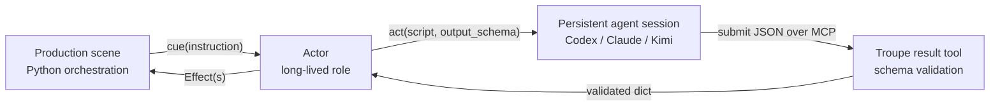
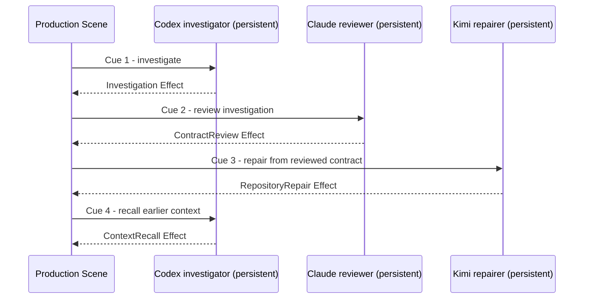

# Troupe

Troupe is a runtime for building long-running, autonomous agent workflows in
Python. A Troupe program casts stateful **Actors**, sends them work as **Cues**,
and receives owned **Effects**. Each Actor owns one persistent Codex, Claude, or
Kimi session, with the provider's native coding harness available for real
repository work.

> Troupe is not a stateless model API wrapper. It is the orchestration layer
> around stateful roles: your Python code decides who acts next, each Actor keeps
> its own working context, and schemas turn agent work back into dependable
> application data.

The orchestration API is Python. Lifecycle, scheduling, cancellation, agent
processes, and ACP transport run on a Rust/Tokio runtime.

## The runtime model

One agent turn travels through the system like this:



The six concepts are deliberately small:

| Concept | What it means |
| --- | --- |
| **Production** | The top-level program. It owns lifecycle, Actors, and orchestration. |
| **Scene** | One run of the Production's orchestration logic. It decides which Actors to cue and how to combine their Effects. |
| **Actor** | A named, long-lived role. It handles one Cue at a time and owns one contextual agent session. |
| **Cue** | An instruction dictionary sent from a Scene to an Actor. |
| **Effect** | An Actor-owned domain result returned to the Scene. |
| **Agent session** | The provider's coding harness reached through Agent Client Protocol (ACP). Context stays with its Actor for that Actor's lifetime. |

This gives a workflow both memory and structure. Cues sent to one Actor execute
in strict FIFO order, while different Actors progress cooperatively. A later Cue
can ask the same Actor to use facts learned earlier, without copying its entire
conversation into another prompt.



That diagram is also a real repository example: Codex investigates a defect,
Claude checks the behavioral contract, Kimi repairs and commits the code, and
the original Codex Actor later recalls context from its first turn. See the
[mixed-provider Production](examples/live_agents/mixed_repository_repair/production.py).

Actor context is durable within the running Troupe process. V1 does not persist
or restore provider sessions across a process restart.

## An agent-backed Actor

The open-ended part of an Actor is one `act()` call. Its script tells the agent
what to do; its schema defines the only result that the Production will accept:

```python
from pathlib import Path
import troupe


class Review(troupe.Effect):
    def __init__(self, payload):
        self.payload = payload


class Reviewer(troupe.Actor):
    async def cued(self, cue):
        result = await self.act(
            script=f"Review the change in {cue.instruction['path']}.",
            output_schema={
                "decision": troupe.act_schema.StrValue(
                    description="the review decision",
                    choices=["accept", "reject"],
                ),
                "summary": troupe.act_schema.StrValue(
                    description="a concise explanation of the decision",
                    min_length=1,
                ),
            },
        )
        review = self.make_effect(
            Review,
            effect_args=(result,),
            effect_kwargs={},
        )
        return (review,)
```

Cast the Actor once from the Production, then cue it from a Scene:

```python
profile = troupe.AgentProfile(
    agent="codex",
    workspace=Path("/path/to/repository"),
    model="gpt-5.6-sol",
    effort="max",
)

self.reviewer = self.cast_actor(
    Reviewer,
    name="reviewer",
    agent_profile=profile,
    actor_args=(),
    actor_kwargs={},
)

# Inside Production.scene():
(review,) = await self.reviewer.cue({"path": "src/payment.py"})
```

`cast_actor()` is synchronous: it submits session creation to the runtime and
returns an `ActorHandle`. If the session is still starting, the first
`Actor.act()` waits until it is ready. The result is a validated,
JSON-compatible `dict`, not the agent's raw text stream.

Troupe does not try to scrape JSON from a chat message. For each turn, it exposes
a schema-specific result tool to the session through Model Context Protocol
(MCP). Invalid submissions go back to the agent for correction; only an accepted
object crosses back into the Actor.

## Install and run

Troupe currently supports GIL-enabled CPython 3.10 through 3.14 on Linux x86_64
glibc. Install it into a Python environment:

```console
pip install troupe
```

Codex, Claude, and Kimi must already be logged in through their own CLI. Troupe
does not collect API keys or add an authentication flow. Codex and Claude use
pinned ACP adapter packages and require Node.js with npm and `npx`; Kimi uses
the ACP server in Kimi Code 0.31.1.

After activating the environment, run a production package directly. Arguments
after `--` are passed untouched to the Production constructor:

```console
troupe --production /path/to/my_production -- --value 7 input.txt
```

The direct command does not require `uv run`.
`uv run troupe` only selects the project environment when its executable
directory is not already on `PATH`.

## Diagnostics

Every Production starts an in-process diagnostic server and a persistent event
store. They are mandatory parts of the Runtime: startup stops before importing
Production code if either cannot become ready, and a core server or persistence
failure stops a running Production with a non-zero exit status.

The default listener binds to `0.0.0.0` on an OS-assigned port. Once the store,
listener, and registry entry are durable, Troupe writes one versioned
`troupe: diagnostic ready {...}` locator to stderr. Diagnostic state is retained
under the writable Production root at `.troupe/diagnostics/`; stdout remains
available to the Production.

The server uses plain HTTP without access control and is intended only for a
trusted LAN. Any peer that can connect can read captured diagnostic content.
See [diagnostic operations](docs/diagnostics/operations.md) for deployment,
archive, failure, and cleanup behavior, and [diagnostic events](docs/diagnostics/events.md)
for the canonical observation model.

The [live diagnostics showcase](examples/README.md#6-live-diagnostics-showcase)
runs a real multi-Scene Production with queued Cues, agent messages, per-Act
usage, custom instrumentation, Python sink summaries, and all four View types.

## Start with the examples

[Progressive examples](examples/README.md) introduce Actors and Effects, repeated
Scenes, Actor-to-Actor routing, cooperative workers, and cancellation in small,
deterministic steps. [Live agent examples](examples/live_agents/README.md) then
exercise Codex, Claude, Kimi, and the mixed-provider repository repair against
real provider CLIs. Every example uses the same `troupe --production` command as
deployment.

## Complete Production example

The constructor receives a `list[str]` equivalent to `sys.argv[1:]`: these are
the untouched tokens after `--` in the Troupe command. Construction is a
synchronous constructor. Lifecycle work belongs in async `start()`, `scene()`, and `stop()`.

This deterministic Production casts two Actors, sends a Cue, receives a real
Effect, and writes a JSON result to the file descriptor supplied on the command
line. It demonstrates the orchestration API without spending a provider turn.
The marked source is also exercised by documentation and literal-console tests.

<!-- BEGIN README PRODUCTION -->
```python
import json
import os
from pathlib import Path
import troupe


class Message(troupe.Effect):
    pass


class Greeter(troupe.Actor):
    async def cued(self, cue):
        message = self.make_effect(
            Message,
            effect_args=(),
            effect_kwargs={},
        )
        message.text = cue.instruction["text"]
        return (message,)


class Production(troupe.Production):
    def __init__(self, args):
        self.fd = int(args[0])
        self.message = args[1]
        profile = troupe.AgentProfile(
            agent="codex",
            workspace=Path.cwd(),
            model="gpt-5.6-sol",
            effort="medium",
        )
        self.greeter = self.cast_actor(
            Greeter,
            name="greeter",
            agent_profile=profile,
            actor_args=(),
            actor_kwargs={},
        )
        self.writer = self.cast_actor(
            Greeter,
            name="writer",
            agent_profile=profile,
            actor_args=(),
            actor_kwargs={},
        )

    async def scene(self):
        result = await self.greeter.cue({"text": self.message})
        effect = result[0]
        payload = [
            type(result).__name__,
            len(result),
            isinstance(self.greeter, troupe.ActorHandle),
            isinstance(effect, Message),
            effect.id,
            effect.owner,
            effect.text,
        ]
        os.write(self.fd, json.dumps(payload).encode())
```
<!-- END README PRODUCTION -->

The same source can be inspected without maintaining a second example:

```py
>>> from pathlib import Path
>>> import re
>>> readme = Path("README.md").read_text(encoding="utf-8")
>>> marker = "README PRODUCTION"
>>> production_source = readme.split(f"<!-- BEGIN {marker} -->\n```python\n", 1)[1].split(f"```\n<!-- END {marker} -->", 1)[0]
>>> namespace = {}
>>> import importlib.util
>>> if importlib.util.find_spec("troupe") is not None:
...     exec(production_source, namespace)
>>> production_type = namespace.get("Production")
>>> example = production_type(["1", "hello"]) if production_type is not None else None
>>> example is None or example.get_actor("greeter").name == "greeter"
True
>>> example is None or [handle.name for handle in example.get_actor(re.compile(r"(?:greeter|writer)"))] == ["greeter", "writer"]
True

```

## Structured agent results

`cast_actor()` requires an `AgentProfile`. It submits creation of the Actor's
agent session immediately and remains synchronous; the first `Actor.act()`
waits until that session is ready. Each Actor owns one persistent ACP session
for its lifetime, so later cues can use context established by earlier calls.
Codex, Claude, and Kimi must already be logged in through their own CLI. Troupe
does not collect credentials, expose an authentication flow, or return raw
agent output from `act()`. Codex and Claude launch pinned ACP packages and
therefore require Node.js with npm and `npx`; Kimi requires Kimi Code 0.31.1.

`Actor.act()` may only be called by that Actor while handling `cued()`. It sends
the script to the persistent session and returns one validated JSON-compatible
dictionary. Built-in schema values require a `description`; scalar values also
accept `choices`, and `ObjectValue` gives nested objects their own typed fields:

```python
result = await self.act(
    script="Inspect the job and submit the reviewed decision.",
    output_schema={
        "decision": troupe.act_schema.StrValue(
            description="the review decision",
            choices=["accept", "reject"],
        ),
        "review": troupe.act_schema.ObjectValue(
            description="the reviewed job facts",
            fields={
                "attempts": troupe.act_schema.Int64Value(
                    description="the observed attempt count",
                    min=0,
                ),
                "complete": troupe.act_schema.BoolValue(
                    description="whether the job is complete",
                    choices=[True],
                ),
            },
        ),
    },
)
```

### Custom schema values

Subclass `SchemaValue` when the built-ins cannot express a domain. This sync
validator accepts values from multiple disjoint ranges. `ValueRejected` means
the agent may correct and resubmit the field; other callback failures become a
`SchemaCallbackError`:

```python
class DisjointIntValue(troupe.act_schema.SchemaValue[int]):
    def __init__(self, *, description: str) -> None:
        super().__init__(description=description, json_kind="int64")

    def render_prompt(self) -> str:
        return "an integer from 1 through 3 or from 10 through 12"

    def validate(self, value: int) -> None:
        if not (1 <= value <= 3 or 10 <= value <= 12):
            raise troupe.act_schema.ValueRejected("outside the accepted ranges")
```

Validation may also await application work. An async database validator can
move a blocking lookup off the event-loop thread:

```python
class ExistingAccountValue(troupe.act_schema.SchemaValue[str]):
    def __init__(self) -> None:
        super().__init__(
            description="an account identifier present in the production database",
            json_kind="string",
        )

    def render_prompt(self) -> str:
        return "a currently registered account identifier"

    async def validate(self, value: str) -> None:
        exists = await asyncio.to_thread(account_exists, value)
        if not exists:
            raise troupe.act_schema.ValueRejected("account does not exist")
```

Treat `render_prompt()` and `validate()` callbacks as idempotent: validation can
run for multiple agent submissions, and callbacks may be cancelled during
caller or Production shutdown. Troupe adds no Runtime timeout to an agent turn
or schema callback; a Production that needs a deadline owns that policy at the
Troupe task level. Preserve `asyncio.CancelledError`. To report a callback bug,
catch `SchemaCallbackError` and inspect its `phase` (`render_prompt` or
`validate`) and schema `path`:

```python
try:
    result = await self.act(script=script, output_schema=schema)
except troupe.act_schema.SchemaCallbackError as error:
    record_schema_failure(phase=error.phase, path=error.path)
    raise
except asyncio.CancelledError:
    raise
```

## Scheduling and lifecycle

### Production lifecycle

The runtime calls the hooks serially. A start failure means startup failed and
stop is not called. A non-cancellation scene failure is retained and stop still
runs. A scene `CancelledError` is normal shutdown; cancellation waits for the
scene's cleanup before stop. There is no cancellation grace period. A scene
that swallows `CancelledError` owns the resulting cleanup and completion delay.
In diagnostics, start, scene, and stop are separate failure phases.

### Task lineage and Cue runners

Scene and Actor cue work use registered task lineage on one captured event-loop
thread. Tasks created through `asyncio.create_task()` or `loop.create_task()`
inherit the current registered lineage.
Direct `asyncio.Task(...)` construction is not supported. Troupe installs a
delegating loop task factory while scenes and cue cleanup are active; replacing the event loop task factory makes the scene phase fail,
after which Troupe restores the factory that was present at run entry.

An Actor remains registered through its last live `ActorHandle`. `get_actor()`
accepts an exact string or a compiled regular expression; the former returns one
handle or `None`, while the latter returns a name-sorted list. Calling
`ActorHandle.cue()` is legal only from an active Scene and its registered task
lineage.

Each cue runner has exactly one consumer. It can be awaited directly or passed
to `asyncio.create_task()` once; concurrent double-await while pending is not supported.
Re-awaiting it has the same boundary as a native coroutine and can
report `cannot reuse already awaited coroutine`. Cancellation preserves the
outcome category but does not guarantee `CancelledError` identity, arguments,
traceback, or `__context__` chain shape.

### Mailboxes and Effects

The instruction dictionary is captured with a shallow copy when the request is
admitted and exposed to the Actor as a read-only mapping. Cue IDs begin with a
scene UUID and use a scene-wide sequence such as `-cue0`; Effects use a
per-cue sequence such as `-effect0`. Requests admitted to one Actor execute in
strict FIFO order, while different Actors progress cooperatively. Mailboxes have
no mailbox capacity or backpressure setting.

Troupe does not detect cue dependency cycles; awaiting a cue to itself, or
creating a dependency cycle between Actors, waits indefinitely and is the
Production author's responsibility.
Scene shutdown rejects new cues, cancels and drains admitted cue work before
restoring the task factory and entering `stop()`. There is no cancellation grace
period.

Effects are created only by the current Actor during `cued()`. Framework-owned
identity fields are fixed, user-defined Effect fields remain mutable, and Troupe
does not consume user Effects returned from a cue.

### Task ownership

Scene-owned work completes or is cancelled before scene returns.
Cancellation is propagated and cleanup is awaited.
Cross-scene work is managed by start and stop.
Production chooses gather or another compatible task library.
Troupe does not define a subtask or task-group API.
`Runtime` is not a public programmatic API.

## Production packages

A production path points to a Python package directory containing
`production.py` and its `Production` class. Its identity rules are:

- The directory basename is the real Python package name.
- Relative and absolute package imports keep the same identity.
- Package resources are available through importlib.resources.
- Module and pickle identity use `<package>.production.Production`.

The basename must be a valid, non-keyword Python identifier and must remain
unchanged by NFKC normalization. Other Python files, subpackages, and resources
inside that production directory are supported.

## Public API and implementation

Troupe ships one thin `troupe/__init__.py` wrapper containing the immutable
`AgentProfile` dataclass. Loading, lifecycle control, cancellation, signals,
diagnostics, and the console command are implemented in the Rust extension.
The `troupe/__init__.pyi` stub describes the public `AgentProfile` and agent
exceptions together with the `Production`, `Actor`, `ActorHandle`, `Cue`,
`CueContextError`, `Effect`, and `EffectContextError` API.

## Platform scope

The first release is Linux x86_64 glibc only, with a minimum
`manylinux_2_17_x86_64` (or equivalent `manylinux2014_x86_64`) wheel tag.
GIL-enabled CPython 3.10 through 3.14 is supported;
free-threaded CPython is not supported. macOS, Windows, musllinux, and other architectures are not supported.
