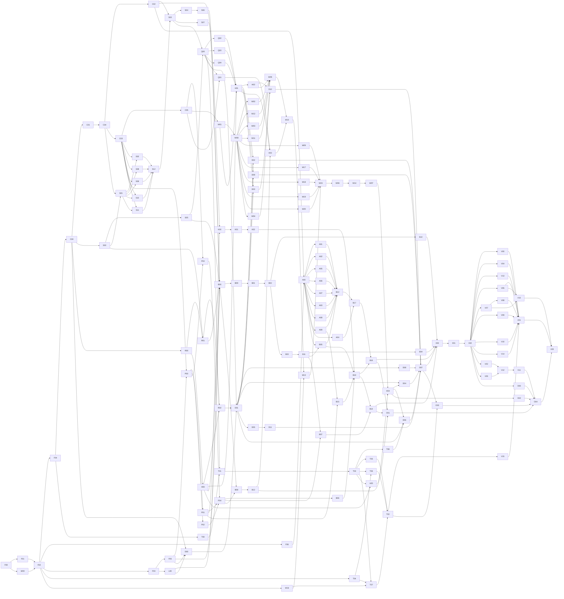

# Troupe Production Diagnostics DAG 实施计划

- 状态：实施内容冻结后不再原地改状态；审查与用户验收状态见 companion review record
- 依据：`docs/design/production-diagnostics.md` D1-D54；只读上游合同`docs/design/actor-agent-session.md`
- 规划基线：`main@16c3c9a5a9040916f1f8c7d709dff372204ebd3c`
- 规划日期：2026-08-14
- 实现状态：未开始

## 0. 目标、完成定义与边界

本计划把已经冻结的 Production diagnostics 设计拆成一个可并行执行的有向无环图（DAG）。DAG 的
每个节点都是一个最小可执行步骤：从其所有依赖已经合并的 integration branch 创建独立 Git worktree，
先增加能精确失败的 RED，再完成实现、节点验收和 commit。任何节点都不能靠未合并 sibling branch、
人工浏览结果或“最终阶段会补”才能变绿。

全部节点完成后，Troupe 交付：

- 一个 Run 级 canonical diagnostic event/hub、强制 durable store、同进程受监督 server、registry、
  HTTP query/SSE、实时 Web UI 与 diagnostic CLI；
- Production/Scene/Actor/Cue/Effect/Act/agent/tool/result/usage 的统一事实与因果模型；
- 可选 per-Act `DiagnosticSink`、Python custom instrumentation 和声明式 `ViewSpec`；
- watermark-consistent Perfetto dump、active/completed/incomplete archive 查询与显式 cleanup；
- 与现有 `Actor.act()` 返回值、agent correctness、Production exception 和 Linux wheel contract 兼容的
  release-quality 实现。

计划完成的证据不是“所有节点都有 commit”，而是以下条件同时成立：

1. 第 3.1 节列出的全部节点验收都在其 merge 后的 integration HEAD 重跑通过。
2. 第 9 节 D1-D54 追踪矩阵的每个决策至少有一个负责实现的节点和一个自动化验收面。
3. 最终 release、browser、Perfetto compatibility 和 failure-injection gates 全部通过。
4. 普通 build/runtime/dump 不需要 Node、npm、`protoc`、Perfetto binary、网络或外部服务。
5. 所有实现 worktree 已合并并移除；没有未合并的 diagnostics branch、生成差异或测试临时文件。

### 0.1 本计划不包含

- 不改变 D1-D54，不重新讨论认证、控制面、Perfetto 嵌入或内容扫描。
- 不实现 PyPI 上传、provider credential 管理或跨不可信网络的 TLS/auth。
- 不把现有 mock UI event shape、Perfetto schema 或 materialized table 当 canonical 事实模型。
- 不以真实 provider、public `ui.perfetto.dev` 或人工 screenshot 替代 deterministic blocking test。
- 不在计划验收前创建实现 worktree或提交产品代码。

## 1. 实现架构与 ownership boundary

### 1.1 Rust crate 边界

新增三个 workspace crate：

| Crate | 职责 | 明确不拥有 |
|---|---|---|
| `troupe-diagnostics-core` | canonical scalar/ID/time、14-variant event、wire JSON、validation、shared protocol types/fixtures、generic Run hub admission/sequence/fan-out state machine | SQLite、HTTP、Python callback、ACP raw update、Perfetto |
| `troupe-diagnostics-runtime` | core hub 的 durable adapter/composition、archive lease、SQLite writer/read model、query、registry、HTTP/SSE、embedded asset serving | canonical hub algorithm、Production/Actor object ownership、Python public value、Perfetto encoding |
| `troupe-diagnostics-perfetto` | pinned minimal protobuf、event-to-TrackEvent projection、bounded atomic `.pftrace` writer | event truth、SQLite schema、UI、Trace Processor runtime |

现有 `troupe-agent-runtime` 只依赖 `troupe-diagnostics-core`，将 ACP update 规范化成 provider-neutral
observation；它不能依赖 SQLite、HTTP 或 Python sink。现有 native `troupe` crate 负责把 Production/
Actor lifecycle、agent observation、Python extension、core hub 与 `troupe-diagnostics-runtime` durable adapter
接起来，并监督启动/收束。C02 是唯一 hub algorithm/identity/sequence owner；runtime 只能实现它声明的
durable reservation/notification adapter，不能另建第二套 sequence 或 fan-out 事实。

`rust/src/application/diagnostics.rs` 继续只负责 stderr failure formatting。新体系放在明确命名的
`diagnostic_runtime` / 新 crates 下，不能改变现有 traceback contract 的含义。

### 1.2 Python public surface

`troupe.diagnostics` 由现有 native extension 在 import 时安装，方式与 `troupe.act_schema` 相同；不新增
runtime `src/troupe/diagnostics.py`。Immutable event projection、`DiagnosticCapture`/`DiagnosticSink`/
summary、custom instrumentation 和 ViewSpec values 使用编译进 native module 的 Python source fragments
定义，`src/troupe/diagnostics.pyi` 提供完整 typing。Native bridge 只提供 private admission/binding/
dispatch capability。Python 与 Rust 使用同一组 checked-in canonical fixtures，不能各自定义 numeric/
wire semantics。

`Actor.act(..., diagnostic_sink=...)` 的 wrapper/stub 只在相应 binding 节点更新。Public event object 不
携带 transport control；sink 只能收到当前 Act 的 canonical projection。

### 1.3 Frontend 与 generated assets

Frontend source 固定在 `frontend/diagnostics/`，使用 strict TypeScript、Preact、Signals、Vite、
`lucide-preact` 和 uPlot。Generated raw/gzip/Brotli bytes、manifest、Rust include table 和 notices 位于
`rust/crates/troupe-diagnostics-runtime/assets/generated/` 并 checked in。普通 Rust/Python build 只读这些
bytes；Node/npm 只由唯一 maintainer script 使用。

### 1.4 Artifact contract 的并行化

F00 将当前 `tests/unit/test_artifact_layout.py` 中重复的 inline inventory/byte snapshot 机械迁移为
`tests/fixtures/artifact_layout/base.json`、
`tests/fixtures/artifact_layout/nodes/<node-id>.json`和
`tests/fixtures/diagnostic_node_gates/<node-id>.json`。`index.json`显式枚举第3.1节的每个node ID和对应
文件名，不使用目录扫描。两类parameterized file的schema明确分离：`artifact_layout/nodes/<node-id>.json`
是唯一ownership fragment，closed字段为`state`、`introduced`、`modified`、`removed`和`generated`；
`diagnostic_node_gates/<node-id>.json`是structured gate descriptor，closed字段为`state`、`argv`、`env`、
`maturin_features`、`cache_requirements`和`exclusive_resources`，绝不参与artifact path union。F00一次性创建两类全部文件：两个
`F00.json`均为`state=realized`，其余artifact fragment为`state=planned`且四类path为空，其他gate
descriptor为`state=planned`且命令/环境/feature/cache/resource字段为空。后续节点只修改自己的两个同名文件，并在
GREEN commit把两者state一起原子改为`realized`；artifact union loader与gate descriptor loader分别拒绝
缺失/额外文件、非法state、planned却非空、realized却未闭合，artifact loader另外拒绝重复path/public
symbol、glob、subset和ignore rule，gate loader拒绝shell string、未知env/feature/cache/resource。exact Rust source
union、Cargo dependency-key set、wrapper/stub/`py.typed` bytes、sdist/wheel members和generated assets仍与
当前contract逐项相等。

F02另外提交`tests/fixtures/artifact_layout/ownership-ledger.json`。其`paths[]`逐条列出每个静态
repository path、`baseline_state=existing|planned`、`writers=[<node-id>, ...]`和每个writer的
`role=create|seam|implement|assemble|generate|remove`。writer顺序必须与DAG可达关系一致；同一路径的相邻
writer必须直接或间接依赖，且最后一个writer以后没有隐式join。F04/F05/F06按照第4.1节创建并接线
compile-safe空slot，后继owner只填充已登记文件；现有shared root只有第4.2节列出的有序writer可以修改。
每次dispatch和merge前，
`scripts/audit_diagnostic_ownership.py --node <ID> --base <SHA>`对Git diff、node fragment和slot ledger做
exact比对。任何未登记path或两个不可比较node拥有同一路径都在启动worktree前失败。

F02的`--plan-only`不把未来空fragment冒充已实现事实：它从第4节机器表和第5节exact artifact字段计算每个node的
projected writer集合，并与ledger双向相等；此时仅F00/F01/W00/F02的artifact fragment和gate descriptor必须
`state=realized`且与实际diff/structured Gate相等，其余artifact fragment必须`state=planned`且四类空，其他
gate descriptor必须`state=planned`且命令/环境/feature/cache/resource字段空。dispatch只允许目标的两类文件一起由
planned转realized，且所有direct dependency的两类文件均已realized；merge audit只验证当前realized节点及其
descriptor，最终V03再用`--all-realized`要求全部145个artifact fragment与145个gate descriptor realized，
artifact fragment与ledger/committed history双向相等。不存在要求F02预填未来node fragment的循环合同。

每个realized node fragment是closed object：`introduced`列该node首次创建的path，`modified`列其base/ancestor已
存在且保留的path，`removed`列真实存在后删除的path并记录删除前SHA-256，`generated`只引用第4.2节登记的
manifest grant并只展开其中封闭的`files[].path`值；manifest文件本身仍是单独的static `introduced` path，不属于
member展开，因而不会与generated category重叠。四类展开后互斥，且
`introduced ∪ modified ∪ removed ∪ generated`必须逐项等于ownership ledger中该node出现为writer的
完整path集合；role与category必须相容（`create`只能introduced，后继`seam|implement|assemble`只能modified，
`generate`只能generated，`remove`只能removed）。反向也成立：Git committed diff的每个path必须恰好命中该
union和ledger writer，不能只审source slot。F04/F05/F06在自己的`introduced`中登记所有slot，后继owner在自己的
`modified`中登记填充。brace expansion只表示逐项列出的finite filename；`*`/`**`不构成授权。唯一content-hashed
asset family必须命中第4.2节唯一的manifest grant；audit先验证exact cardinality、parent、filename grammar、
content SHA绑定和`files[].path`，再把实际成员加入realized集合，不能扩张为目录/glob授权。

## 2. Worktree、subagent 与合并协议

### 2.1 Integration branch 与基线冻结

用户验收计划后，root integrator 执行以下协议，而不是直接在 `main` 开发：

1. 确认 primary worktree tracked-clean，记录 `PRODUCT_BASE_SHA=$(git rev-parse HEAD)`；如果不再是本计划头部的
   规划基线，只允许在证明 D1-D54/计划仍适用并重跑 baseline gate 后继续。
2. 用户验收后、任何implementation worktree前，root从`PRODUCT_BASE_SHA`创建唯一
   `integration/production-diagnostics` branch，并在该branch执行一次root-owned planning bootstrap：用
   `git add -f`纳入`docs/design/actor-agent-session.md`、
   `docs/design/production-diagnostics.md`、
   `docs/plan/production-diagnostics-implementation-plan.md`、
   `docs/plan/verify_production_diagnostics_plan.py`和
   `docs/plan/production-diagnostics-plan-review-record.md`，先复核
   review record冻结的Actor design/diagnostics design/plan/validator SHA-256及四票approval，再提交唯一
   `accepted-production-diagnostics-plan` commit。该commit不得包含产品、测试或`.gitignore`改动。
3. 记录`PLAN_BUNDLE_SHA=$(git rev-parse HEAD)`；所有node branch/worktree都从包含这个commit的integration HEAD
   创建，因此F02/V11/V03读取的是Git-tracked、只读且hash-verified的同一planning bundle。任何node修改这五个
   文件都由ownership audit拒绝；plan byte变化必须停止执行并重新走第10节review，不能向worktree临时复制文件。
4. 在 ignored local file `docs/plan/production-diagnostics-execution-state.md` 记录PRODUCT_BASE、PLAN_BUNDLE、
   integration HEAD、
   每个 node 的 `pending/ready/running/review/merged`、worktree path、subagent、commit 和 gate 结果。
5. root创建repository sibling
   `<workspace>/troupe-diagnostics-evidence/<PLAN_BUNDLE_SHA>/`作为非临时evidence base；普通
   node/worktree/merge Gate不得写这里。每次第8.3节真实final attempt前，root生成从未使用的canonical UUID
   `TROUPE_FINAL_ATTEMPT_ID`并预创建fresh
   `attempts/<TROUPE_FINAL_ATTEMPT_ID>/`；runner只能在该attempt内以create-new+atomic rename写入合同点名的
   `V07-wheel-report.json`、`V05-performance-raw.json`和`V03-final-evidence.json`，任一预存同名文件都fail closed。
   失败attempt原样保留且重试必须使用新ID；全部Gate成功后V03 final runner才调用V16-owned
   `scripts/publish_diagnostics_acceptance.py`才验证三个report/schema/hash并在base通过same-directory
   `O_EXCL` staging、file fsync、no-overwrite hard-link publish、staging-name unlink和directory fsync创建一次`accepted.json`，绑定
   成功attempt ID、integration SHA和三个report SHA；既有path、symlink、schema/hash mismatch或任一I/O step
   failure都fail closed且绝不覆盖旧acceptance；publisher保留staging fd到最终directory fsync，link后的staging-name
   unlink或directory fsync失败时，只对device/inode/content hash仍等于该fd的output做identity-checked unlink并再次
   fsync directory，任一rollback/rollback-fsync失败则报告
   `publication_indeterminate`、保留现场并禁止自动retry，不能把可见文件冒充成功evidence。root没有手工JSON/rename步骤。该base不进入source/wheel，保留到
   最终用户验收完成，此后只可由root按用户明确决定归档或删除；final zero-temp audit不把它当temp。
6. 实现 worktree 放在 repository sibling 的专用目录
   `<workspace>/troupe-diagnostics-worktrees/<subproject>/<node-id>`，不放进 source tree。

### 2.2 一个节点的标准执行

对于 ready 节点，root 必须先证明其所有依赖 commit 都是 integration HEAD 的 ancestor，然后：

```console
git worktree add -b diag/<subproject>/<node-id> \
  <workspace>/troupe-diagnostics-worktrees/<subproject>/<node-id> \
  integration/production-diagnostics
```

root 将该节点的完整“产物、验收、禁止项、base SHA”交给一个 implementation subagent。每一次subagent、root
worktree review和merge后integration Gate都获得一个fresh、repository外且realpath校验后的
`TROUPE_GATE_TMP=$(mktemp -d)`；该次runner只可在其中写临时report，root记入命令/结果hash后删除整个owned root，
不同attempt绝不复用path。Subagent 只能在
该 worktree 修改节点声明的 ownership paths；先提交 RED evidence，再完成 GREEN、运行节点 gate、提交
一个可 review commit，并返回 commit SHA 与命令摘要。它不得 merge/rebase integration branch、修改计划、
跳过失败测试或把 sibling branch 拉进来。

root 对 commit 做 diff/ownership/secret/generated-file 审计，在该 worktree重跑节点 gate。通过后由 root
把 branch merge 到 integration branch；如 integration 已前进且出现冲突，root 不手工拼接两个未经测试
的版本，而是从新的 integration HEAD 重新创建节点 worktree、移植该节点 patch 并重跑完整 gate。Merge
后 root 在 integration worktree 再跑节点 gate和第 8 节 cumulative gate，再移除 worktree/branch并更新
ledger。

F02 merge以前的F01/W00/F02是唯一pre-ledger nodes：root用F00的exact fragment loader对每个realized diff做
introduced/modified/removed/generated集合审计，并对同时running/review的fragment path做pairwise disjoint
检查。F02显式依赖F01和W00，因此建立ledger时三个crate roots和frontend composition placeholder都已存在；
F00/F01/W00/F02 fragment必须realized，其余`baseline_state=planned`path由未来first writer创建且对应fragment保持
planned/empty。F02 merge以后所有node无例外同时通过F00 fragment和F02 ledger audit；audit按目标node状态验证
realized集合，不要求未来planned fragment提前实现，也不存在“ledger还没准备好”的隐式豁免。

需要Python/native/CLI的合同统一执行`scripts/run_diagnostic_node_gate.sh <node-id>`。唯一例外是V07自己
构建ordinary wheel、V08在自身owned temp构建一次并逐版本安装同一个exact wheel；两者的runner合同包含同样的source/wheel/install origin
断言。F03 runner验证当前
checkout和Cargo workspace realpath后，用`mktemp -d .troupe-test/<node-id>.XXXXXX`建立独占venv、
`CARGO_TARGET_DIR`、wheel output、npm cache和temp；执行`uv sync --frozen --all-groups --no-install-project`，
再以当前absolute`rust/Cargo.toml`运行descriptor中结构化`maturin_features`指定的`maturin build --locked
--features <validated-comma-list> --out <owned-wheel-dir>`，通过`uv pip install --reinstall <exact-wheel>`
安装，而不是`maturin develop`。runner在执行节点命令前断言`sys.executable`、console script和
`troupe._runtime.__file__`均位于本次venv，wheel RECORD中的native member SHA-256与installed `.so`相等，
wheel/`.so`mtime不早于本次build start，Cargo JSON artifact path只位于本次target。任一事实不符立即失败，
因此不能误测primary checkout、共享venv/target或另一个worktree binary。runner只读取该node独占的
`tests/fixtures/diagnostic_node_gates/<node-id>.json`结构化argv/env，不执行任意shell字符串；成功或失败后只
删除已解析且位于当前worktree `.troupe-test/`下的本次目录。Rust-only/frontend-only节点可使用合同列出的
直接命令，但仍必须拥有同名gate descriptor记录命令和环境。

F03自己的descriptor只指定基线已经存在的`agent-test-support`并执行普通installed-wheel origin smoke；F05
在同一node加入`diagnostics-test-support`后，其descriptor和所有后继native/Python/CLI descriptor才可以指定
`agent-test-support,diagnostics-test-support`。runner拒绝未知、重复或当前manifest不存在的feature，因此
F03不依赖未来slot，也不会因省略feature而偷偷复用旧binary。

F03之前或完全不需要native import的Python maintainer test统一执行
`scripts/run_diagnostic_bootstrap_gate.sh <node-id>`。该F00-owned runner用`mktemp -d`在repository外创建
unique `UV_PROJECT_ENVIRONMENT`/uv cache/temp，执行`uv sync --frozen --all-groups --no-install-project`，拒绝
descriptor中的native import/console invocation，再按structured argv运行；它不读取worktree `.venv`且无论
exit/signal都只删除validated owned root。任何合同中的裸`uv run --no-sync pytest`都视为错误。Frontend
`maintain.mjs`同理从exact lock在owned temp安装node_modules，用absolute temp binaries操作当前source，结束后
清理；不能依赖前一个frontend worktree留下的node_modules。所有调用都必须显式传
`--npm-cache "${TROUPE_NPM_CACHE:?}"`；W00的`--allow-registry` Gate/provision mode使用fresh writable staging并逐项
复核integrity，除此以外一律先复核readonly cache identity，再执行
`npm ci --offline --ignore-scripts --cache <absolute-cache>`，禁止home cache、隐式registry或别的worktree残留。

W00是唯一允许访问npm registry的node：其implementation/root-review Gate使用fresh writable
`TROUPE_NPM_CACHE`和exact package-lock integrity。W00 merge后，root在repository sibling
`<workspace>/troupe-diagnostics-tool-cache/npm/<package-lock-sha256>/<node-major>`中执行
`node frontend/diagnostics/scripts/maintain.mjs --npm-cache "${TROUPE_NPM_CACHE:?}" --provision-package-cache --allow-registry`，
逐tarball复核lock integrity后atomic publish readonly cache，并把absolute realpath、Node/npm version、lock hash和
member integrity写入execution ledger。后继frontend dispatch必须复核该记录；missing/mismatch直接失败。普通
Rust/Python/wheel/Troupe runtime仍不需要Node、npm或该cache。

Gate descriptor和第5节literal Gate command中禁止任何直接`npm`/`npx` argv；npm只能作为W00-owned
`maintain.mjs`的内部实现，并由该script强制cache/offline/registry authority。除第8.3节真实V03 final runner及
V16 publisher外，所有ordinary node/worktree/merge Gate descriptor还必须拒绝
`TROUPE_DIAGNOSTICS_EVIDENCE`、`TROUPE_FINAL_ATTEMPT_ID`、literal `accepted.json`、
`.troupe/diagnostics/evidence`和任意persistent-copy/publish option；所有output/report/evidence path只允许位于
realpath-validated `TROUPE_GATE_TMP`。禁止bare、absolute-path、`env`/shell-wrapper或nested command形式的
npm/npx；F02 dispatch audit与plan validator扫描每个structured argv token和第5节每个literal Gate command，而不是
看到一条合法maintainer命令后忽略追加命令。

W16 merge gate由root创建repository sibling
`<workspace>/troupe-diagnostics-tool-cache/playwright/<package-lock-sha256>/<platform>`，执行
`node frontend/diagnostics/scripts/provision_browsers.mjs --browser-cache "${TROUPE_PLAYWRIGHT_CACHE:?}"`，
把lock对应的Chromium/Firefox/WebKit exact revisions先装入owned staging，校验W16 browser manifest后atomic
publish为只读cache。absolute realpath、platform、lock hash、browser revisions/member hashes写入execution ledger；
所有真实browser Gate显式传入该cache并先复核，禁止使用home cache、PATH browser、自动联网或别的worktree。
普通frontend unit/build、Rust/Python build和Troupe runtime不需要browser cache。

T04 merge gate另外由root创建repository sibling
`<workspace>/troupe-diagnostics-tool-cache/perfetto-v57.2/<platform>`，用T04 manifest的official URL下载到
同目录temporary file、逐项校验SHA-256后atomic rename，再把files和目录改为只读。root把absolute realpath、
platform、manifest hash、每个member hash写入execution ledger并导出`TROUPE_PERFETTO_CACHE`；T06/T07/T02/V15
dispatch前必须复核该记录与当前T04 commit一致。下游只读cache，missing/mismatch直接失败，不从PATH、网络、
primary checkout或旧worktree补齐。T05的stdlib decoder不使用此cache，因此不依赖T04。
provision的唯一命令是`scripts/fetch_pinned_perfetto_tools.sh --manifest tests/perfetto/tools/manifest.json --cache "${TROUPE_PERFETTO_CACHE:?}" --provision`；除了T04这个显式步骤，所有blocking compatibility mode都带
`--offline`。

### 2.3 并行规则

- root 是唯一 merge owner，始终保留一个 concurrency slot 做审查、合并和 cumulative gate。
- 当前四槽环境最多同时派出三个 implementation subagent；scheduler 每次从 ready frontier 选择最多
  三个不同 subproject、ownership 不重叠的节点。
- 优先占满 critical path，然后选择最长 downstream path；不能为了“看起来并行”提前启动依赖尚未 merge
  的节点。
- 同一 subproject 默认最多一个 active worktree。表中明确拆成不同 subproject 的 sibling 节点才可并行。
- gate descriptor的`exclusive_resources`参与ready过滤：closed resource目前只有`benchmark-host`，且第4.2节
  机器表唯一授权V05。V05 running/review/Gate期间root暂停其他subagent Gate与本机重负载工作；它不是DAG依赖，结束后立即释放。
- 任一 merge 都可能解锁新节点；root 立即补满空闲 slot，而不等待整个人工 wave 结束。
- Subagent 完成只等于进入 root review；未 merge 的 sibling 输出不能作为另一个节点的依赖证据。

## 3. DAG 总览

### 3.1 节点索引

| ID | 最小步骤 | Subproject | Depends on |
|---|---|---|---|
| F00 | Artifact contract 无行为变化分片 | foundation | - |
| F01 | Diagnostics workspace crates 与 dependency graph | foundation | F00 |
| F02 | Exact ownership ledger 与 dispatch audit | foundation | F01,W00 |
| F04 | Diagnostics crates compile-safe module slots | foundation-crate-slots | F02 |
| F05 | Native、Runtime hook 与 CLI compile-safe slots | foundation-native-slots | F03 |
| F06 | Agent diagnostics compile-safe module slots | foundation-agent-slots | F02 |
| F03 | Isolated worktree native gate runner | foundation | F02 |
| C00 | Canonical scalar、ID、时间与 JSON wire primitives | core-model | F04 |
| C01 | 14-variant event taxonomy 与 closed typed detail | core-model | C00 |
| C04 | Span、scope 与 backward causal-reference validation | core-model | C01 |
| C02 | Hub sequence/admission/fan-out contract | core-hub | C04 |
| C03 | Shared canonical protocol fixtures 与 independent decoder | core-fixtures | C04 |
| C05 | View/query wire schema、capabilities 与 shared fixtures | core-fixtures | C03 |
| L00 | Loader path/class/construct phase split | loader | F03 |
| S00 | Run directory layout 与真实 write probe | archive | C00 |
| S05 | Process-owned archive lease | archive | S00 |
| R00 | Registry codec、process identity 与 candidate classification primitives | registry | C00 |
| S01 | SQLite schema、initial transaction 与 recovery validation | store-write | C04,S00 |
| S02 | Pure span/scope read-model projector | store-projector-spans | C03,S01 |
| S08 | Pure message assembly projector | store-projector-messages | C03,S01 |
| S09 | Pure plan state projector | store-projector-plans | C03,S01 |
| S10 | Pure counter state projector | store-projector-counters | C03,S01 |
| S11 | Pure usage/coverage projector | store-projector-usage | C03,S01 |
| S12 | Pure snapshot/gap projector assembly | store-projector-snapshot | S02,S08,S09,S10,S11 |
| S03 | Transactional event/read-model writer 与 dense watermark | store-write | C02,S12 |
| S04 | Mandatory ingress budget、atomic admission 与 fatal seal | store-admission | S03 |
| S06 | Writer progress/drain deadlines 与 task-exit supervision | store-progress | S04 |
| S07 | `max_run_bytes` accounting 与 fatal quota boundary | store-quota | S03 |
| Q00 | Reader、lease 与 captured-watermark primitive | query | S03,S05 |
| Q02 | Status query projection | query-status | Q00 |
| Q03 | Snapshot query projection | query-snapshot | Q00 |
| Q04 | Finite event-range query projection | query-events | Q00 |
| R01 | Atomic registry publish/unpublish 与 durable directory sync | registry | S00,R00 |
| R02 | Registry/archive discovery、candidate classification 与 identity revalidation | registry | R01,H00 |
| P00 | Python immutable `DiagnosticEvent` projection | python-events | C03,F05 |
| P01 | Capture、sink lifecycle/error/summary values | python-sink-values | P00 |
| P02 | Custom instrumentation values 与 eager validation | python-custom-values | P00 |
| P03 | ViewSpec 与 closed query descriptor values | python-view-values | P00,C05 |
| P04 | Assemble native `troupe.diagnostics`、stub 与 package contract | python-public | P01,P02,P03 |
| K00 | Sink queue、budget、reserve 与 deterministic eviction | sink-dispatch | C02,P01 |
| K01 | Dedicated dispatcher thread 与 callback execution isolation | sink-dispatch | K00 |
| K02 | Sink seal、delivery summary 与 bounded shutdown | sink-dispatch | K01 |
| A00 | ACP diagnostic observation interface 与 session lifecycle | agent-observer | C02,F06 |
| A01 | Agent message boundary/coalescing normalization | agent-message | A00 |
| A02 | Agent plan snapshot normalization | agent-plan | A00 |
| A05 | Thinking activity normalization 与 content exclusion | agent-thinking | A00 |
| A06 | Context occupancy normalization | agent-context | A00 |
| A07 | Cost normalization | agent-cost | A00 |
| A03 | Tool transition normalization | agent-tool | A00 |
| A08 | Result transition normalization | agent-result | A00 |
| A09 | Opaque sink-only payload budgeting | agent-payload | A00 |
| A04 | Terminal Act usage qualification | agent-usage | A00 |
| T00 | Minimal Perfetto protobuf/schema encoder | perfetto-schema | F04 |
| T01 | Canonical event 到 deterministic Perfetto packet projection | perfetto-export | Q00,T00 |
| T03 | Bounded captured-prefix Perfetto packet stream | perfetto-export | T01 |
| T08 | Atomic local `.pftrace` publication wrapper | perfetto-export | T03 |
| T04 | Pinned Perfetto tool manifest、fetch 与 offline cache contract | perfetto-tools | F02 |
| T05 | Independent protobuf decode compatibility layer | perfetto-decode | T03 |
| T06 | Trace Processor SQL compatibility layer | perfetto-sql | T03,T04 |
| T07 | Perfetto UI browser compatibility layer | perfetto-ui | T03,T04,W16 |
| T02 | Perfetto compatibility layer assembly | perfetto-compat | T05,T06,T07 |
| W00 | Pinned frontend toolchain 与 deterministic test shell | frontend-foundation | F00 |
| W16 | Pinned Playwright browser cache provisioning | frontend-browser-tools | F02 |
| W01 | Frontend canonical protocol decoder 与 compatibility checks | frontend-foundation | C05 |
| W08 | Bounded browser read model、cursor 与 query invalidation reducer | frontend-foundation | W01 |
| H00 | HTTP listener/router、identity 与 security shell | server-core | R00 |
| H01 | Status/snapshot/events HTTP endpoints | server-core | H00,Q02,Q03,Q04,W01 |
| H02 | SSE replay/live handoff 与 control protocol | server-core | H01 |
| B00 | Pre-import diagnostic bootstrap coordinator | bootstrap-runtime | F05,L00,S05,S06,S07,R01,H00 |
| B09 | Path/load/construct pre-user lifecycle producer | bootstrap-runtime | B00 |
| B01 | Run/start/stop/shutdown lifecycle producer | bootstrap-runtime | B09 |
| B02 | Scene lifecycle 与 registered task lineage | bootstrap-runtime | B01 |
| B10 | Scene drain、cancellation propagation 与 cleanup producer | producer-scene-drain | B02 |
| B03 | Actor cast 与 handle/session ownership producer | producer-actor-cue | B02 |
| B11 | Cue admission/mailbox/execution/outcome 与 counters | producer-actor-cue | B03 |
| B04 | Effect lifecycle 与 cancellation/return/handoff flows | producer-effect | B11 |
| B05 | Act caller/remote-turn lifecycle 与 internal usage slot | producer-act | A00,B11 |
| B12 | Agent session/message/state/tool/result canonical bridge | producer-act | A01,A02,A05,A06,A07,A03,A08,A09,B05 |
| B17 | Exactly-once terminal Act usage canonical admission | producer-act | A04,B12 |
| B06 | `Actor.act()` diagnostic sink signature 与 preflight | producer-act-sink | P04 |
| B15 | Pure Act capture 与 canonical sink projection | producer-act-projection | P01,A09 |
| B18 | Act sink admission 与 one-shot binding | producer-act-sink | B05,B06,B15,K02 |
| B16 | Act sink seal、`wait_closed()` 与 summary settlement | producer-act-sink | B17,B18 |
| B07 | Custom instrumentation Runtime context 与 mandatory admission | producer-custom | P04,B11 |
| B14 | Act-scoped custom context 与 `DiagnosticSink` projection | producer-custom | B07,B18 |
| Q01 | Analytical ViewSpec query/reducer/pagination engine | query | Q00,C05 |
| B08 | Pre-constructor ViewSpec compile 与 atomic persistence | producer-view | B00,P04 |
| B13 | Archive View record compatibility 与 isolation | producer-view | B08 |
| D00 | Private diagnostic CLI grammar 与 target validation | cli-foundation | C00,L00,F05 |
| D01 | Local/URL/archive target resolver | cli-foundation | Q00,R02,D00 |
| D08 | `runs` candidate listing 与 human/JSON output | cli-runs | D01 |
| D02 | Finite `status` client 与 human/JSON output | cli-status | H01,D01 |
| D09 | Finite `snapshot` client 与 human/JSON output | cli-snapshot | H01,D01 |
| D03 | Finite `events` client 与 human/JSONL output | cli-events | H01,D01 |
| D10 | `events --follow` SSE reconnect/dedupe client | cli-events | H02,D03 |
| W02 | Frontend shell、execution tree 与 primary navigation | frontend-shell | W08 |
| W12 | Event table、inspector 与 filter/selection linkage | frontend-inspector | W08 |
| W03 | Transcript、tool 与 result panels | frontend-transcript | W08 |
| W11 | Live context、final usage 与 aggregate coverage panel | frontend-usage | W08 |
| W09 | Timeline ViewSpec renderer | frontend-view-timeline | W08 |
| W17 | Metric ViewSpec renderer | frontend-view-metric | W08 |
| W18 | Table ViewSpec renderer | frontend-view-table | W08 |
| W19 | TimeSeries ViewSpec shell | frontend-view-timeseries | W08 |
| W20 | ViewSpec panel-local error boundary | frontend-view-error | W08 |
| W04 | Canvas timeline、ARIA treegrid 与 hit testing | frontend-timeline | W08 |
| W05 | SSE/reconnect/live-edge/pause frontend integration | frontend-live | H02,W02,W12,W03,W11,W04 |
| H03 | View query HTTP endpoint 与 panel-local error contract | server-views | H01,Q01,B13 |
| H05 | Perfetto captured-prefix HTTP dump endpoint | server-dump | H00,T03 |
| W10 | View query invalidation、pagination 与 uPlot data integration | frontend-query | H03,W05 |
| W13 | uPlot TimeSeries renderer 与 exact coverage display | frontend-query | W10,W16 |
| W15 | Frontend application composition assembly | frontend-assembly | W09,W17,W18,W19,W20,W13 |
| W06 | Deterministic Vite production bundle | frontend-release | W15 |
| W14 | Precompression、manifest/include table 与 notices generation | frontend-release | W06 |
| W07 | Embedded asset HTTP/cache/security/browser compatibility | frontend-serving | W14 |
| H04 | Complete active/archive HTTP route assembly | server-assembly | W07,H05 |
| D04 | Archive `serve` 与 shared lease | cli-serve | D01,H04 |
| D05 | Cleanup policy selection、ordering 与 preview | cli-cleanup | D01 |
| D11 | Cleanup apply、lease revalidation 与 whole-directory removal | cli-cleanup | D05 |
| D06 | `dump` command wiring 与 atomic output UX | cli-dump | D01,H04,T08 |
| D07 | Top-level diagnostic CLI assembly 与 exit semantics | cli-assembly | D08,D02,D09,D10,D04,D11,D06 |
| X00 | Mandatory Runtime activation 与 ready ordering | convergence | B10,B04,B14,B16,D07 |
| X01 | Core fatal supervision 与 Production cancellation convergence | convergence | X00 |
| X02 | Terminal facts、drain、stream close、registry/store shutdown | convergence | X01 |
| V00 | Cross-browser desktop/mobile visual interaction acceptance | verify-browser | X02 |
| V04 | Accessibility、keyboard 与 touch acceptance | verify-accessibility | X02 |
| V13 | Browser content、network 与 response-security acceptance | verify-security | X02 |
| V05 | Pinned Chromium stress、heap 与 render-budget acceptance | verify-performance | X02 |
| V07 | Ordinary offline sdist/wheel 与 packaged smoke | verify-wheel | X02 |
| V08 | Python 3.10-3.14 installed-wheel compatibility | verify-python-compat | V07 |
| V09 | Frontend deterministic release 与 embedded budgets | verify-frontend-release | X02 |
| V10 | Rust workspace quality release mode | verify-rust-quality | X02 |
| V14 | Python quality release mode | verify-python-quality | X02 |
| V15 | Perfetto compatibility release mode | verify-perfetto-quality | T02 |
| V01 | Release gate assembly | verify-release | V00,V04,V13,V05,V08,V09,V10,V14,V15 |
| V02 | Full-system happy-path E2E matrix | verify-system | X02 |
| V06 | Full-system startup/runtime/shutdown failure matrix | verify-failures | X02 |
| V12 | Happy/failure E2E runner assembly | verify-e2e-assembly | V02,V06 |
| V16 | Acceptance evidence publisher primitive | verify-evidence-publisher | V05,V07 |
| O00 | Operator overview、state、failure 与 cleanup documentation | docs-operations | X02 |
| O01 | Python diagnostics API 与 examples documentation | docs-python | B13,B14,B16 |
| O02 | Live Web UI documentation | docs-web | H04 |
| O03 | Diagnostic CLI 与 Perfetto documentation | docs-cli-perfetto | D07,T02 |
| V11 | D1-D54 traceability tooling 与 release checklist | verify-traceability | V12 |
| O04 | Diagnostic documentation index closure | docs-index | O00,O01,O02,O03,V11 |
| V03 | Final release runner closure | verify-final | O04,V01,V16 |

### 3.2 依赖图



F00 是唯一 root。F00 合并后，workspace与frontend toolchain并行；F02合并后crate slots、agent slots、
native gate harness、Playwright cache和Perfetto tool manifest并行；F04解锁canonical core和Perfetto schema，F03再
解锁native slots，F05阻塞loader/Python路径。A00合并后九个ACP normalizer互不写同一路径；W08合并后五个基础UI surface
及五个View renderer/error boundary也是独立 sibling。T05/T06/T07 分别验证 Perfetto decode、SQL 与 UI，
V00/V04/V13/V05/V07/V09/V10/V14 和 V06 在 X02 后形成最终宽 frontier，V15独立只等待T02；V01 release join
与V12 E2E join保持并行，并由V03直接汇合。scheduler 每次按第 6.3 节从 integration HEAD 重算 ready frontier；任何
文件级 ownership collision 都先被 F02 ledger 和 dispatch audit 阻止。

## 4. Subproject 与路径所有权

索引中的subproject是实际worktree/branch ownership unit，不是node的别名。下表按domain family
列出shard；逗号表示可以独立调度的subproject。每个subproject内的多node都由DAG严格排序，validator会
拒绝同组但互不可达的node，因此分组不会牺牲ready-frontier并行度。

| Domain family | Subproject shards (nodes) | Primary ownership boundary |
|---|---|---|
| Foundation/loader | `foundation` (F00,F01,F02,F03), `foundation-crate-slots` (F04), `foundation-native-slots` (F05), `foundation-agent-slots` (F06), `loader` (L00) | artifact/ownership/gate harness；三组可并行slots；loader split |
| Canonical core | `core-model` (C00,C01,C04), `core-hub` (C02), `core-fixtures` (C03,C05) | core scalar/event/validation；hub；shared event/view fixtures |
| Archive/store | `archive` (S00,S05), `store-write` (S01,S03), `store-projector-spans` (S02), `store-projector-messages` (S08), `store-projector-plans` (S09), `store-projector-counters` (S10), `store-projector-usage` (S11), `store-projector-snapshot` (S12), `store-admission` (S04), `store-progress` (S06), `store-quota` (S07) | archive/schema/writer与六个pure projector shard及admission/progress/quota |
| Registry/query | `registry` (R00,R01,R02), `query` (Q00,Q01), `query-status` (Q02), `query-snapshot` (Q03), `query-events` (Q04) | registry；reader/View query；三个独立base projection |
| Python public values | `python-events` (P00), `python-sink-values` (P01), `python-custom-values` (P02), `python-view-values` (P03), `python-public` (P04) | 四个独立native source fragment；P04独占module/wrapper/stubs/artifact inventory |
| Sink/agent | `sink-dispatch` (K00,K01,K02), `agent-observer` (A00), `agent-message` (A01), `agent-plan` (A02), `agent-thinking` (A05), `agent-context` (A06), `agent-cost` (A07), `agent-tool` (A03), `agent-result` (A08), `agent-payload` (A09), `agent-usage` (A04) | queue/dispatcher/closure串行；九个可并行ACP normalizer |
| Perfetto | `perfetto-schema` (T00), `perfetto-export` (T01,T03,T08), `perfetto-tools` (T04), `perfetto-decode` (T05), `perfetto-sql` (T06), `perfetto-ui` (T07), `perfetto-compat` (T02) | projection/stream/local publication严格串行；独立tool/decode/SQL/UI layers；assembly |
| HTTP server | `server-core` (H00,H01,H02), `server-views` (H03), `server-dump` (H05), `server-assembly` (H04) | listener/base query/SSE；View与Perfetto dump endpoint；唯一active/archive route join |
| Bootstrap/producers | `bootstrap-runtime` (B00,B09,B01,B02), `producer-scene-drain` (B10), `producer-actor-cue` (B03,B11), `producer-effect` (B04), `producer-act` (B05,B12,B17), `producer-act-projection` (B15), `producer-act-sink` (B06,B18,B16), `producer-custom` (B07,B14), `producer-view` (B08,B13) | 独立producer modules；B17唯一usage event owner；pure sink projection可并行，preflight/bind/settlement串行 |
| CLI | `cli-foundation` (D00,D01), `cli-runs` (D08), `cli-status` (D02), `cli-snapshot` (D09), `cli-events` (D03,D10), `cli-serve` (D04), `cli-cleanup` (D05,D11), `cli-dump` (D06), `cli-assembly` (D07) | command modules互不写top-level dispatch；D07独占assembly |
| Frontend foundation | `frontend-foundation` (W00,W01,W08), `frontend-browser-tools` (W16) | pinned source toolchain、protocol/state与独立external browser cache provisioning |
| Frontend views | `frontend-shell` (W02), `frontend-inspector` (W12), `frontend-transcript` (W03), `frontend-usage` (W11), `frontend-view-timeline` (W09), `frontend-view-metric` (W17), `frontend-view-table` (W18), `frontend-view-timeseries` (W19), `frontend-view-error` (W20), `frontend-timeline` (W04) | UI与五个可独立RED的View renderer/error shards，禁止相互编辑composition root |
| Frontend integration/release | `frontend-live` (W05), `frontend-query` (W10,W13), `frontend-assembly` (W15), `frontend-release` (W06,W14), `frontend-serving` (W07) | live transport；query+uPlot；唯一app composition；bundle+assets；Rust HTTP asset response |
| Convergence | `convergence` (X00,X01,X02) | top-level mandatory activation、fatal supervisor、ordered shutdown，严格串行 |
| Verification | `verify-browser` (V00), `verify-accessibility` (V04), `verify-security` (V13), `verify-performance` (V05), `verify-wheel` (V07), `verify-python-compat` (V08), `verify-frontend-release` (V09), `verify-rust-quality` (V10), `verify-python-quality` (V14), `verify-perfetto-quality` (V15), `verify-release` (V01), `verify-system` (V02), `verify-failures` (V06), `verify-e2e-assembly` (V12), `verify-traceability` (V11), `verify-evidence-publisher` (V16), `verify-final` (V03) | 独立harness/runner/publisher/assembly；产品缺陷退回original owner |
| Documentation | `docs-operations` (O00), `docs-python` (O01), `docs-web` (O02), `docs-cli-perfetto` (O03), `docs-index` (O04) | 四组内容docs/examples互不重叠；O04只组装最终index |

### 4.1 Compile-safe slot 的有限清单

下列brace中的每个名字都是一个literal filename，不是glob。F02把展开后的每个path逐行写入ledger；F04/F05/F06
必须一次性创建完整集合，不能在后继node补parent declaration。

| Creator | Exact slot paths |
|---|---|
| F04 | `rust/crates/troupe-diagnostics-core/src/{scalar,id,time,wire,event,detail,kinds,validate,hub,view_protocol}.rs` |
| F04 | `rust/crates/troupe-diagnostics-runtime/src/archive/{mod,layout,probe,constants,lease}.rs` |
| F04 | `rust/crates/troupe-diagnostics-runtime/src/store/{mod,schema,connection,key,writer,batch,watermark,admission,progress,quota,view_records}.rs` |
| F04 | `rust/crates/troupe-diagnostics-runtime/src/store/projector/{mod,spans,messages,plans,counters,usage,snapshot}.rs` |
| F04 | `rust/crates/troupe-diagnostics-runtime/src/registry/{mod,model,codec,process_identity,publish,discover,revalidate}.rs` |
| F04 | `rust/crates/troupe-diagnostics-runtime/src/query/{mod,reader,status,snapshot,events,views,filter,aggregate,pagination,archive_views}.rs` |
| F04 | `rust/crates/troupe-diagnostics-runtime/src/server/{mod,runtime,service,routes,identity,error,query,views,dump,assets,assembly}.rs` |
| F04 | `rust/crates/troupe-diagnostics-runtime/src/server/sse/{mod,cursor,replay,subscriber,frame}.rs` |
| F04 | `rust/crates/troupe-diagnostics-perfetto/src/{schema,collect,identity,tracks,project,dump,atomic_file}.rs` |
| F05 | `rust/src/diagnostic_python/{mod,install,events,sink,custom,views,fragment_test_support}.rs` |
| F05 | `rust/src/diagnostic_sink/{mod,queue,budget,thread,dispatcher,callback,seal,summary,shutdown}.rs` |
| F05 | `rust/src/diagnostic_runtime/{mod,hooks,activation,bootstrap,load_producer,runtime_producer,scene_producer,scene_drain_producer,actor_producer,cue_producer,effect_producer,act_producer,observation_bridge,usage_finalization,sink_binding,sink_projection,sink_settlement,custom_binding,custom_act_binding,view_compile,archive_views,supervisor,shutdown}.rs` |
| F05 | `rust/src/application/diagnostic_cli/{mod,dispatch,args,target,values,resolver,http_client,archive_target,runs,status,snapshot,events_finite,events_follow,serve,cleanup_policy,cleanup_apply,dump}.rs` |
| F06 | `rust/crates/troupe-agent-runtime/src/diagnostics/{mod,observer,session,message,plan,thinking,context,cost,tool,result,payload,usage}.rs` |

三个新crate的`src/lib.rs`由F01创建placeholder、F04追加上表的全部declaration；各目录`mod.rs`只由creator写
declaration。普通实现slot恰有`creator -> 第5节声明该path的implementation node`两名writer；如果第5节没有
implementation owner（例如纯declaration `mod.rs`和`hooks.rs`），creator就是唯一writer。

### 4.2 Shared root 与 assembly slot 的有序 writer

最后一张表枚举所有非参数化shared root/assembly seam：既包括multi-writer path，也显式保留必须由foundation
一次接线、后继不得触碰的single-writer root。每行writer必须与第4.1节creator/behavior owner及第5节exact
artifact字段推导出的writer集合双向相等，因而表内ghost row和合同漏项都失败；其他single-writer static path只进入
F02 ownership ledger，不在这里重复。下面第一张机器表是**全部且仅有**的parameterized lifecycle-controlled
file family；validator按index展开每个family，F00自身折叠重复writer为`F00`，其余严格为
`F00 -> <node-id>`，并拒绝第三个family、writer模板变化、缺失/额外ID。两行schema不同：第一行是唯一
artifact fragment family，第二行是唯一structured gate descriptor family，不得把两者的字段或union混用。
accepted planning bundle的五个tracked文件是root-owned read-only input，不进入任何node writer集合。

| Exact parameterized family | Kind | Closed fields | Bootstrap writer | Expanded writer | Expansion |
|---|---|---|---|---|---|
| `tests/fixtures/artifact_layout/nodes/<node-id>.json` | artifact-fragment | `state,introduced,modified,removed,generated` | F00 | `<node-id>` | index-exact |
| `tests/fixtures/diagnostic_node_gates/<node-id>.json` | gate-descriptor | `state,argv,env,maturin_features,cache_requirements,exclusive_resources` | F00 | `<node-id>` | index-exact |

下表是全部且仅有的本机独占resource授权；其他node descriptor的`exclusive_resources=[]`。它不增加DAG边，
但dispatch、root review、node Gate和merge Gate都必须持有该资源且不能与任何其他本机Gate重叠。

| Node | Exact exclusive resource |
|---|---|
| V05 | `benchmark-host` |

第二张机器表是全部且仅有的manifest-delegated generated grant。它不是目录授权：F02在plan-time把grant本身与W14
writer登记，W14 realization时才从manifest展开六个actual member；validator和runtime audit都要求exact owner、field、
parent、template、cardinality和SHA绑定。任何其他artifact placeholder、其他manifest field或额外grant均失败。

| Grant | Manifest | Owner | Member field | Exact parent | Filename template | Cardinality |
|---|---|---|---|---|---|---|
| G01 | `rust/crates/troupe-diagnostics-runtime/assets/generated/manifest.json` | W14 | `files[].path` | `rust/crates/troupe-diagnostics-runtime/assets/generated/` | `diagnostics-<sha256>.{js,css}.{raw,gz,br}` | 6 |

| Exact path | Ordered writers | 约束 |
|---|---|---|
| `rust/crates/troupe-diagnostics-core/src/lib.rs` | F01 -> F04 | placeholder后只接module declaration |
| `rust/crates/troupe-diagnostics-runtime/src/lib.rs` | F01 -> F04 | placeholder后只接module declaration |
| `rust/crates/troupe-diagnostics-perfetto/src/lib.rs` | F01 -> F04 | placeholder后只接module declaration |
| `rust/Cargo.toml` | F01 -> F05 | F05只加入`diagnostics-test-support`feature，不加dependency |
| `rust/src/lib.rs` | F05 | 一次性调用private installer seam；P04只填`install.rs` |
| `rust/src/act_call.rs` | F05 -> B06 | F05接no-op lifecycle hooks；B06唯一修改public sink signature/preflight |
| `rust/src/application/loader.rs` | L00 | 等价迁移后由L00在fragment的`removed`登记 |
| `rust/src/application/invocation.rs` | L00 -> D07 | loader return type后才接diagnostic CLI dispatch |
| `rust/src/application/mod.rs` | F05 -> D07 | private module declaration后才公开dispatch |
| `rust/src/application/cli.rs` | D07 -> X00 | CLI family join后才接mandatory Runtime activation |
| `rust/src/orchestration/{mod,actor_handle,actor_registry,cue,cue_future,effect,mailbox,production,python_task,runtime,scene_context}.rs` | F05 | F05一次性放置typed no-op calls；B节点只填`diagnostic_runtime/`slot |
| `rust/src/orchestration/actor.rs` | F05 -> B06 | F05放置compile-safe signature/preflight seam；B06唯一加入PyO3 keyword和同步validation调用 |
| `rust/crates/troupe-agent-runtime/src/{lib.rs,session/mod.rs,session/supervisor.rs,session/turn.rs}` | F06 | F06一次性放置typed optional observer calls；A节点只填`diagnostics/`slot |
| `rust/src/diagnostic_python/install.rs` | F05 -> P04 | P04唯一组装Python module |
| `rust/src/diagnostic_runtime/activation.rs` | F05 -> X00 | X00唯一启用mandatory Runtime path |
| `rust/src/application/diagnostic_cli/{mod,dispatch}.rs` | F05 -> D07 | D07唯一组装command families |
| `rust/crates/troupe-diagnostics-runtime/src/server/assembly.rs` | F04 -> H04 | H04唯一组装active/archive route matrix |
| `src/troupe/__init__.py` | P04 | Python re-export |
| `src/troupe/{__init__.pyi,diagnostics.pyi}` | P04 -> B06 | B06只加入`diagnostic_sink`signature |
| `frontend/diagnostics/src/app.tsx` | W00 -> W15 | W15唯一composition owner；其他UI节点只导出component/controller |
| `scripts/audit_diagnostic_ownership.py` | F00 -> F02 | F00建立bootstrap检查，F02填充全路径ledger/diff审计 |
| `tests/unit/test_diagnostic_ownership.py` | F00 -> F02 | 与audit实现同序扩展negative matrix |
| `scripts/verify_diagnostic_fixtures.py` | C03 -> C05 | event decoder先建立，View fixture扩展后封口 |
| `tests/unit/test_verify_diagnostic_fixtures.py` | C03 -> C05 | 与fixture verifier同序扩展 |
| `scripts/verify_wheel.py` | F00 -> V07 | F00等价迁移，V07只增加diagnostics assertions |
| `tests/unit/test_release_script.py` | F00 -> V01 | F00等价迁移，V01只增加diagnostics dispatch cases |

### 4.3 Slot behavior owner 的完整映射

`mod.rs`默认只含F04/F05/F06创建的declaration；下表覆盖4.1中除此以外的每个slot，且每个展开path恰出现
一次。behavior owner只能填充该文件，不能修改parent；creator与owner相同时表示该foundation node直接完成
test-only seam。4.2同时列出的slot，其最后一个writer必须等于这里的behavior owner。

| Owner | Exact slot paths |
|---|---|
| C00 | `rust/crates/troupe-diagnostics-core/src/{scalar,id,time,wire}.rs` |
| C01 | `rust/crates/troupe-diagnostics-core/src/{event,detail,kinds}.rs` |
| C04 | `rust/crates/troupe-diagnostics-core/src/validate.rs` |
| C02 | `rust/crates/troupe-diagnostics-core/src/hub.rs` |
| C05 | `rust/crates/troupe-diagnostics-core/src/view_protocol.rs` |
| S00 | `rust/crates/troupe-diagnostics-runtime/src/archive/{layout,probe}.rs` |
| S05 | `rust/crates/troupe-diagnostics-runtime/src/archive/{constants,lease}.rs` |
| S01 | `rust/crates/troupe-diagnostics-runtime/src/store/{schema,connection,key}.rs` |
| S02 | `rust/crates/troupe-diagnostics-runtime/src/store/projector/spans.rs` |
| S08 | `rust/crates/troupe-diagnostics-runtime/src/store/projector/messages.rs` |
| S09 | `rust/crates/troupe-diagnostics-runtime/src/store/projector/plans.rs` |
| S10 | `rust/crates/troupe-diagnostics-runtime/src/store/projector/counters.rs` |
| S11 | `rust/crates/troupe-diagnostics-runtime/src/store/projector/usage.rs` |
| S12 | `rust/crates/troupe-diagnostics-runtime/src/store/projector/snapshot.rs` |
| S03 | `rust/crates/troupe-diagnostics-runtime/src/store/{writer,batch,watermark}.rs` |
| S04 | `rust/crates/troupe-diagnostics-runtime/src/store/admission.rs` |
| S06 | `rust/crates/troupe-diagnostics-runtime/src/store/progress.rs` |
| S07 | `rust/crates/troupe-diagnostics-runtime/src/store/quota.rs` |
| B08 | `rust/crates/troupe-diagnostics-runtime/src/store/view_records.rs` |
| R00 | `rust/crates/troupe-diagnostics-runtime/src/registry/{model,codec,process_identity}.rs` |
| R01 | `rust/crates/troupe-diagnostics-runtime/src/registry/publish.rs` |
| R02 | `rust/crates/troupe-diagnostics-runtime/src/registry/{discover,revalidate}.rs` |
| Q00 | `rust/crates/troupe-diagnostics-runtime/src/query/reader.rs` |
| Q02 | `rust/crates/troupe-diagnostics-runtime/src/query/status.rs` |
| Q03 | `rust/crates/troupe-diagnostics-runtime/src/query/snapshot.rs` |
| Q04 | `rust/crates/troupe-diagnostics-runtime/src/query/events.rs` |
| Q01 | `rust/crates/troupe-diagnostics-runtime/src/query/{views,filter,aggregate,pagination}.rs` |
| B13 | `rust/crates/troupe-diagnostics-runtime/src/query/archive_views.rs` |
| H00 | `rust/crates/troupe-diagnostics-runtime/src/server/{runtime,service,routes,identity,error}.rs` |
| H01 | `rust/crates/troupe-diagnostics-runtime/src/server/query.rs` |
| H02 | `rust/crates/troupe-diagnostics-runtime/src/server/sse/{cursor,replay,subscriber,frame}.rs` |
| H03 | `rust/crates/troupe-diagnostics-runtime/src/server/views.rs` |
| H05 | `rust/crates/troupe-diagnostics-runtime/src/server/dump.rs` |
| W07 | `rust/crates/troupe-diagnostics-runtime/src/server/assets.rs` |
| H04 | `rust/crates/troupe-diagnostics-runtime/src/server/assembly.rs` |
| T00 | `rust/crates/troupe-diagnostics-perfetto/src/schema.rs` |
| T01 | `rust/crates/troupe-diagnostics-perfetto/src/{collect,identity,tracks,project}.rs` |
| T03 | `rust/crates/troupe-diagnostics-perfetto/src/dump.rs` |
| T08 | `rust/crates/troupe-diagnostics-perfetto/src/atomic_file.rs` |
| F05 | `rust/src/diagnostic_python/fragment_test_support.rs` |
| P04 | `rust/src/diagnostic_python/install.rs` |
| P00 | `rust/src/diagnostic_python/events.rs` |
| P01 | `rust/src/diagnostic_python/sink.rs` |
| P02 | `rust/src/diagnostic_python/custom.rs` |
| P03 | `rust/src/diagnostic_python/views.rs` |
| K00 | `rust/src/diagnostic_sink/{queue,budget}.rs` |
| K01 | `rust/src/diagnostic_sink/{thread,dispatcher,callback}.rs` |
| K02 | `rust/src/diagnostic_sink/{seal,summary,shutdown}.rs` |
| F05 | `rust/src/diagnostic_runtime/hooks.rs` |
| X00 | `rust/src/diagnostic_runtime/activation.rs` |
| B00 | `rust/src/diagnostic_runtime/bootstrap.rs` |
| B09 | `rust/src/diagnostic_runtime/load_producer.rs` |
| B01 | `rust/src/diagnostic_runtime/runtime_producer.rs` |
| B02 | `rust/src/diagnostic_runtime/scene_producer.rs` |
| B10 | `rust/src/diagnostic_runtime/scene_drain_producer.rs` |
| B03 | `rust/src/diagnostic_runtime/actor_producer.rs` |
| B11 | `rust/src/diagnostic_runtime/cue_producer.rs` |
| B04 | `rust/src/diagnostic_runtime/effect_producer.rs` |
| B05 | `rust/src/diagnostic_runtime/act_producer.rs` |
| B12 | `rust/src/diagnostic_runtime/observation_bridge.rs` |
| B17 | `rust/src/diagnostic_runtime/usage_finalization.rs` |
| B15 | `rust/src/diagnostic_runtime/sink_projection.rs` |
| B18 | `rust/src/diagnostic_runtime/sink_binding.rs` |
| B16 | `rust/src/diagnostic_runtime/sink_settlement.rs` |
| B07 | `rust/src/diagnostic_runtime/custom_binding.rs` |
| B14 | `rust/src/diagnostic_runtime/custom_act_binding.rs` |
| B08 | `rust/src/diagnostic_runtime/view_compile.rs` |
| B13 | `rust/src/diagnostic_runtime/archive_views.rs` |
| X01 | `rust/src/diagnostic_runtime/supervisor.rs` |
| X02 | `rust/src/diagnostic_runtime/shutdown.rs` |
| D00 | `rust/src/application/diagnostic_cli/{args,target,values}.rs` |
| D01 | `rust/src/application/diagnostic_cli/{resolver,http_client,archive_target}.rs` |
| D08 | `rust/src/application/diagnostic_cli/runs.rs` |
| D02 | `rust/src/application/diagnostic_cli/status.rs` |
| D09 | `rust/src/application/diagnostic_cli/snapshot.rs` |
| D03 | `rust/src/application/diagnostic_cli/events_finite.rs` |
| D10 | `rust/src/application/diagnostic_cli/events_follow.rs` |
| D04 | `rust/src/application/diagnostic_cli/serve.rs` |
| D05 | `rust/src/application/diagnostic_cli/cleanup_policy.rs` |
| D11 | `rust/src/application/diagnostic_cli/cleanup_apply.rs` |
| D06 | `rust/src/application/diagnostic_cli/dump.rs` |
| D07 | `rust/src/application/diagnostic_cli/{mod,dispatch}.rs` |
| A00 | `rust/crates/troupe-agent-runtime/src/diagnostics/{observer,session}.rs` |
| A01 | `rust/crates/troupe-agent-runtime/src/diagnostics/message.rs` |
| A02 | `rust/crates/troupe-agent-runtime/src/diagnostics/plan.rs` |
| A05 | `rust/crates/troupe-agent-runtime/src/diagnostics/thinking.rs` |
| A06 | `rust/crates/troupe-agent-runtime/src/diagnostics/context.rs` |
| A07 | `rust/crates/troupe-agent-runtime/src/diagnostics/cost.rs` |
| A03 | `rust/crates/troupe-agent-runtime/src/diagnostics/tool.rs` |
| A08 | `rust/crates/troupe-agent-runtime/src/diagnostics/result.rs` |
| A09 | `rust/crates/troupe-agent-runtime/src/diagnostics/payload.rs` |
| A04 | `rust/crates/troupe-agent-runtime/src/diagnostics/usage.rs` |

F02的`ownership-ledger.json`是全部static committed path writer和唯一G01 generated grant的机器事实：
4.1/4.2/4.3是slot/shared subset，第5节artifact、唯一artifact fragment family、唯一gate descriptor family和G01 realization补足完整
集合。dispatch在创建worktree前拒绝writer缺失/越序、两个不可比较writer、合同未登记path、非法placeholder、
category/role不匹配或diff越权，不能由subagent临场扩大ownership。除4.2明示shared表、恰好一个artifact fragment family与一个gate descriptor family
和G01 actual members外，不存在multi-writer或delegated path。

## 5. 节点执行合同

本节是 implementation subagent 的唯一任务入口。索引中的标题只是摘要；节点是否完成以这里列出的
产物和验收为准。所有路径均相对 repository root。每个节点还自动继承以下规则：

合同产物中的每个反引号path都是repository-root relative literal或finite brace expansion；第5节不使用
crate-local scope缩写。`rust/crates/.../tests/foo.rs`与repository-root `tests/foo.py`必须分别写全，不能靠前文
出现“core/runtime/native”等词改变后续path含义。validator拒绝artifact field中的crate shorthand、以
`src/`、`schema/`或`assets/`开头的unrooted path、以`/`结尾或经验证为directory的ownership key以及隐式
目录成员。每个committed artifact必须展开为exact file；目录只能出现在普通边界说明中，不能出现在产物字段或ledger。

- 先添加能够因目标行为缺失而失败的 test/fixture，并把 RED 命令、失败断言和 test diff hash 写入 execution
  ledger；最终 branch 只要求一个 reviewable GREEN commit，不保留故意失败的 commit。
- `Gate` 中列出的命令必须在节点 worktree 和 merge 后 integration HEAD 各运行一次；此外必须通过
  `git diff --check`、`scripts/audit_diagnostic_ownership.py --node <ID> --base <SHA>`和F00建立的exact
  artifact-layout test。每个node自动拥有且必须更新
  `tests/fixtures/artifact_layout/nodes/<node-id>.json`与
  `tests/fixtures/diagnostic_node_gates/<node-id>.json`；这两个exact path不在下文重复列出。
- 产物列表不授权任何目录。若普通说明提到一个目录，实际diff仍必须逐file命中该节点的finite artifact和ledger；
  如实现发现必须扩大ownership，节点退回`pending`，先修改本计划并重新review，不能由subagent临场决定。
- “边界”是禁止项而非建议。节点不能提前接入 top-level Runtime、public CLI 或 release gate；这些行为由
  明确的 downstream node 所有。

### 5.1 Foundation、Core 与 Loader

#### F00 - Artifact contract 无行为变化分片

- **产物**：`tests/fixtures/artifact_layout/{index,base}.json`；第3.1节每个ID对应的`tests/fixtures/artifact_layout/nodes/<node-id>.json`和`tests/fixtures/diagnostic_node_gates/<node-id>.json`；共享只读loader`tests/support/artifact_layout.py`；`scripts/{audit_diagnostic_ownership.py,run_diagnostic_bootstrap_gate.sh}`；`tests/support/diagnostic_bootstrap_gate.py`；迁移后的`tests/unit/{test_artifact_layout.py,test_diagnostic_ownership.py,test_diagnostic_bootstrap_gate.py,test_release_script.py}`与`scripts/verify_wheel.py`。
- **验收**：index与第3.1节ID byte-exact且不scan目录；迁移前后exact Rust source union、Cargo dependency-key set、wrapper/stub/`py.typed` bytes、sdist/wheel member set完全相同；artifact family的F00 fragment为`state=realized`，其余artifact fragment为`state=planned`且`introduced/modified/removed/generated`全空；gate family的F00 descriptor为`state=realized`且structured argv/env有效，其余descriptor为`state=planned`且argv/env/feature/cache/resource全空；恰好一个artifact fragment family和一个gate descriptor family按4.2由index精确展开，ownership union只读取前者；两类closed schema逐field拒绝unknown/missing/extra，非法state、两类planned非空、两类realized未闭合、schema字段混用、删除/增加/改写现有artifact、缺失/额外file、重复path/category、未知owner、glob/directory/subset/ignore及无删除前hash的`removed`各自使明确negative test失败。
- **Gate**：`scripts/run_diagnostic_bootstrap_gate.sh F00`，descriptor执行`pytest -q tests/unit/test_artifact_layout.py tests/unit/test_diagnostic_ownership.py tests/unit/test_diagnostic_bootstrap_gate.py tests/unit/test_release_script.py`。
- **边界**：只做 contract 等价迁移；不新增 crate、dependency、public symbol 或 runtime behavior。

#### F01 - Diagnostics workspace crates 与 dependency graph

- **产物**：`rust/crates/{troupe-diagnostics-core,troupe-diagnostics-runtime,troupe-diagnostics-perfetto}/Cargo.toml`及`rust/crates/{troupe-diagnostics-core,troupe-diagnostics-runtime,troupe-diagnostics-perfetto}/src/lib.rs`；`rust/Cargo.toml` workspace/path edges；`rust/crates/troupe-agent-runtime/Cargo.toml`的member dependency/ACP feature edges；`rust/Cargo.lock`、`pyproject.toml` cache keys；`tests/unit/test_diagnostics_workspace.py`。
- **验收**：crate ownership 与第 1.1 节一致，`troupe-agent-runtime -> diagnostics-core`且绝不指向runtime/perfetto，`troupe-diagnostics-runtime -> troupe-diagnostics-core`只实现C02 adapter，native crate可以依赖三者；`prost`精确为`0.14.4`且只在perfetto crate；SQLite使用exact-pinned`rusqlite`、关闭default features并启用bundled SQLite；process lease、arbitrary-size token sum、HTTP(S) CLI client所需新direct dependencies在manifest与lockfile中固定，禁止`prost-build/prost-types/Perfetto SDK/FFI`和runtime Node dependency；ACP只开启`unstable_end_turn_token_usage`，不打开umbrella unstable feature。
- **Gate**：`scripts/run_diagnostic_bootstrap_gate.sh F01`，descriptor执行`pytest -q tests/unit/test_diagnostics_workspace.py tests/unit/test_artifact_layout.py`；`cargo check --locked --manifest-path rust/Cargo.toml --workspace --all-targets --all-features`。
- **边界**：新 crate 只能导出 private placeholder module；不安装 `troupe.diagnostics`、不开 listener、不建 SQLite 文件。

#### F02 - Exact ownership ledger 与 dispatch audit

- **产物**：`tests/fixtures/artifact_layout/ownership-ledger.json`；`scripts/audit_diagnostic_ownership.py`的全路径/role/diff验证扩展；`tests/unit/test_diagnostic_ownership.py`的DAG/path/category/owner negative cases。
- **验收**：ledger的`paths[]`逐static file指定`baseline_state`、closed ordered`writers`及`create|seam|implement|assemble|generate|remove` role，并另含4.2唯一G01 grant；`--plan-only`从4.1 creator/behavior、4.2 shared rows、4.3、第5节exact artifact、唯一artifact fragment family与唯一gate descriptor family计算projected writer集合，与ledger/grant双向相等，且每个slot的creator/behavior owner、每个shared row与contract-derived writer都双向相等，不读取未来manifest actual members；第5节产物字段中每个反引号literal必须是canonical repository-root path、F00登记的artifact family或W14登记的`files[].path`，拒绝absolute、`./`、`.`/`..` segment、backslash、empty segment、未知root、重复展开和`*?[]` glob；Gate literal与realized descriptor argv中的每个repository path必须来自exact PRODUCT_BASE_SHA、五文件accepted planning bundle或当前node/任一ancestor的artifact，frontend maintain relative test path先规范化到`frontend/diagnostics/`，ownerless、sibling或future-only path在dispatch前失败；gate descriptor concrete path绝不进入artifact union；F00/F01/W00/F02的两类lifecycle file必须realized，artifact fragment的`introduced ∪ modified ∪ removed ∪ generated`与其实际ledger writer集合双向相等，其余两类file分别保持planned/empty；existing/planned与F02 checkout和future first writer一致；writer必须是index node且相邻writer可达；两个不可比较node不能拥有同path；每node必须有至少一个projected exact file或唯一受限grant，directory/glob不作为ownership key；所有4.2机器表逐row/逐column closed解析，missing/extra/malformed row或field失败；missing/extra/duplicate/ghost shared path、第三个parameterized family、artifact/gate schema混用、family writer漂移、unknown/越序writer、hidden parent join、非法generated field/template/cardinality、W06/V00 exact artifact漂移、Gate ownerless/non-ancestor path、diff未登记、category/role/state不符逐一失败；accepted planning bundle五文件必须tracked、hash匹配且不属于任何node。
- **Gate**：`scripts/run_diagnostic_bootstrap_gate.sh F02`，descriptor执行`pytest -q tests/unit/test_diagnostic_ownership.py tests/unit/test_artifact_layout.py`和`python scripts/audit_diagnostic_ownership.py --plan-only --plan docs/plan/production-diagnostics-implementation-plan.md`。
- **边界**：只定义/验证ledger，不创建Rust slot或改变build/runtime。

#### F04 - Diagnostics crates compile-safe module slots

- **产物**：第4.1节F04行展开后的全部literal .rs slot；第4.2节三个crate的`rust/crates/{troupe-diagnostics-core,troupe-diagnostics-runtime,troupe-diagnostics-perfetto}/src/lib.rs` declaration接线；`rust/crates/{troupe-diagnostics-core,troupe-diagnostics-runtime,troupe-diagnostics-perfetto}/tests/module_slots.rs`。
- **验收**：F02登记的core/runtime/perfetto slot全部真实存在、被parent module编译且只暴露workspace-private placeholder；所有后续crate节点只需填自己的文件，不再编辑parent；删除declaration或新增未登记source失败；workspace all-features check通过，default behavior不分配I/O/thread。
- **Gate**：`cargo test --locked --manifest-path rust/Cargo.toml -p troupe-diagnostics-core --test module_slots`；`cargo test --locked --manifest-path rust/Cargo.toml -p troupe-diagnostics-runtime --test module_slots`；`cargo test --locked --manifest-path rust/Cargo.toml -p troupe-diagnostics-perfetto --test module_slots`；`cargo check --locked --manifest-path rust/Cargo.toml --workspace --all-targets --all-features`。
- **边界**：不创建native/agent slot，不实现协议/store/server/export behavior。

#### F05 - Native、Runtime hook 与 CLI compile-safe slots

- **产物**：第4.1节F05行展开后的全部literal .rs slot；`rust/src/{lib,act_call}.rs`、`rust/src/application/mod.rs`和`rust/src/orchestration/{mod,actor,actor_handle,actor_registry,cue,cue_future,effect,mailbox,production,python_task,runtime,scene_context}.rs`的compile-time/no-op hook接线；`rust/Cargo.toml`的native feature diagnostics-test-support及fresh fragment installer；`rust/tests/diagnostic_native_slots.rs`。
- **验收**：F02登记native/CLI/shared root slots全部真实存在并编译；F02预留的no-op hooks在未激活时不分配、不启动thread、不建文件、不改变public symbol/output/error/cancellation；RunBinding seam可携带一个type-erased optional diagnostic admission capability，X00安装Production mandatory durable capability，B18仅在合法sink-only API path且不存在Production capability时安装volatile capability；`ActCall`在成功admission后、prompt submission前通过同一seam把existing `AgentTurnControl`和bind-time frozen internal capture config交给capability，使B18无需再编辑`act_call.rs`即可安装per-turn diagnostic context，后续节点无需再编辑RunBinding root；`orchestration/actor.rs`预留真实可编译且no-op的PyO3 signature/preflight seam，只有B06可作为第二writer加入keyword和validation调用；F05不写`application/cli.rs`或`application/invocation.rs`，因此可与L00独立执行；后续nodes只填独立slot或4.2显式有序shared root；现有native/CLI/lifecycle baseline byte-equivalent。
- **Gate**：`scripts/run_diagnostic_node_gate.sh F05`，descriptor执行`cargo test --locked --manifest-path rust/Cargo.toml --package troupe --test diagnostic_native_slots`和`pytest -q tests/unit/test_public_api.py tests/integration/test_cli.py tests/integration/test_lifecycle.py`。
- **边界**：不创建agent/crate slot，不实现Python diagnostics/public CLI/Runtime activation。

#### F06 - Agent diagnostics compile-safe module slots

- **产物**：第4.1节F06行展开后的十二个literal agent slot；`rust/crates/troupe-agent-runtime/src/{lib.rs,session/mod.rs,session/supervisor.rs,session/turn.rs}`的no-op observation seam；`rust/crates/troupe-agent-runtime/src/result/mod.rs`的no-op result-transition observation seam；`rust/crates/troupe-agent-runtime/tests/diagnostic_module_slots.rs`。
- **验收**：F02登记agent slots全部真实存在并compile；session roots与现有result MCP state machine都只调用compile-safe typed observer seam，后者在真实state transition线性化后为submitted/validation-rejected/repair-requested/accepted/missing提供一次观察点及cumulative rejection count，但不暴露submitted/validated value或raw payload；seam支持Production在session opening前安装Run级observer，并支持B18在成功Act admission后、prompt submission前把`TurnDiagnosticContext`恰好一次安装到existing `AgentTurnControl`；context携带Act identity、effective observer destination及A09 sink-only input/output policy，已有session observer时必须复用且不能被per-turn destination覆盖，但sidecar policy仍生效；没有session observer时才接受standalone destination，late/wrong-control attach稳定拒绝，既有session无需重建；no observer/context时hook优化为no-op且现有session/result/update/error/cancellation behavior byte-equivalent；A00及九个normalizer只填独立files，不编辑`diagnostics/mod.rs`、session roots或`result/mod.rs`；删除slot/declaration/result observation point/per-turn context attach point或启用raw payload side effect失败。
- **Gate**：`cargo test --locked --manifest-path rust/Cargo.toml -p troupe-agent-runtime --test diagnostic_module_slots`；`cargo test --locked --manifest-path rust/Cargo.toml -p troupe-agent-runtime`。
- **边界**：不解释ACP update，不依赖runtime/PyO3/SQLite/HTTP。

#### F03 - Isolated worktree native gate runner

- **产物**：`scripts/run_diagnostic_node_gate.sh`；`tests/support/diagnostic_gate.py`；`.gitignore`中的exact /.troupe-test/ entry；`tests/unit/test_diagnostic_worktree_gate.py`。
- **验收**：runner按第2.2节为worktree/integration rerun建立独占venv/Cargo target/wheel/temp，使用frozen lock且不读共享`.venv`/`target`/console；构建当前absolute manifest的唯一wheel并验证RECORD member、installed `.so` hash/mtime/path和Cargo artifact origin；foreign module/wheel、stale file、shared env/target、多wheel、path traversal、symlink、cleanup escape逐一fail closed；两个repository copy并行不共享writable path；SIGINT/failure只清理已验证owned temp。
- **Gate**：`scripts/run_diagnostic_bootstrap_gate.sh F03`，descriptor执行`pytest -q tests/unit/test_diagnostic_worktree_gate.py`；`scripts/run_diagnostic_node_gate.sh F03`以仅有`agent-test-support`的descriptor执行installed-wheel origin smoke。
- **边界**：纯external harness，不修改Rust/Python package或产品symbol；test-only native fragment support由F05创建。

#### C00 - Canonical scalar、ID、时间与 JSON wire primitives

- **产物**：`rust/crates/troupe-diagnostics-core/src/{scalar,id,time,wire}.rs`；`rust/crates/troupe-diagnostics-core/tests/scalar_wire.rs`。
- **验收**：canonical UUID、非空 bounded opaque ASCII `RunLocalId`、Run monotonic origin/`elapsed_ns`、schema-declared `u64`、arbitrary nonnegative token integer、normalized finite `DecimalString` 和 ISO-4217 currency 都有唯一内存/JSON 表示；所有 schema `u64` 写成无前导零 decimal JSON string，完整 `0..2^64-1` round-trip；token integer 不声明 `u64` product maximum且拒绝负数/bool projection；invalid UUID/ASCII/decimal/nonfinite/overflow 在构造边界失败；不把 wall clock 用作排序。
- **Gate**：`cargo test --locked --manifest-path rust/Cargo.toml -p troupe-diagnostics-core --test scalar_wire`。
- **边界**：不定义 event variant、SQLite encoding 或 Python class。

#### C01 - 14-variant event taxonomy 与 closed typed detail

- **产物**：`rust/crates/troupe-diagnostics-core/src/{event,detail,kinds}.rs`；`rust/crates/troupe-diagnostics-core/tests/event_taxonomy.rs`。
- **验收**：实现且只实现设计 D14 的 14 个 snake-case discriminant；公共 envelope、`DiagnosticScope`、五种 causal relation、built-in span/instant/counter kind 和每个 kind 的 typed detail 是 closed enum/struct；`diagnostic.component_failed`的sink detail精确冻结component/id、enqueue|callback stage、三个stable error code及optional related sequence，禁止raw exception/payload；start sequence即span ID，finish不复制start detail；agent message、plan、context、usage、gap和Custom四类payload的optional/zero/unknown语义精确；默认类型没有script、reasoning、validated result value、provider raw envelope或credential字段；unknown kind/detail、cost半对和非法usage combination拒绝decode。
- **Gate**：`cargo test --locked --manifest-path rust/Cargo.toml -p troupe-diagnostics-core --test event_taxonomy`；compile-fail assertion 证明外部代码不能构造 unknown enum variant。
- **边界**：本节点只冻结 shape；不做跨事件 span/reference state validation，不分配 sequence。

#### C04 - Span、scope 与 backward causal-reference validation

- **产物**：`rust/crates/troupe-diagnostics-core/src/validate.rs`；`rust/crates/troupe-diagnostics-core/tests/reference_validation.rs`；`tests/fixtures/diagnostics/reference-validation/{cross-run.json,forward-link.json,self-link.json,finish-before-start.json,double-finish.json,child-outside-parent.json,kind-mismatch.json}`。
- **验收**：验证同 Run backward-only causal link、有界 link count、start/finish type matching、最多一个 finish、parent/containing span 的 earlier/open/type/scope/temporal containment规则；scope 缺失用 `None`，不得以空串/0 代替；跨 Run、forward/self link、finish-before-start、double finish、child 越出 parent 和 built-in/custom 混配均返回 stable validation code；open span合法且验证不回写既有 event。
- **Gate**：`cargo test --locked --manifest-path rust/Cargo.toml -p troupe-diagnostics-core --test reference_validation`。
- **边界**：不决定 runtime producer 应建立哪些 span；不修复、猜测或丢弃 malformed reference。

#### C02 - Hub sequence/admission/fan-out contract

- **产物**：`rust/crates/troupe-diagnostics-core/src/hub.rs`与public-to-workspace-only admission/subscriber traits；`rust/crates/troupe-diagnostics-core/tests/hub.rs`。
- **验收**：在一个 admission critical section 内规范化 candidate size、向typed admission reserver申请容量、分配从 1 开始的 dense global sequence并提交；Production profile只允许mandatory durable reserver，B18的sink-only profile只允许bounded in-memory reserver且没有durable/live consumer，两者复用同一identity/sequence/validation/fan-out algorithm；reservation failure不消耗sequence；accepted event immutable，适用的durable path、live notifier与optional Act subscriber得到相同canonical bytes/identity；subscriber failure不回滚accepted fact；canonical `ObservationGap`与subscriber-local gap类型不可互换；并发producer stress仍得到唯一、严格连续顺序，profile不能在Run中切换或让Production降级到volatile。
- **Gate**：`cargo test --locked --manifest-path rust/Cargo.toml -p troupe-diagnostics-core --test hub`，包括 loom-style/deterministic barrier concurrency test（若不用 loom，测试必须用显式 barrier 和重复 seed）。
- **边界**：只用 fake durable reserver；真实 queue、SQLite commit、Python callback 和 SSE 属于后续节点。

#### C03 - Shared canonical protocol fixtures 与 independent decoder

- **产物**：`tests/fixtures/diagnostics/events/{manifest.json,span-started.json,span-finished.json,instant-occurred.json,diagnostic-component-failed.json,counter-sampled.json,agent-message-delta.json,agent-message-completed.json,agent-plan-snapshot.json,context-usage-sampled.json,act-token-usage-finalized.json,observation-gap.json,custom-span-started.json,custom-span-finished.json,custom-instant-occurred.json,custom-counter-sampled.json,limits.json,nested-overlap.json,malformed.json}`；`rust/crates/troupe-diagnostics-core/tests/canonical_fixtures.rs`；仅使用Python stdlib的`scripts/verify_diagnostic_fixtures.py`与`tests/unit/test_verify_diagnostic_fixtures.py`。
- **验收**：fixture覆盖14 variants、所有built-in kind family、sink enqueue/callback `diagnostic.component_failed` typed detail、minimum/maximum`u64`、arbitrary token int、Unicode、null/zero、open/nested/overlap span、multi-causal link、gap、custom decimal和malformed cases；manifest固定每个fixture SHA-256；Rust encode的bytes与checked-in golden byte-exact，stdlib decoder独立验证canonical decimal/UUID/discriminant/optional rules；reverse fixture order不改变单条bytes。
- **Gate**：`cargo test --locked --manifest-path rust/Cargo.toml -p troupe-diagnostics-core --test canonical_fixtures`；`scripts/run_diagnostic_bootstrap_gate.sh C03`，descriptor执行`python scripts/verify_diagnostic_fixtures.py`和其unit test。
- **边界**：fixture 是 protocol oracle，不从 Rust 类型自动生成 validator，也不包含 frontend/SQLite-specific shape。

#### C05 - View/query wire schema、capabilities 与 shared fixtures

- **产物**：`rust/crates/troupe-diagnostics-core/src/view_protocol.rs`；`tests/fixtures/diagnostics/views/{manifest.json,timeline.json,metric.json,table.json,timeseries.json,compatible.json,newer.json,corrupt.json,invalid-descriptor.json}`；`rust/crates/troupe-diagnostics-core/tests/view_protocol.rs`与`scripts/verify_diagnostic_fixtures.py`/`tests/unit/test_verify_diagnostic_fixtures.py`的View扩展。
- **验收**：冻结四个renderer record、closed source/filter/group/reducer、time/scope binding、opaque cursor、最多500 rows、captured watermark、coverage/excluded/pagination/truncation/incompatible fields和versioned operational capabilities；TimeSeries response冻结Run-origin、左闭右开range/bucket、`max_points=1024`、`width=max(1,ceil(duration/1023))`、partial/empty bucket、per-bucket coverage与整体stale binding；拒绝SQL、regex、join、nested path、callable/custom renderer/executable markup；counter latest-before-reduce与exact mean numerator/count可被schema表达；event/view/API versions独立；fixture byte-exact覆盖empty、boundary、partial、1024 point cap、compatible/newer/corrupt/invalid descriptor。
- **Gate**：`cargo test --locked --manifest-path rust/Cargo.toml -p troupe-diagnostics-core --test view_protocol`；`scripts/run_diagnostic_bootstrap_gate.sh C05`，descriptor执行`python scripts/verify_diagnostic_fixtures.py --views`和其unit test。
- **边界**：只定义 wire/query algebra；不执行查询、不构造 Python ViewSpec、不渲染 panel。

#### L00 - Loader path/class/construct phase split

- **产物**：`rust/src/application/loader/{path.rs,class.rs,construct.rs,mod.rs}`（由现有`rust/src/application/loader.rs`等价迁移并删除该旧文件）；`rust/src/application/invocation.rs`必需的internal return type调整；`tests/unit/test_loader.py`与`tests/integration/test_failures.py`增量用例。
- **验收**：loader 可分别完成纯路径解析、transactional import+Production class resolution、显式 constructor invocation；class resolution 后可用 static lookup 检查 `diagnostic_views`，且 constructor 尚未运行；任何 path/import/class/constructor failure 仍保留现有 reason、rollback、`SystemExit` 和 stderr formatting；现有 run syntax完全兼容。
- **Gate**：`scripts/run_diagnostic_node_gate.sh L00`，descriptor执行`pytest -q tests/unit/test_loader.py tests/integration/test_failures.py tests/integration/test_cli.py`和`cargo test --locked --manifest-path rust/Cargo.toml --package troupe application::loader`。
- **边界**：不创建 `.troupe`、不编译 ViewSpec、不增加 diagnostic command parser。

### 5.2 Archive、Store、Registry 与 Query

#### S00 - Run directory layout 与真实 write probe

- **产物**：`rust/crates/troupe-diagnostics-runtime/src/archive/{layout,probe}.rs`；`rust/crates/troupe-diagnostics-runtime/tests/archive_layout.rs`。
- **验收**：只使用 `<production-root>/.troupe/diagnostics/{instances,runs/<run-id>}`；canonical run UUID决定新目录名，拒绝 symlink/非目录/identity collision；Troupe-owned `.troupe/diagnostics`、`instances`、`runs`和新Run目录经创建/复核后精确为owner-only `0700`，既有更宽mode必须安全收紧，否则startup失败；在任何 Production import/constructor 前创建目录，并以同目录 create-write-sync-close-unlink probe验证实际可写；`umask 000`、既有宽权限、只读、普通文件占位及mkdir/chmod/fstat/write/fsync/unlink fault均有test，任一失败返回stable startup error且不回退 `/tmp`、home、cwd或alternate root；partial creation cleanup不删除既有archive。
- **Gate**：`cargo test --locked --manifest-path rust/Cargo.toml -p troupe-diagnostics-runtime --test archive_layout`，包含 permission/fault-injected filesystem adapter tests。
- **边界**：不打开 SQLite、不持有 lease、不发布 registry；top-level pre-import ordering由 B00/X00 完成。

#### S05 - Process-owned archive lease

- **产物**：`rust/crates/troupe-diagnostics-runtime/src/archive/lease.rs`；冻结anchor filename的`rust/crates/troupe-diagnostics-runtime/src/archive/constants.rs`；`rust/crates/troupe-diagnostics-runtime/tests/archive_lease.rs`。
- **验收**：Runtime active持有process-owned exclusive lease并向内部active HTTP/query handler提供不可复制的borrowed guard capability，handler不得重新取得shared lease或释放active guard；CLI active target必须走server，direct active store open冲突失败；inactive local/archive status/snapshot/events/dump/serve reader使用shared lease；cleanup apply使用exclusive cleanup lease；shared/shared兼容，其余冲突保守失败；进程退出/crash由OS释放；lock error不等于unlocked；只检查anchor存在不能获得访问权；完整静止copy可独立加锁读取；symlink anchor拒绝；exact locking primitive和anchor name被测试冻结。
- **Gate**：`cargo test --locked --manifest-path rust/Cargo.toml -p troupe-diagnostics-runtime --test archive_lease`，含真实 child-process contention/crash test和 fake error injection。
- **边界**：不选择 archive、不删除目录、不读 SQLite。

#### S01 - SQLite schema、initial transaction 与 recovery validation

- **产物**：`rust/crates/troupe-diagnostics-runtime/src/store/{schema,connection,key}.rs`；`rust/crates/troupe-diagnostics-runtime/schema/diagnostics-v1.sql`；`rust/crates/troupe-diagnostics-runtime/tests/store_schema.rs`。
- **验收**：每Run恰好一个`diagnostics.sqlite3`，active connection强制WAL和`synchronous=FULL`；DB及SQLite WAL/SHM sidecar和本节点创建的所有Troupe regular files精确为owner-only `0600`，父目录保持`0700`，在`umask 000`、create/reopen/checkpoint/sidecar出现时逐次fstat验证并安全收紧既有宽mode，chmod/fchmod/fstat失败即core failure；initial durable transaction写schema/version/run identity、两个watermark 0、`clean_shutdown=false`；events append-only、metadata和versioned materialized tables有明确约束；所有需排序的`u64` key用8-byte unsigned big-endian表示并交叉校验canonical JSON；reopen只接受identity/schema/pragma/watermark/mode一致的dense prefix，newer/corrupt/mismatched store明确失败；不同Run不共享DB/WAL/connection。
- **Gate**：`cargo test --locked --manifest-path rust/Cargo.toml -p troupe-diagnostics-runtime --test store_schema`，覆盖 `2^63-1/2^63/2^64-1` key排序、pragma、schema corruption和initial commit injection。
- **边界**：不写 event batch、不计算 read model、不开放 reader endpoint。

#### S02 - Pure span/scope read-model projector

- **产物**：`rust/crates/troupe-diagnostics-runtime/src/store/projector/spans.rs`；`rust/crates/troupe-diagnostics-runtime/tests/projector_spans.rs`。
- **验收**：纯函数按canonical sequence只投影open/completed span、parent/causal scope tree与caller/turn/Cue分离；incremental与full replay byte-equal；open、nested、overlap、multiple Cue和malformed reference分别有确定结果/error；无I/O、clock、global state或其他fact family解释。
- **Gate**：`cargo test --locked --manifest-path rust/Cargo.toml -p troupe-diagnostics-runtime --test projector_spans`。
- **边界**：不投影message/plan/counter/usage/gap/snapshot，不管理transaction/watermark。

#### S08 - Pure message assembly projector

- **产物**：`rust/crates/troupe-diagnostics-runtime/src/store/projector/messages.rs`；`rust/crates/troupe-diagnostics-runtime/tests/projector_messages.rs`。
- **验收**：只按stable message identity/sequence组装delta/completed/truncated message，跨Actor/Cue/Act绝不拼接；duplicate completion、delta-after-complete与identity mismatch返回stable error；incremental/full replay byte-equal且不读取clock/global state。
- **Gate**：`cargo test --locked --manifest-path rust/Cargo.toml -p troupe-diagnostics-runtime --test projector_messages`。
- **边界**：不解释thinking/tool/result或生成consumer-local transcript。

#### S09 - Pure plan state projector

- **产物**：`rust/crates/troupe-diagnostics-runtime/src/store/projector/plans.rs`；`rust/crates/troupe-diagnostics-runtime/tests/projector_plans.rs`。
- **验收**：每scope只保留sequence-latest typed plan snapshot并保留empty/null/truncated语义；out-of-order input、scope mismatch和malformed plan明确失败；incremental/full replay byte-equal，无I/O、clock或message推断。
- **Gate**：`cargo test --locked --manifest-path rust/Cargo.toml -p troupe-diagnostics-runtime --test projector_plans`。
- **边界**：不合并message，不生成View aggregate。

#### S10 - Pure counter state projector

- **产物**：`rust/crates/troupe-diagnostics-runtime/src/store/projector/counters.rs`；`rust/crates/troupe-diagnostics-runtime/tests/projector_counters.rs`。
- **验收**：按exact counter series identity保留latest sample及canonical arbitrary numeric representation，sequence tie/series/tag mismatch fail closed；incremental/full replay byte-equal，不把counter累加或转为浮点近似。
- **Gate**：`cargo test --locked --manifest-path rust/Cargo.toml -p troupe-diagnostics-runtime --test projector_counters`。
- **边界**：不执行View reducer、不持有history beyond materialized latest state。

#### S11 - Pure usage/coverage projector

- **产物**：`rust/crates/troupe-diagnostics-runtime/src/store/projector/usage.rs`；`rust/crates/troupe-diagnostics-runtime/tests/projector_usage.rs`。
- **验收**：只从唯一`ActTokenUsageFinalized`计算六字段known sums、reported/finalized/available/partial/unavailable counts与coverage；arbitrary Python-sized integer exact，zero与unknown分离，duplicate Act terminal usage或非法availability组合失败；incremental/full replay byte-equal。
- **Gate**：`cargo test --locked --manifest-path rust/Cargo.toml -p troupe-diagnostics-runtime --test projector_usage`。
- **边界**：不从context occupancy、message或provider session counter估算usage。

#### S12 - Pure snapshot/gap projector assembly

- **产物**：`rust/crates/troupe-diagnostics-runtime/src/store/projector/snapshot.rs`；`rust/crates/troupe-diagnostics-runtime/tests/projector_snapshot.rs`。
- **验收**：只组合S02/S08/S09/S10/S11 typed outputs并投影canonical gap、truncation和Run snapshot state；删除全部materialized rows后从C03 fixtures重建byte-equal，incremental/full property覆盖各family交错；任何child projector error原样返回且不部分更新；无I/O、clock或ViewSpec aggregate。
- **Gate**：`cargo test --locked --manifest-path rust/Cargo.toml -p troupe-diagnostics-runtime --test projector_snapshot`。
- **边界**：仅是pure projector join，不管理SQLite transaction/watermark。

#### S03 - Transactional event/read-model writer 与 dense watermark

- **产物**：`rust/crates/troupe-diagnostics-runtime/src/store/{writer,batch,watermark}.rs`；`rust/crates/troupe-diagnostics-runtime/tests/store_writer.rs`。
- **验收**：单 writer按 sequence消费，25 ms/512 events/1 MiB任一 trigger形成有界 batch；同一 transaction连续 append events、应用 S12 projector assembly并同步推进 committed/read-model watermarks；只有 `COMMIT` 成功后才更新内存 W和通知 observer；逐 statement/before-commit/commit-after-error fault injection全部 rollback到原 `1..W`；accepted-uncommitted不可被 reader看到；successful FULL commit重开后保留；writer不 resume旧 run、不出现 gap/partial state。
- **Gate**：`cargo test --locked --manifest-path rust/Cargo.toml -p troupe-diagnostics-runtime --test store_writer`，使用 paused clock验证三个 trigger，并执行 crash/reopen helper process矩阵。
- **边界**：本节点使用足够大的内部 test channel；hard admission budget/fatal policy在 S04，stall/quota在 S06/S07。

#### S04 - Mandatory ingress budget、atomic admission 与 fatal seal

- **产物**：`rust/crates/troupe-diagnostics-runtime/src/store/admission.rs`；`rust/crates/troupe-diagnostics-runtime/tests/store_admission.rs`。
- **验收**：accepted-but-uncommitted固定 hard limits为32,768 events和64 MiB canonical bytes，queued与in-flight都计入，commit才释放；size计算、双维 reservation、sequence allocation、enqueue原子；等于上限可接受，越过任一上限不消费 sequence、不阻塞等待、不建 overflow buffer，立即 seal normal ingress并发唯一 core-failure signal；rollback/retry tail持续占容量；sealed run不可因空间恢复而继续业务，仍可按序 best-effort写 fatal fact；consumer/sink/SSE budget完全独立。
- **Gate**：`cargo test --locked --manifest-path rust/Cargo.toml -p troupe-diagnostics-runtime --test store_admission`，逐一覆盖 event/byte/in-flight/off-by-one/concurrent producer/rollback boundary。
- **边界**：不决定 Production cancellation、stderr或exit code；X01消费 fatal signal。

#### S06 - Writer progress/drain deadlines 与 task-exit supervision

- **产物**：`rust/crates/troupe-diagnostics-runtime/src/store/progress.rs`；`rust/crates/troupe-diagnostics-runtime/tests/store_progress.rs`。
- **验收**：accepted tail存在而 watermark在默认10 s或配置期限不推进时只触发一次 fatal；writer task正常意外退出、panic、commit/flush/storage unavailable分别形成stable component/error code；shutdown drain默认30 s且可配置，超时保持 incomplete并报告 fatal；watermark持续推进不误报；无 tail时idle不误报；期限是有限正 duration并可由 status读取。
- **Gate**：`cargo test --locked --manifest-path rust/Cargo.toml -p troupe-diagnostics-runtime --test store_progress`，全部使用 paused deterministic clock，不进行真实长等待。
- **边界**：只产生监督事实/结果，不取消 Production、不处理 server task。

#### S07 - `max_run_bytes` accounting 与 fatal quota boundary

- **产物**：`rust/crates/troupe-diagnostics-runtime/src/store/quota.rs`；`rust/crates/troupe-diagnostics-runtime/tests/store_quota.rs`。
- **验收**：unset时不裁剪；configured limit统计 Run directory内validated regular files的 apparent length，包括 DB/WAL/SHM/Troupe metadata且不跟随 symlink；admission/batch前conservative precheck和commit/checkpoint/growth后remeasure，预测越界或实测达到/越过limit均 seal并发 fatal；status暴露limit/current/measurement time；测量/I/O error fail closed；不删除早期 event换空间；多 Run互不计入。
- **Gate**：`cargo test --locked --manifest-path rust/Cargo.toml -p troupe-diagnostics-runtime --test store_quota`，覆盖exact boundary、WAL growth、symlink、measurement failure和no-retention assertion。
- **边界**：不实现 CLI cleanup policy。

#### R00 - Registry codec、process identity 与 candidate classification primitives

- **产物**：`rust/crates/troupe-diagnostics-runtime/src/registry/{model,codec,process_identity}.rs`；`rust/crates/troupe-diagnostics-runtime/tests/registry_model.rs`。
- **验收**：versioned per-Run locator冻结 run/store/process identity、PID reuse discriminator、local endpoint、optional advertise URL、protocol/security scope；entry不保存动态 Production状态；strict codec拒绝unknown required/newer schema而保留原 path用于报告；wildcard bind在未配置 advertise URL时只导出loopback local endpoint；explicit advertise URL不改变bind；process identity能够区分 alive、definitely gone、PID reused和unknown，unknown不当stale。
- **Gate**：`cargo test --locked --manifest-path rust/Cargo.toml -p troupe-diagnostics-runtime --test registry_model`。
- **边界**：不读写 registry文件、不发送 HTTP identity probe。

#### R01 - Atomic registry publish/unpublish 与 durable directory sync

- **产物**：`rust/crates/troupe-diagnostics-runtime/src/registry/publish.rs`；`rust/crates/troupe-diagnostics-runtime/tests/registry_publish.rs`。
- **验收**：唯一路径为`.troupe/diagnostics/instances/<run-id>.json`；instances目录精确`0700`，locator及same-directory exclusive temp精确`0600`，在`umask 000`和既有宽mode下逐次fstat并安全收紧，chmod/fchmod/fstat失败即core failure；store/listener ready前不得调用publish；same-directory exclusive temp write+file sync+no-overwrite rename+instances directory sync后才成功；既有entry不覆盖；unpublish在listener停止前unlink并sync directory；write/sync/rename/unlink/sync failure均返回core error且无可见partial JSON；并发Run不覆盖；startup rollback只撤销本Run已发布entry。
- **Gate**：`cargo test --locked --manifest-path rust/Cargo.toml -p troupe-diagnostics-runtime --test registry_publish`，对每个filesystem step fault injection。
- **边界**：不判断 stale、不自动删除别人的 entry。

#### R02 - Registry/archive discovery、candidate classification 与 identity revalidation

- **产物**：`rust/crates/troupe-diagnostics-runtime/src/registry/{discover,revalidate}.rs`；`rust/crates/troupe-diagnostics-runtime/tests/registry_discovery.rs`。
- **验收**：合并 instances与runs但不制造 latest；输出 active/definite_stale/unhealthy/identity_mismatch/invalid/incompatible/completed/incomplete，无法信任 Run ID的 entry仍按 path列出；只有 owner definitely gone/PID reused且复核后仍 stale才可自动清理，unreachable、live-owner mismatch、damage、newer schema保守保留；active必须同时验证process identity和server `/identity` run/process/protocol；TOCTOU在删除/使用前再次验证；candidate排序deterministic。
- **Gate**：`cargo test --locked --manifest-path rust/Cargo.toml -p troupe-diagnostics-runtime --test registry_discovery`，用 fake process/server和real temp entries覆盖完整状态矩阵及身份变化race。
- **边界**：只返回 candidates/revalidation结果；target选择规则在 D01，HTTP listener在 H00。

#### Q00 - Reader、lease 与 captured-watermark primitive

- **产物**：`rust/crates/troupe-diagnostics-runtime/src/query/reader.rs`；`rust/crates/troupe-diagnostics-runtime/tests/query_reader.rs`。
- **验收**：active reader必须接收S05 borrowed active guard并用独立read connection，绝不加锁/释放guard；archive reader先持有并最终释放request-owned shared lease；每次finite read在一个transaction捕获W并提供只读`1..W`typed source；并发commit barrier证明范围稳定且不见uncommitted；active SQLite corruption、identity或dense-prefix invariant failure发typed core-fatal signal，archive schema/corruption/identity/lease failure只返回该archive operation error；failed/incomplete archive仍可在结构健康时打开；reader不解释status/snapshot/event payload。
- **Gate**：`cargo test --locked --manifest-path rust/Cargo.toml -p troupe-diagnostics-runtime --test query_reader`。
- **边界**：只拥有reader/lease/captured watermark primitive，不格式化任何query response。

#### Q02 - Status query projection

- **产物**：`rust/crates/troupe-diagnostics-runtime/src/query/status.rs`；`rust/crates/troupe-diagnostics-runtime/tests/query_status.rs`。
- **验收**：从Q00 captured metadata投影identity/outcome/clean shutdown/config/writer/quota/current event/read-model watermark；active/completed/failed/incomplete及unavailable字段精确，所有numeric保持canonical；读取不推进watermark且不把observed failure当operation error。
- **Gate**：`cargo test --locked --manifest-path rust/Cargo.toml -p troupe-diagnostics-runtime --test query_status`。
- **边界**：不读取event rows、不组装snapshot、不定义HTTP JSON envelope。

#### Q03 - Snapshot query projection

- **产物**：`rust/crates/troupe-diagnostics-runtime/src/query/snapshot.rs`；`rust/crates/troupe-diagnostics-runtime/tests/query_snapshot.rs`。
- **验收**：只返回与captured read-model watermark W一致的S12 materialized snapshot；event W领先时显式区分，不配对第二套span/message/usage逻辑；empty、gap/truncated、failed/incomplete和full `u64`边界确定，canonical scalar byte-preserving。
- **Gate**：`cargo test --locked --manifest-path rust/Cargo.toml -p troupe-diagnostics-runtime --test query_snapshot`。
- **边界**：不分页event、不执行ViewSpec aggregate、不定义HTTP response。

#### Q04 - Finite event-range query projection

- **产物**：`rust/crates/troupe-diagnostics-runtime/src/query/events.rs`；`rust/crates/troupe-diagnostics-runtime/tests/query_events.rs`。
- **验收**：在Q00 captured head内实现after/tail/range，tail0/after0/empty/full `u64`、page boundary和future cursor精确；strict increasing且canonical event bytes/identity不变，不读取captured W之后的commit；corrupt/non-dense row fail closed。
- **Gate**：`cargo test --locked --manifest-path rust/Cargo.toml -p troupe-diagnostics-runtime --test query_events`。
- **边界**：finite typed iterator only；不实现SSE、HTTP/JSONL formatting或Perfetto projection。

#### Q01 - Analytical ViewSpec query/reducer/pagination engine

- **产物**：`rust/crates/troupe-diagnostics-runtime/src/query/{views,filter,aggregate,pagination}.rs`；`rust/crates/troupe-diagnostics-runtime/tests/query_views.rs`。
- **验收**：只执行C05 closed algebra；exact kind/name/severity/outcome/scalar equality/existence、单closed group dimension、count/sum/min/max/mean/latest合法组合正确；counter先按exact series取latest；span只计completed duration；token六字段分别known sum/reported/finalized/availability coverage；open/missing/non-numeric/gap/truncated被计入excluded/coverage而不冒充完整；TimeSeries严格按C05 Run-origin/left-closed-right-open/1024-point width规则，event/finish/finalized timestamp归桶、counter bucket latest、partial/empty/coverage byte-exact且不截断；captured watermark/time/scope binding稳定，watermark/viewport/width变化使旧result整体stale；cursor opaque且单页<=500，tamper/cross-query cursor拒绝；arbitrary token integer精确累计；单query error返回局部error，engine worker/system context loss产生typed core-fatal signal。
- **Gate**：`cargo test --locked --manifest-path rust/Cargo.toml -p troupe-diagnostics-runtime --test query_views`，逐renderer/source/reducer合法矩阵、invalid矩阵、pagination round-trip及bucket origin/boundary/empty/partial/1024/live-window refetch golden。
- **边界**：不编译 Python ViewSpec、不提供 HTTP route、不渲染结果。

### 5.3 Python Values、Sink Dispatcher 与 Agent Normalization

#### P00 - Python immutable `DiagnosticEvent` projection

- **产物**：`rust/src/diagnostic_python/events.rs` source fragment/builder；`rust/tests/diagnostic_python_events.rs`。
- **验收**：C03 的14 variants投影为同名 immutable、slotted、keyword-only Python classes和closed `DiagnosticEvent` union；UUID、scope、causal tuple、optional `None`、decimal和arbitrary token `int`无损；另外定义D38的immutable public `FrozenJsonArray`、`FrozenJsonObject`、closed `FrozenJsonValue` alias、`DiagnosticToolLocation`、`DiagnosticToolInput`和`DiagnosticToolOutput`，tool start/update typed detail含optional `captured_input/captured_output`且canonical fixture投影恒为`None`；raw/content/location递归immutable、finite Decimal与canonical object-key order精确、无object hook，并区分未请求与`truncated=True`的原子省略；嵌套值也immutable，kind/type不能伪造或继承扩展；projection round-trip回canonical bytes；public type name无V1 suffix；没有transport controls、mutable dict/list或`ActDiagnosticEvent` wrapper。
- **Gate**：`scripts/run_diagnostic_node_gate.sh P00`，descriptor执行`cargo test --locked --manifest-path rust/Cargo.toml --package troupe --features diagnostics-test-support --test diagnostic_python_events`；测试通过F03 fresh-module installer执行fragment并读取全部C03 fixtures。
- **边界**：只构建内部 module fragment；不修改 package wrapper/stub，不实现 sink/custom/ViewSpec。

#### P01 - Capture、sink lifecycle/error/summary values

- **产物**：`rust/src/diagnostic_python/sink.rs` source fragment；`tests/fixtures/diagnostics/sink-capture-matrix.json`；`rust/tests/diagnostic_python_sink_values.rs`。
- **验收**：`DiagnosticCapture` defaults和八个strict-bool fields精确，tool input/output要求tool_calls；D34 closed event-kind matrix作为checked fixture，Act-scoped `agent.turn.active`和`diagnostic.dropped_events`两种counter与Act/caller/turn lifecycle及相关gap均不可关闭且只投递当前Act，mailbox/Cue/Run级counter明确排除，所有sink-targeted `diagnostic.component_failed`明确排除以防递归；`result_validation`同时控制五种transition metadata和`result.validation_rejections` counter且不含submitted/invalid/validated result value；thinking activity明确随`agent_messages`，context occupancy与terminal accounting明确随`usage`，`usage=False`只关闭两种usage event的sink delivery而上述不可关闭集合仍投递，不存在隐式context/thinking flag；`DiagnosticSink`抽象基类需要`super().__init__`，public state只有UNBOUND/BOUND/SEALED/CLOSED；state error code精确为uninitialized/unbound/already_bound；callback签名只接一个event；summary/drop/callback-failure values immutable且字段、close reason、`complete`语义冻结，不重复token accounting或usage pointer；`wait_closed()`无timeout、无public close/force-close。
- **Gate**：`scripts/run_diagnostic_node_gate.sh P01`，descriptor执行`cargo test --locked --manifest-path rust/Cargo.toml --package troupe --features diagnostics-test-support --test diagnostic_python_sink_values`，通过fresh-module harness覆盖signature/dataclass/ABC/introspection negative cases。
- **边界**：不启动thread、不bind Act、不调用callback；private hooks可以是明确抛未接入错误的slots。

#### P02 - Custom instrumentation values 与 eager validation

- **产物**：`rust/src/diagnostic_python/custom.rs` source fragment；`rust/tests/diagnostic_python_custom_values.rs`。
- **验收**：同步 `event/counter/span` signature和返回shape冻结；至少两段lowercase ASCII dotted name、`troupe.*`保留、name/key/unit/entry/list/64-KiB上限逐一验证；flat tagged scalar/list model，拒绝nested/bytes/lazy iterable；counter拒绝bool并接受任意int、finite float/Decimal，canonical decimal/series identity精确；输入Mapping/list/tuple eager copy；TypeError与ValueError边界稳定；span未enter不产生candidate，enter/exit candidate shape及completed/cancelled/failed、不抑制exception正确。
- **Gate**：`scripts/run_diagnostic_node_gate.sh P02`，descriptor执行`cargo test --locked --manifest-path rust/Cargo.toml --package troupe --features diagnostics-test-support --test diagnostic_python_custom_values`，通过fresh-module harness对每个上限做below/equal/above和mutation-after-call测试。
- **边界**：使用fake admission/context hook；不分配canonical identity、不扫描/脱敏内容。

#### P03 - ViewSpec 与 closed query descriptor values

- **产物**：`rust/src/diagnostic_python/views.rs` source fragment；`rust/tests/diagnostic_python_view_values.rs`。
- **验收**：`TimelineView|MetricView|TableView|TimeSeriesView`及其descriptor为final/frozen/slotted/keyword-only；ID regex/64-byte、title 128-byte、time_range/scope、closed source/filter/group/reducer和renderer compatibility立即验证；拒绝list/generator subclass hook、SQL/regex/join/callable/custom renderer/markup；值可确定性编译为 C05 pure JSON record，不保留Python object或callback；四类fixture byte-equal。
- **Gate**：`scripts/run_diagnostic_node_gate.sh P03`，descriptor执行`cargo test --locked --manifest-path rust/Cargo.toml --package troupe --features diagnostics-test-support --test diagnostic_python_view_values`，通过fresh-module harness执行Rust-to-Python C05 fixture parity。
- **边界**：只验证单个value；Production exact tuple、unique ID和持久化在 B08。

#### P04 - Assemble native `troupe.diagnostics`、stub 与 package contract

- **产物**：填充`rust/src/diagnostic_python/install.rs`；`src/troupe/{__init__.py,__init__.pyi,diagnostics.pyi}`；`tests/unit/{test_public_api.py,test_typing.py}`；`tests/typing/diagnostics_public.py`和`tests/typing/diagnostics_public_invalid.py`。
- **验收**：`import troupe.diagnostics`和`from troupe import diagnostics`是同一native-installed module，`__module__`/`__all__`/runtime-stub surface精确；只新增 `diagnostics.pyi`，没有runtime `diagnostics.py`；P00-P03所有public names和signatures被stubtest/mypy覆盖，包括D38 public Frozen JSON/tool payload types、tool detail optional fields和八字段`DiagnosticCapture`，invalid mutable/nested/subclass/type cases一致；wheel仍只有一个runtime `src/troupe/__init__.py`和native extension，不出现loose Python implementation或frontend assets。
- **Gate**：`scripts/run_diagnostic_node_gate.sh P04`，descriptor依次执行`pytest -q tests/unit/test_public_api.py tests/unit/test_typing.py tests/unit/test_artifact_layout.py`、`python -m mypy --strict --show-error-codes tests/typing/diagnostics_public.py`和`python -m mypy.stubtest troupe --concise`。
- **边界**：不改变 `Actor.act()` signature，不启用publication context或dispatcher。

#### K00 - Sink queue、budget、reserve 与 deterministic eviction

- **产物**：`rust/src/diagnostic_sink/{queue,budget}.rs`；`rust/tests/diagnostic_sink_queue.rs`。
- **验收**：每sink固定1,024 events/8 MiB且32 events/256 KiB structural reserve，Runtime aggregate固定16,384/64 MiB；queued与in-callback bytes都计入；双维admission原子；按冻结priority确定性evict并返回typed cumulative DropDelta、精确累计drop-by-kind；reserve exhaustion形成local terminal reason；永不await Python、不自行写canonical gap/counter或阻塞mandatory hub；equal/one-over/concurrent reserve boundaries可重复。
- **Gate**：`scripts/run_diagnostic_node_gate.sh K00`，descriptor执行`cargo test --locked --manifest-path rust/Cargo.toml --package troupe --features diagnostics-test-support --test diagnostic_sink_queue`。
- **边界**：只用fake event/consumer；不创建thread/loop，不执行callback或计算最终summary。

#### K01 - Dedicated dispatcher thread 与 callback execution isolation

- **产物**：`rust/src/diagnostic_sink/{thread,dispatcher,callback}.rs`；`tests/unit/test_diagnostic_sink_callback.py`。
- **验收**：每Runtime恰好一个daemon thread和独立asyncio loop；每sink独立task、同sink strictly serial sequence，跨sink只在callback yield时可交错；yielding async callback及已失败sink不阻塞其他sink，阻塞型sync callback会占用同一个diagnostic loop并延迟其他sink，直到K02 shutdown deadline后可被abandon，但任何sink都不阻塞mandatory hub或Production；callback在empty`contextvars.Context`且无Actor/Cue authority；sync/async`None`合法，raised/`CancelledError`/non-None形成唯一typed CallbackFailure outcome并停止该sink后续回调，不向调用者或waiter重抛；本节点不admit canonical event，由B18消费首次failure；agent enqueue不执行/await Python；deterministic two-sink tests分别证明async yield interleave、sync阻塞loop和hub持续推进。
- **Gate**：`scripts/run_diagnostic_node_gate.sh K01`，descriptor执行`pytest -q tests/unit/test_diagnostic_sink_callback.py`和`cargo test --locked --manifest-path rust/Cargo.toml --package troupe diagnostic_sink::dispatcher`。
- **边界**：消费K00 queue并返回delivery outcomes；不seal Act、不发布public summary或处理Runtime shutdown。

#### K02 - Sink seal、delivery summary 与 bounded shutdown

- **产物**：`rust/src/diagnostic_sink/{seal,summary,shutdown}.rs`；`tests/unit/test_diagnostic_sink_close.py`。
- **验收**：seal只发生一次，已admitted structural terminal在普通facts之后；summary的delivered/dropped/failure/close reason/`complete`只来自K00/K01事实；repeat read byte-equivalent且不含token accounting/event pointer；正常drain有界，Runtime shutdown可以abandon无限慢sync callback并返回明确close reason，不join无限期；dispatcher/thread无work时退出，post-close enqueue稳定拒绝。
- **Gate**：`scripts/run_diagnostic_node_gate.sh K02`，descriptor执行`pytest -q tests/unit/test_diagnostic_sink_close.py`和`cargo test --locked --manifest-path rust/Cargo.toml --package troupe diagnostic_sink::shutdown`。
- **边界**：使用fake Act lifecycle；不编辑`act_call.rs`，不自行持久化subscriber-local outcome；B18消费K00/K01 typed outcome。

#### A00 - ACP diagnostic observation interface 与 session lifecycle

- **产物**：填充`rust/crates/troupe-agent-runtime/src/diagnostics/{observer,session}.rs`；`rust/crates/troupe-agent-runtime/tests/diagnostic_observer.rs`。
- **验收**：adapter validation之后、raw update释放之前产生provider-neutral observation；session opening/lifecycle/ready/broken/closing/closed和turn boundary有typed identity/model/effort/error code，不泄露raw JSON；定义F06 seam所需的typed `TurnDiagnosticContext`，把effective observer destination与只供A09消费的input/output capture policy分开，Production sidecar不能替换Run observer；observer是非阻塞、ordered且可缺省，无observer/context时现有session behavior/return/error/cancellation byte-for-byte不变；observer failure只报告给owner，不改变agent state；session generation准确。
- **Gate**：`cargo test --locked --manifest-path rust/Cargo.toml -p troupe-agent-runtime --test diagnostic_observer`；`cargo test --locked --manifest-path rust/Cargo.toml -p troupe-agent-runtime`。
- **边界**：不分配Run sequence、不引用SQLite/PyO3 callback、不解释message/tool/usage细节。

#### A01 - Agent message boundary/coalescing normalization

- **产物**：`rust/crates/troupe-agent-runtime/src/diagnostics/message.rs`；`rust/crates/troupe-agent-runtime/tests/diagnostic_message.rs`；`tests/fixtures/acp/message-{delta,completed,malformed}.json`。
- **验收**：只采user-visible message，thought text永久排除；provider ID映射Run-local ID，missing ID在一个Act共用anonymous ID，跨tool/plan/usage/reasoning interleave不拆分；anonymous和explicit可并存，explicit ID change/terminal按规则完成，completed ID reuse生成新ID+source gap；只合并相邻同normalized ID，16 KiB/20 ms/其他canonical candidate/terminal四种flush精确，elapsed取首chunk；empty delta不产生；每message 4 MiB、每Act 16 MiB超限停止delta并标truncated；sequence allocation后没有coalescing API。
- **Gate**：`cargo test --locked --manifest-path rust/Cargo.toml -p troupe-agent-runtime --test diagnostic_message`，paused clock和所有interleave/resource边界。
- **边界**：输出无sequence的normalized candidates给B12；不访问hub/store/sink。

#### A02 - Agent plan snapshot normalization

- **产物**：`rust/crates/troupe-agent-runtime/src/diagnostics/plan.rs`；`rust/crates/troupe-agent-runtime/tests/diagnostic_plan.rs`。
- **验收**：每个plan update成为完整ordered snapshot而非delta，最大256 KiB；equal接受、over原子省略并标truncated；stable model/effort metadata typed且不保留raw envelope；empty/replace/reorder/Unicode deterministic。
- **Gate**：`cargo test --locked --manifest-path rust/Cargo.toml -p troupe-agent-runtime --test diagnostic_plan`。
- **边界**：不解释thinking/context/cost或分配Run sequence。

#### A05 - Thinking activity normalization 与 content exclusion

- **产物**：`rust/crates/troupe-agent-runtime/src/diagnostics/thinking.rs`；`rust/crates/troupe-agent-runtime/tests/diagnostic_thinking.rs`。
- **验收**：thinking/reasoning update只产生无content activity start/progress/finish candidate；任何reasoning text、summary或raw block都不进入candidate/debug/display；interleave和terminal闭合正确；malformed transition给stable source gap而不猜文本。
- **Gate**：`cargo test --locked --manifest-path rust/Cargo.toml -p troupe-agent-runtime --test diagnostic_thinking`。
- **边界**：不产message delta、plan或usage。

#### A06 - Context occupancy normalization

- **产物**：`rust/crates/troupe-agent-runtime/src/diagnostics/context.rs`；`rust/crates/troupe-agent-runtime/tests/diagnostic_context.rs`。
- **验收**：ACP`UsageUpdate.used/size`只映射实时context occupancy，used/size independently optional且合法时`used<=size`；可跨Act上升或下降，绝不转成Act consumed tokens；sample保存observation elapsed以供B12 carried-forward，缺失不估算，invalid/bool/overflow按adapter contract拒绝。
- **Gate**：`cargo test --locked --manifest-path rust/Cargo.toml -p troupe-agent-runtime --test diagnostic_context`。
- **边界**：不生成terminal accounting或聚合差值。

#### A07 - Cost normalization

- **产物**：`rust/crates/troupe-agent-runtime/src/diagnostics/cost.rs`；`rust/crates/troupe-agent-runtime/tests/diagnostic_cost.rs`。
- **验收**：amount/currency必须成对，amount为canonical finite exact decimal、currency为ISO-4217；zero保留，negative/nonfinite/half-pair拒绝；provider/model metadata只进typed detail且不把cost当token usage。
- **Gate**：`cargo test --locked --manifest-path rust/Cargo.toml -p troupe-agent-runtime --test diagnostic_cost`。
- **边界**：不累计跨Act账单或决定display currency conversion。

#### A03 - Tool transition normalization

- **产物**：`rust/crates/troupe-agent-runtime/src/diagnostics/tool.rs`；`rust/crates/troupe-agent-runtime/tests/diagnostic_tool.rs`。
- **验收**：tool start/update/end只含stable ID/name/status/error metadata；start/update/end ordering、reuse/interleave/cancel/source gap确定；默认candidate无input/output/content/raw envelope或`_meta`。
- **Gate**：`cargo test --locked --manifest-path rust/Cargo.toml -p troupe-agent-runtime --test diagnostic_tool`。
- **边界**：不处理result transition或opt-in payload。

#### A08 - Result transition normalization

- **产物**：`rust/crates/troupe-agent-runtime/src/diagnostics/result.rs`；`rust/crates/troupe-agent-runtime/tests/diagnostic_result.rs`。
- **验收**：消费F06接入真实result MCP state machine的typed observations；submitted/rejected/repair/accepted/missing只含stable metadata/code/path，validated result value、raw validation payload和script永不进入candidate；每次validation rejection同时产生同一Act scope的cumulative `result.validation_rejections` counter candidate，值严格为1..N，repair-requested/terminal/cancel不重复计数；transition与counter的先后、cardinality及全部terminal/cancel permutations deterministic且不改变现有Act return/error。
- **Gate**：`cargo test --locked --manifest-path rust/Cargo.toml -p troupe-agent-runtime --test diagnostic_result`；test必须驱动真实Result MCP service/state machine及F06 seam，逐项断言accepted/rejected/repair/missing和0/1/N rejection边界，不能只直接构造normalizer输入。
- **边界**：不读取tool payload或构造Python dict结果。

#### A09 - Opaque sink-only payload budgeting

- **产物**：`rust/crates/troupe-agent-runtime/src/diagnostics/payload.rs`；`rust/crates/troupe-agent-runtime/tests/diagnostic_payload.rs`。
- **验收**：只在A00/F06 `TurnDiagnosticContext`的bind-frozen input/output sidecar policy开启相应方向时，从当前turn的ACP stable raw input/output/content/locations选择并排除envelope/`_meta`；Production复用Run observer时policy仍生效但payload只随该Act的internal candidate流向B15/B18，关闭或无context时raw字段在source boundary立即释放；不扫描、脱敏或改写credential-like key；typed depth32/nodes65,536、snapshot256 KiB、per-Act4 MiB的equal/over边界原子，over只标omitted/truncated且不生成partial JSON；类型明确sink-only，core/store/Web/Perfetto API不可构造它。
- **Gate**：`cargo test --locked --manifest-path rust/Cargo.toml -p troupe-agent-runtime --test diagnostic_payload`。
- **边界**：不决定DiagnosticCapture flags或callback delivery。

#### A04 - Terminal Act usage qualification

- **产物**：`rust/crates/troupe-agent-runtime/src/diagnostics/usage.rs`；`tests/fixtures/acp/usage/{qualification.json,codex-available.json,claude-partial.json,kimi-unavailable.json,malformed.json}`；`rust/crates/troupe-agent-runtime/tests/diagnostic_usage.rs`。
- **验收**：只读取ACP terminal`PromptResponse.usage`；Codex/Claude pinned single-request和tool-loop/multi-request fixtures证明whole-turn后才qualified，Kimi保持source_unsupported直到等价证据；available/partial/unavailable、source和四reason合法组合；六字段独立，zero!=None，不合成total；prompt-not-submitted/settlement-unknown/unsupported/not-reported唯一；caller cancellation后仍等待supervisor settlement；不用tokenizer/context差/session counter/log/file；每个settled remote turn只输出一个typed terminal candidate，underlying ACP u64只是adapter detail。
- **Gate**：`cargo test --locked --manifest-path rust/Cargo.toml -p troupe-agent-runtime --test diagnostic_usage`及固定adapter fixtures；manifest test确认只开指定ACP feature。
- **边界**：不发canonical event、不拥有exactly-once Act state；B17把candidate和B05 internal slot原子收束为唯一event。

### 5.4 Perfetto、HTTP 与 Live Transport

#### T00 - Minimal Perfetto protobuf/schema encoder

- **产物**：`rust/crates/troupe-diagnostics-perfetto/src/schema.rs`；`rust/crates/troupe-diagnostics-perfetto/schema/upstream/{LICENSE,protos/perfetto/common/builtin_clock.proto,protos/perfetto/trace/trace.proto,protos/perfetto/trace/trace_packet.proto,protos/perfetto/trace/track_event/track_event.proto,protos/perfetto/trace/track_event/track_descriptor.proto,protos/perfetto/trace/track_event/debug_annotation.proto}`；`rust/crates/troupe-diagnostics-perfetto/schema/{SHA256SUMS,used-fields.json,PROVENANCE.md}`；`scripts/audit_perfetto_schema.py`；`rust/crates/troupe-diagnostics-perfetto/tests/encoder.rs`和`tests/unit/test_perfetto_schema_audit.py`。
- **验收**：provenance commit精确为`da1d152cff27890903d158fe96751de3aab883cc`，逐文件hash与closed used-definition manifest闭合：每个private mirrored message/field/enum记录upstream file、containing definition、field number/type/cardinality或enum value，并递归包含被选字段实际引用的message/enum definition；明确核对upstream `BUILTIN_CLOCK_TRACE_FILE=11`与non-interned DebugAnnotation name/value fields。未选中的upstream import/oneof arm不属于closure，audit不调用protoc或尝试编译完整raw schema；删除/替换任一used definition/type dependency、hash/field/enum drift或加入orphan snapshot file均失败，而缺失未选import target不应失败；只用`prost 0.14.4`直接derive的stable-public subset，普通build无`prost-build/prost-types/protoc/network`；编码Trace field 1 fragment、descriptor、TrackEvent slice/instant/counter/flow/debug annotation的byte-exact unit vectors；禁止interning、incremental state、compression、legacy/custom/unstable fields。
- **Gate**：`cargo test --locked --manifest-path rust/Cargo.toml -p troupe-diagnostics-perfetto --test encoder`；`scripts/run_diagnostic_bootstrap_gate.sh T00`，descriptor执行`pytest -q tests/unit/test_perfetto_schema_audit.py`和`python scripts/audit_perfetto_schema.py --offline`。
- **边界**：不解释Troupe event、不写文件、不下载Trace Processor。

#### T01 - Canonical event 到 deterministic Perfetto packet projection

- **产物**：`rust/crates/troupe-diagnostics-perfetto/src/{collect,identity,tracks,project}.rs`；`rust/crates/troupe-diagnostics-perfetto/tests/projection.rs`；`tests/fixtures/perfetto/projection/{manifest.json,canonical-events.json,expected-trace.pb,expected-packets.json}`。
- **验收**：captured prefix先按canonical typed track/causal identity排序，再分配dense nonzero export-local IDs；descriptor parent-before-child和stable sibling order；Actor为logical group；lifecycle/Cue/caller/turn/tool、mailbox、Effect/dispatch/handoff flow、counter/gap/custom/usage映射符合D51-D53；non-LIFO overlap按start order最低可用lane；open span无假end；elapsed使用clock id 11且`>i64::MAX`失败；counter仅exact int64或exact finite double，其他number保留decimal text+not_exact；missing usage absent；message正文默认不导出；相同prefix重复投影byte-identical，hash/map iteration不影响结果。
- **Gate**：`cargo test --locked --manifest-path rust/Cargo.toml -p troupe-diagnostics-perfetto --test projection`，覆盖empty/open/nested/multi-Cue/overlap/equal timestamp/Unicode/gap/flow/numeric-ID boundary/malformed reference。
- **边界**：输入为Q00 captured event iterator；不自行查询live head、不执行atomic publish。

#### T03 - Bounded captured-prefix Perfetto packet stream

- **产物**：`rust/crates/troupe-diagnostics-perfetto/src/dump.rs`；`rust/crates/troupe-diagnostics-perfetto/tests/dump.rs`；`tests/fixtures/perfetto/traces/{manifest.json,empty.pftrace,open.pftrace,nested.pftrace,multi-cue.pftrace,overlap.pftrace,numeric-boundary.pftrace,active-watermark.pftrace,archive-watermark.pftrace,repeated-dump.pftrace}`。输入只使用Q00在workspace interface暴露的CapturedEventSource，不新增runtime/native bridge文件。
- **验收**：提供唯一可复用`CapturedEventSource -> AsyncWrite/packet stream`bounded encoder core，调用方admission捕获W，default导出1..W，explicit through必须canonical且<=W，through0/empty生成合法descriptor-only trace；每次只把一个packet写入可复用buffer，paged reader/peak memory不随Run长度增长；writer short-write/cancel/encode/source error原样返回且不重试或改变source；metadata精确包含schemas/run/W/version/outcome/clean shutdown availability/content warning；九个checked-in fixture由同一typed source向in-memory writer确定性生成，manifest逐文件固定SHA-256，clean regenerate byte-equal。
- **Gate**：`cargo test --locked --manifest-path rust/Cargo.toml -p troupe-diagnostics-perfetto --test dump`，覆盖writer short-write/cancel、source/encode fault和large paged-stream memory bound，且不接触filesystem output path。
- **边界**：只编码captured prefix；不创建/rename/fsync文件、不解释force/CLI/HTTP、不运行official Perfetto工具。

#### T08 - Atomic local `.pftrace` publication wrapper

- **产物**：`rust/crates/troupe-diagnostics-perfetto/src/atomic_file.rs`；`rust/crates/troupe-diagnostics-perfetto/tests/atomic_file.rs`。
- **验收**：接收T03 stream producer和调用方exact output path，在output parent dirfd内创建exclusive temp并完成encode/flush/file-fsync/close；absent target用no-replace atomic rename，force只替换identity-checked regular file并先用exclusive same-directory backup hard link+directory-fsync持久保存旧inode，拒绝directory/symlink/special file；每次namespace mutation后directory-fsync。结果closed为published/not_published/publication_indeterminate：success要求new target和temp/backup cleanup均durable；pre-commit或成功rollback只有identity-check+rollback rename/unlink+directory-fsync完成才报not_published；post-rename fsync、rollback rename/unlink/fsync、backup unlink/cleanup fsync任一无法证明则报publication_indeterminate及stable phase/observed identities，不谎称旧目标不变且不删除identity mismatch path；parent/path traversal/cross-directory拒绝，SIGINT遵循同一state machine；wrapper不读取event、选择W或解释trace metadata。
- **Gate**：`cargo test --locked --manifest-path rust/Cargo.toml -p troupe-diagnostics-perfetto --test atomic_file`，用fake T03 producer和dirfd/filesystem adapter逐step覆盖absent/force success、no-overwrite/path-type、backup link+first fsync、publication rename+fsync、rollback rename/unlink/fsync、backup cleanup unlink+fsync、identity race、SIGINT及每步fault，并逐case断言published/not_published/publication_indeterminate与discoverable paths。
- **边界**：只负责本地文件publication；不编码Perfetto packet、不查询store、不解析CLI或服务HTTP。

#### T04 - Pinned Perfetto tool manifest、fetch 与 offline cache contract

- **产物**：`tests/perfetto/tools/{manifest.json,SHA256SUMS,README.md}`；`scripts/fetch_pinned_perfetto_tools.sh`；`tests/unit/test_perfetto_tool_fetch.py`。
- **验收**：manifest只允许official v57.2 exact URLs/platforms/hashes和cache filenames；fetch必须显式`--cache <absolute-owned-dir>`且先download temp、hash、atomic rename，已有hash-match复用；`--offline`绝不联网且missing/mismatch明确失败；path traversal/symlink/cache escape拒绝；binary/UI bundle只在external cache，不进source/wheel；current public UI canary是另一个non-blocking mode且网络失败不改变blocking result。
- **Gate**：`scripts/run_diagnostic_bootstrap_gate.sh T04`，descriptor在owned fake transport/cache执行`pytest -q tests/unit/test_perfetto_tool_fetch.py`和`scripts/fetch_pinned_perfetto_tools.sh --offline --verify-only --cache "${TROUPE_PERFETTO_CACHE:?}"`；root随后执行`scripts/fetch_pinned_perfetto_tools.sh --manifest tests/perfetto/tools/manifest.json --cache "${TROUPE_PERFETTO_CACHE:?}" --provision`并按第2.2节冻结cache evidence。
- **边界**：不生成trace、不运行任何兼容层、不提交downloaded tool。

#### T05 - Independent protobuf decode compatibility layer

- **产物**：`tests/perfetto/decode/{decoder.py,expectations.json,fixtures.manifest.json}`（manifest逐项引用T03九个exact trace path/hash）；`scripts/test_perfetto_decode_compatibility.sh`；`tests/unit/test_perfetto_decode_harness.py`。
- **验收**：stdlib independent wire decoder不import Rust declarations，逐packet验证field/wire type、descriptor、track event、clock11、flow/counter/annotation和metadata；覆盖empty/open/nested/multi-Cue/overlap/numeric边界/active/archive W/repeated dump；golden mutation和truncation明确失败，decode不把未知字段误作已知；所有fixture hash固定。
- **Gate**：`scripts/run_diagnostic_bootstrap_gate.sh T05`，descriptor执行`pytest -q tests/unit/test_perfetto_decode_harness.py`；`scripts/test_perfetto_decode_compatibility.sh --offline`。
- **边界**：不运行Trace Processor/browser，不验证UI布局。

#### T06 - Trace Processor SQL compatibility layer

- **产物**：`tests/perfetto/sql/{assertions.sql,expected.json,fixtures.manifest.json}`（manifest逐项引用T03九个exact trace path/hash）；`scripts/test_perfetto_sql_compatibility.sh`；`tests/unit/test_perfetto_sql_harness.py`。
- **验收**：只运行T04 hash-verified v57.2`trace_processor_shell`，SQL exact断言tracks/slices/counters/flows/args/metadata/stats及open/overlap/large-number fallback；missing/hash mismatch/tool error/query schema drift均blocking且不fallback到PATH tool；fixed fixtures完全offline、输出canonical JSON。
- **Gate**：`scripts/run_diagnostic_bootstrap_gate.sh T06`，descriptor执行`pytest -q tests/unit/test_perfetto_sql_harness.py`；`scripts/test_perfetto_sql_compatibility.sh --offline --cache "${TROUPE_PERFETTO_CACHE:?}"`。
- **边界**：不下载tool、不运行browser或修改golden。

#### T07 - Perfetto UI browser compatibility layer

- **产物**：`tests/perfetto/ui/{playwright.config.ts,trace.spec.ts,pixel-oracle.json,fixtures.manifest.json}`（manifest逐项引用T03九个exact trace path/hash）；`scripts/test_perfetto_ui_compatibility.sh`；`tests/unit/test_perfetto_ui_harness.py`。
- **验收**：只serve T04 hash-verifiedofficial v57.2 UI cache和local trace；pinned Chromium断言加载完成、tracks/slices/counters/flows可检索、Canvas非blank和关键pixel/labels；network allowlist仅loopback且无public upload；empty/open/overlap/multi-Cue/active/archive/repeated dump覆盖；missing/hash mismatch/blank canvas/console error/timeout明确失败。
- **Gate**：`scripts/run_diagnostic_bootstrap_gate.sh T07`，descriptor执行`pytest -q tests/unit/test_perfetto_ui_harness.py`；`scripts/test_perfetto_ui_compatibility.sh --offline --cache "${TROUPE_PERFETTO_CACHE:?}" --browser-cache "${TROUPE_PLAYWRIGHT_CACHE:?}"`。
- **边界**：不验证Troupe Web UI、不下载bundle、不以人工截图判定。

#### T02 - Perfetto compatibility layer assembly

- **产物**：`scripts/test_perfetto_compatibility.sh`；`tests/unit/test_perfetto_compatibility_assembly.py`。
- **验收**：`--offline --all-layers --cache --browser-cache`按T05/T06/T07固定顺序执行且任一失败保留首个非零；`--decode|--sql|--ui`恰选layer，参数完整转发且不联网；summary列出tool/fixture/browser hashes与各层结果；wheel/source inventory断言cache/tool/UI/browser binary不被打包；current-public-UI canary另行显式调用且不属于release result。
- **Gate**：`scripts/run_diagnostic_bootstrap_gate.sh T02`，descriptor以三个fake layer执行`pytest -q tests/unit/test_perfetto_compatibility_assembly.py tests/unit/test_artifact_layout.py`和`scripts/test_perfetto_compatibility.sh --offline --all-layers --cache "${TROUPE_PERFETTO_CACHE:?}" --browser-cache "${TROUPE_PLAYWRIGHT_CACHE:?}"`，fake Perfetto/browser cache由runner以explicit argv注入。
- **边界**：只组装已经独立通过的层，不实现新的decode/SQL/UI断言。

#### H00 - HTTP listener/router、identity 与 security shell

- **产物**：`rust/crates/troupe-diagnostics-runtime/src/server/{runtime,service,routes,identity,error}.rs`；`rust/crates/troupe-diagnostics-runtime/tests/server_shell.rs`。
- **验收**：同一OS进程内独立受监督execution context，default bind`0.0.0.0:0`由OS分配，显式host/port可用；plain HTTP、read-only methods/routes，无auth/session/control/WebSocket/TLS；只注册`/api/v1/identity`和injectable test route primitive，identity返回run/process/bind/local/advertise/protocol/event/view/security_scope/operational limits，base-path正确；无条件忽略大小写/重复组合的`Forwarded`、`X-Forwarded-Host`、`X-Forwarded-Proto`和`X-Forwarded-Prefix`，带这些header的identity bytes、URL/base/path和route结果与无header请求byte-equal；所有response`no-store`、无任何CORS opt-in；client disconnect/4xx/单request error局部，listener/context意外退出形成core-fatal signal；ready handle只在listener实际accept后返回。
- **Gate**：`cargo test --locked --manifest-path rust/Cargo.toml -p troupe-diagnostics-runtime --test server_shell`，真实ephemeral listener+fake injected handler，覆盖wildcard/local URL、configured base path、method matrix、no-CORS/header matrix、forwarded-header大小写/重复组合忽略、bind failure和task-exit，并断言`/status`尚未注册。
- **边界**：不发布registry、不拥有status/snapshot/events、不serve UI bytes、不实现SSE/View query。

#### H01 - Status/snapshot/events HTTP endpoints

- **产物**：`rust/crates/troupe-diagnostics-runtime/src/server/query.rs`；`rust/crates/troupe-diagnostics-runtime/tests/server_query.rs`；`tests/fixtures/diagnostics/http/{status-v1.json,snapshot-v1.json,events-v1.json,error-v1.json}`。
- **验收**：唯一注册identity-checked `/status`、`/snapshot`和finite `/events`，分别只调用Q02/Q03/Q04，并让同一golden通过Rust response、stdlib verifier与W01 TypeScript decoder；snapshot state/watermark一致，events after/tail/captured head与HTTP errors/version精确；所有schema `u64`/token int decimal string，UUID/null/canonical event bytes不损；invalid cursor/format/identity/schema有closed error；headers/MIME/no-store/relative base path正确；failed/incomplete读取仍200并显式status；单request cancellation不取消query engine或Runtime。
- **Gate**：`cargo test --locked --manifest-path rust/Cargo.toml -p troupe-diagnostics-runtime --test server_query`，golden response和concurrent commit captured-head test。
- **边界**：不实现follow/SSE、View aggregate或CLI formatting。

#### H02 - SSE replay/live handoff 与 control protocol

- **产物**：`rust/crates/troupe-diagnostics-runtime/src/server/sse/{cursor,replay,subscriber,frame}.rs`；`rust/crates/troupe-diagnostics-runtime/tests/server_sse.rs`。
- **验收**：初连after必需，合法nonempty `Last-Event-ID`优先；invalid/future cursor在stream前HTTP error，stream后不可恢复发resync并close；捕获H、第一帧stream_ready、依序replay `(cursor,H]`、无缝进入committed tail，无交界loss/duplicate；event frame一条canonical event且`id=sequence`，control closed set无id/不推进cursor；at-least-once跨重连；per-subscriber finite buffer独立于mandatory writer，overflow尽力delivery_gap后断开而不静默跳过；heartbeat/stream_closed语义；及时flush，exact SSE MIME、`no-cache,no-transform`和no-buffering header；archive不follow。
- **Gate**：`cargo test --locked --manifest-path rust/Cargo.toml -p troupe-diagnostics-runtime --test server_sse`，barrier控制snapshot/replay/live race、slow client、reconnect、shutdown和frame bytes。
- **边界**：不实现browser reducer/CLI reconnect；control不写hub/store/sink/Perfetto。

#### H03 - View query HTTP endpoint 与 panel-local error contract

- **产物**：`rust/crates/troupe-diagnostics-runtime/src/server/views.rs`；`rust/crates/troupe-diagnostics-runtime/tests/server_views.rs`；`tests/fixtures/diagnostics/http/{view-timeline-v1.json,view-metric-v1.json,view-table-v1.json,view-timeseries-v1.json,view-error-v1.json}`。
- **验收**：只接受version-compatible C05 descriptor/compiled view ID，调用Q01并返回run/W/time/scope/coverage/cursor/capabilities；TimeSeries response带exact frozen range/width/aligned empty+partial buckets且不允许client override width；page<=500、cursor和scope tamper拒绝；unsupported/corrupt archive view返回单panel unavailable但canonical endpoints仍工作；invalid client query/timeout/cancel是local versioned error；active profile的Q00 corruption或query execution context系统性退出转发core-fatal，archive profile同类store/query open failure只终止对应request/serve command；所有内容只作data，不执行Production Python。
- **Gate**：`cargo test --locked --manifest-path rust/Cargo.toml -p troupe-diagnostics-runtime --test server_views`，逐四renderer、pagination、newer/corrupt、local-vs-system failure。
- **边界**：不渲染UI、不compile Python ViewSpec。

#### H05 - Perfetto captured-prefix HTTP dump endpoint

- **产物**：`rust/crates/troupe-diagnostics-runtime/src/server/dump.rs`；`rust/crates/troupe-diagnostics-runtime/tests/server_dump.rs`；`tests/fixtures/diagnostics/http/{dump-metadata-v1.json,dump-error-v1.json}`。
- **验收**：identity-checked read-only `GET /api/v1/dump`在active profile复用S05 Runtime-held borrowed guard且断言零lock acquire/release，在archive profile才由server端取得并释放request-owned shared lease；两者都通过Q00 read transaction捕获W，并以optional canonical `through<=W`选择同一稳定prefix；直接把T03 bounded encoder流式写入response，exact MIME、run/W/schema/version/outcome/content-warning metadata headers与trace内metadata一致，memory不随Run长度增长；client disconnect只取消本request并释放reader/request-owned archive lease，绝不释放active guard，不创建server temp或访问archive外path；remote request不能提供server output path、force/overwrite参数或任意filesystem target；active并发commit只影响后续request，archive/incomplete/error均有closed response fixture且不影响其他route。
- **Gate**：`cargo test --locked --manifest-path rust/Cargo.toml -p troupe-diagnostics-runtime --test server_dump`，用counting fake lease覆盖active zero-reacquire/guard retention与archive exact shared acquire-release，并覆盖through边界、concurrent commit barrier、large paged stream、disconnect、path/force参数拒绝和metadata golden。
- **边界**：只把Q00 captured source接到T03 stream core；不创建本地文件、不解析CLI、不提供upload或public Perfetto UI。

#### H04 - Complete active/archive HTTP route assembly

- **产物**：`rust/crates/troupe-diagnostics-runtime/src/server/assembly.rs`；`rust/crates/troupe-diagnostics-runtime/tests/server_assembly.rs`和`tests/fixtures/diagnostics/http/route-matrix.json`。
- **验收**：唯一assembly owner把F02预留的identity/status/snapshot/events/SSE/views/dump/assets/bootstrap routes注册到active router；archive profile复用identity/status/snapshot/events/views/dump/assets且明确不注册SSE/write/control；route matrix method/path/profile/headers byte-exact，无duplicate/shadow/fallback-to-index for API；base path和asset relative URL一致；所有handler仍调用其owner interface，不复制query/export逻辑。
- **Gate**：`cargo test --locked --manifest-path rust/Cargo.toml -p troupe-diagnostics-runtime --test server_assembly`。
- **边界**：不bind listener、不启动archive CLI或改变handler行为。

### 5.5 Bootstrap 与 Runtime Producers

#### B00 - Pre-import diagnostic bootstrap coordinator

- **产物**：`rust/src/diagnostic_runtime/bootstrap.rs`；`tests/integration/test_diagnostic_bootstrap.py`；`tests/fixtures/diagnostics/bootstrap/failure-matrix.json`。
- **验收**：协调顺序固定为consume CLI-prevalidated production root + allocate run ID -> S00 write probe -> S05 real active lease -> initial store -> writer/progress/quota supervisor -> listener ready -> registry publish -> ready result；这里只消费已验证root来定位`.troupe`，不把尚未建立hub前的CLI path parsing伪装成canonical `production.path_resolution` span；本节点直接依赖S05并通过其真实lease API取得guard，不允许test-local lock替身；任一步失败按逆序清理已取得资源，不执行Production import/constructor，不遗留published entry/活listener/锁/后台task，archive保留真实incomplete状态；返回的guard唯一拥有store/server/registry并且drop不能静默忽略shutdown error；不输出ready locator、不启动用户lifecycle。
- **Gate**：`scripts/run_diagnostic_node_gate.sh B00`，descriptor执行`pytest -q tests/integration/test_diagnostic_bootstrap.py`。
- **边界**：不编辑top-level CLI、不产生Production lifecycle event；X00负责强制调用和locator输出。

#### B09 - Path/load/construct pre-user lifecycle producer

- **产物**：`rust/src/diagnostic_runtime/load_producer.rs`；`tests/integration/test_diagnostic_load_events.py`；`tests/fixtures/diagnostics/producers/load-events.json`。
- **验收**：在bootstrap成功后由B09包裹真正的Production package/class resolution、import/load和construct，为`production.path_resolution/load/construct`生成合法start/finish pair、typed path/package/class detail、outcome和stable error code；初始CLI root语法/存在性验证不属于该span，不能事后伪造elapsed；start在对应ready后操作前，finish在success/failure后；import/constructor异常沿用原public/stderr contract且diagnostic event不替代异常；构造期Actor cast/session opening能被后续producer捕获；不记录module source/script/raw traceback；所有event进入mandatory hub。
- **Gate**：`scripts/run_diagnostic_node_gate.sh B09`，descriptor执行`pytest -q tests/integration/test_diagnostic_load_events.py tests/unit/test_loader.py tests/integration/test_failures.py`。
- **边界**：仅提供phase hooks，尚不改变top-level invocation顺序；View compile插点由B08，激活由X00。

#### B01 - Run/start/stop/shutdown lifecycle producer

- **产物**：填充`rust/src/diagnostic_runtime/runtime_producer.rs`；`tests/integration/test_diagnostic_runtime_events.py`。
- **验收**：每Run一个`run.lifecycle`，Production start/stop/shutdown各有exact start/finish和completed/cancelled/failed outcome；scope/parent/elapsed和stable normalized error正确；用户Production failure仍保留原exception/exit语义，diagnostic failure不伪装成用户error；stop未调用、start失败、cancellation、shutdown路径也闭合能证明的span，未知不猜；不采集args/script/rawexception。
- **Gate**：`scripts/run_diagnostic_node_gate.sh B01`，descriptor执行`pytest -q tests/integration/test_diagnostic_runtime_events.py tests/integration/test_lifecycle.py tests/integration/test_failures.py`。
- **边界**：不创建scene/actor/cue/effect/act事实，不实现最终clean shutdown transaction。

#### B02 - Scene lifecycle 与 registered task lineage

- **产物**：填充`rust/src/diagnostic_runtime/scene_producer.rs`；`tests/integration/test_diagnostic_scene_events.py`。
- **验收**：每次Scene独立Run-local ID和lifecycle span，start/finish/outcome/parent正确；并发Scene不混scope；registered child task继承合法Run/Scene domain lineage，unregistered task/thread不继承；scope snapshot在event admission时immutable，Scene结束后lineage过期；用户task/cancellation语义不变；active状态只由open/finished `scene.lifecycle`推导，不生成closed taxonomy之外的`scene.active` counter。
- **Gate**：`scripts/run_diagnostic_node_gate.sh B02`，descriptor执行`pytest -q tests/integration/test_diagnostic_scene_events.py tests/integration/test_cancellation.py tests/integration/test_cue_context.py`。
- **边界**：不实现drain/cleanup、Actor/Cue或custom span stack。

#### B10 - Scene drain、cancellation propagation 与 cleanup producer

- **产物**：填充`rust/src/diagnostic_runtime/scene_drain_producer.rs`；`tests/integration/test_diagnostic_scene_drain.py`。
- **验收**：`scene.drain`/`scene.cleanup`分别表示停止新admission、等待/取消existing work和资源cleanup；normal/user failure/signal/cancellation/timeout的span outcome与causal links正确；cancellation request/propagation不虚构业务failure；terminal facts发生在Scene lifecycle finish前；现有Effect/Cue/Actor cleanup顺序和exception precedence不变；无法证明的lost observation用canonical gap而非假finish。
- **Gate**：`scripts/run_diagnostic_node_gate.sh B10`，descriptor执行`pytest -q tests/integration/test_diagnostic_scene_drain.py tests/integration/test_cancellation.py tests/integration/test_cue_cancellation.py tests/integration/test_actor_lifetime.py`。
- **边界**：不做Runtime-level writer drain/registry shutdown；X02负责。

#### B03 - Actor cast 与 handle/session ownership producer

- **产物**：填充`rust/src/diagnostic_runtime/actor_producer.rs`；`tests/integration/test_diagnostic_actor_events.py`。
- **验收**：每次cast发`actor.cast`并建立Actor ID/display name/type和`actor.handle_lifetime`；同名规则沿用现有registry，不使用object address；handle drop、Actor lifetime、session-generation identifier ownership/outcome可观察；多个Actor并发scope不混；constructor期cast在Production constructor span内可见；mailbox/session detail不泄露profile secret；existing Actor API/error/lifetime不变。
- **Gate**：`scripts/run_diagnostic_node_gate.sh B03`，descriptor执行`pytest -q tests/integration/test_diagnostic_actor_events.py tests/unit/test_actor_registry.py tests/integration/test_actor_lifetime.py`。
- **边界**：不产生Cue/Act/agent-session protocol event；后续B11/B05及独立agent observer负责。

#### B11 - Cue admission/mailbox/execution/outcome 与 counters

- **产物**：填充`rust/src/diagnostic_runtime/cue_producer.rs`；`tests/integration/test_diagnostic_cue_events.py`。
- **验收**：每Cue独立ID，admitted/enqueued/dispatched/cancel_requested、mailbox_wait和cue.execution start/finish、active/mailbox depth counters按真实transition发出；同Actor同Scene多个queued/running/completed Cue绝不合并，Actor mailbox serialization和跨Actor并发正确；dispatch/return/cancel causal relation backward-only；queue cancellation、caller drop、Actor failure和Scene shutdown outcome精确；instruction内容默认不记录。
- **Gate**：`scripts/run_diagnostic_node_gate.sh B11`，descriptor执行`pytest -q tests/integration/test_diagnostic_cue_events.py tests/integration/test_actor_scheduling.py tests/integration/test_cue_cancellation.py tests/integration/test_cue_failures.py`。
- **边界**：不产生Effect/Act细节或UI grouping；只提供canonical facts。

#### B04 - Effect lifecycle 与 cancellation/return/handoff flows

- **产物**：填充`rust/src/diagnostic_runtime/effect_producer.rs`；`tests/integration/test_diagnostic_effect_events.py`。
- **验收**：effect created/lifecycle/returned/consumed有stable ID/type/owner scope；return、Scene consumption和cancellation handoff使用typed causal links；created-but-never-returned、multiple effects、consumer cancellation、owner failure与cleanup各有可证明outcome；Effect payload/value不记录；不改变现有ownership、return ordering和exception behavior。
- **Gate**：`scripts/run_diagnostic_node_gate.sh B04`，descriptor执行`pytest -q tests/integration/test_diagnostic_effect_events.py tests/unit/test_effect.py tests/integration/test_cue_cancellation.py`。
- **边界**：不实现Perfetto flow映射或frontend rendering。

#### B05 - Act caller/remote-turn lifecycle 与 internal usage slot

- **产物**：填充`rust/src/diagnostic_runtime/act_producer.rs`；`rust/tests/diagnostic_usage_slot.rs`；`tests/integration/test_diagnostic_act_lifecycle.py`。
- **验收**：成功Actor admission后才分配act ID并start`act.lifecycle`；caller与remote`agent.turn`是共同parent下两个独立span，waiting_ready/admitted/prompt_submitted/cancel_requested/supervisor_handoff/activity/terminal/settled按真实boundary；每个实际started remote turn在其`agent.turn` SpanStarted admission后恰好发同Act scope的`agent.turn.active=1`，在matching SpanFinished admission后恰好发`agent.turn.active=0`，未started turn不伪造sample，normal/cancel/handoff/failure均断言顺序与cardinality；caller cancellation可先finish，remote turn继续authoritative settlement且handoff flow正确；每started Act创建一个不能复制的internal`UsageFinalizationSlot`，仅记录prompt-submitted/settlement状态且不是event/candidate；Act finish必须等待slot被B17消费的typed acknowledgment；Act结果仍只返回validated dict，原exception/cancellation/session reuse不变。
- **Gate**：`scripts/run_diagnostic_node_gate.sh B05`，descriptor执行`pytest -q tests/integration/test_diagnostic_act_lifecycle.py tests/integration/test_actor_act.py tests/integration/test_actor_act_cancellation.py tests/integration/test_agent_session.py`和`cargo test --locked --manifest-path rust/Cargo.toml --package troupe --test diagnostic_usage_slot`；compile-fail cases由该test用checked fixture编译并断言error code。
- **边界**：绝不发`ActTokenUsageFinalized`；只接A00 lifecycle并把linear slot交B17，其他candidate在B12，sink signature/preflight、pure projection、binding和settlement分别在B06/B15/B18/B16。

#### B12 - Agent session/message/state/tool/result canonical bridge

- **产物**：`rust/src/diagnostic_runtime/observation_bridge.rs`；`tests/integration/test_diagnostic_agent_observations.py`；`tests/fixtures/diagnostics/agent-observations.json`。
- **验收**：A00的session opening/lifecycle/closing/closed观察映射为exactly-once canonical session span start/finish，ready/broken映射为exactly-once canonical instant，并保留typed session generation/model/effort/error scope；A01/A02/A05/A06/A07/A03/A08 candidates用同一hub生成canonical AgentMessage/Plan/ThinkingActivity/Context/Cost/Tool/Result/Gap facts，A08每个validation rejection的transition与同Act scope cumulative `result.validation_rejections` counter各恰好admit一次且counter值/sequence严格递增，sequence前coalescing后不再改写；carried-forward context sample无论sink是否存在都进global stream并链接原observation；A09 sink-only extension旁路global store；thought content/script/result value/raw provider payload不可见；每个A00-A03/A05-A08输入candidate恰好一次admission或stable rejection；不接受A04 usage candidate。
- **Gate**：`scripts/run_diagnostic_node_gate.sh B12`，descriptor执行`pytest -q tests/integration/test_diagnostic_agent_observations.py tests/integration/test_result_mcp.py tests/integration/test_agent_lifecycle.py tests/integration/test_agent_session.py`，fixture逐项断言session opening/ready/broken/closing/closed span/instant cardinality和generation scope。
- **边界**：不bind/call Python sink，不执行View query或frontend logic。

#### B17 - Exactly-once terminal Act usage canonical admission

- **产物**：`rust/src/diagnostic_runtime/usage_finalization.rs`；`rust/tests/diagnostic_usage_finalization.rs`；`tests/integration/test_diagnostic_act_usage.py`。
- **验收**：B17是唯一能构造/admit`ActTokenUsageFinalized`的native module；B05 linear slot在首个“已不可能再得到可靠accounting”的typed trigger上原子消费且只消费一次：pre-submission Act terminal直接以`prompt_not_submitted` finalise，prompt已提交但无authoritative settlement的A00/B12 session terminal以`turn_settlement_unknown` finalise，authoritative settlement消费至多一个A04 candidate并按source-unsupported/not-reported或available/partial六字段与source投影；三类trigger race按观察到的slot transition线性化，late terminal/settlement/double callback不能覆盖或duplicate。每条路径恰好一个event并取得mandatory admission acknowledgment后B05才允许`act.lifecycle` finish；pre-submission/session-terminal/caller-cancel/normal/tool-loop/result-repair/source unsupported/not-reported及admission error逐项断言exact reason、唯一性和usage-before-finish；arbitrary Python int不受u64 product max，global aggregate由S11只读取这一个fact。
- **Gate**：`scripts/run_diagnostic_node_gate.sh B17`，descriptor执行`pytest -q tests/integration/test_diagnostic_act_usage.py`和`cargo test --locked --manifest-path rust/Cargo.toml --package troupe diagnostic_runtime::usage_finalization`。
- **边界**：不观察context delta、不计算tokenizer/session diff，不投影Python sink。

#### B06 - `Actor.act()` diagnostic sink signature 与 preflight

- **产物**：`rust/src/orchestration/actor.rs`的真实PyO3 method signature/pre-context validation调用；`rust/src/act_call.rs`的typed preflight hook；`src/troupe/{__init__.pyi,diagnostics.pyi}`signature；`tests/integration/test_actor_act_diagnostic_sink_preflight.py`；`tests/typing/{actor_act_diagnostic_sink.py,actor_act_diagnostic_sink_invalid.py}`。
- **验收**：在当前真实`#[pymethods] Actor.act`及其`#[pyo3(signature = ...)]`中加入`diagnostic_sink` keyword-only default`None`，runtime/stub/introspection一致；F05 seam使修改无需第二个`#[pymethods]` block或`multiple-pymethods` feature；non-None在context/schema/prompt处理和`ActCall::new`之前同步检查exact`DiagnosticSink`instance及base-init；schema/context/busy/pre-start failure和never-awaited coroutine不改变sink UNBOUND；invalid sink在Actor admission/session/prompt之前失败；None路径现有Act behavior byte-equivalent。
- **Gate**：`scripts/run_diagnostic_node_gate.sh B06`，descriptor执行`pytest -q tests/integration/test_actor_act_diagnostic_sink_preflight.py tests/integration/test_actor_act.py tests/unit/test_typing.py`和`python -m mypy.stubtest troupe --concise`。
- **边界**：只作为F05之后`orchestration/actor.rs`的唯一第二writer修改signature和一处typed preflight调用；不改Actor调度/session逻辑，不bind sink、不过滤/投影event、不seal或实现waiter settlement。

#### B15 - Pure Act capture 与 canonical sink projection

- **产物**：`rust/src/diagnostic_runtime/sink_projection.rs`；`rust/tests/diagnostic_sink_projection.rs`；`tests/fixtures/diagnostics/sink-projection.json`。
- **验收**：唯一pure total projection函数只接canonical immutable event、current Act scope、P01 frozen capture和optional A09 payload，逐项执行P01 checked-in D34 matrix：Act-scoped `agent.turn.active`和`diagnostic.dropped_events`counter与Act/caller/turn lifecycle及相关gap不可关闭、只选择当前Act并排除mailbox/Cue/Run counter及所有sink-targeted `diagnostic.component_failed`，`agent_messages/plans/tool_calls/result_validation/usage/custom_events`各自只控制登记的event kind，result_validation同时选择五种transition metadata和`result.validation_rejections` counter但永不附result value，thinking随agent_messages、context与terminal accounting随usage，`usage=False`不选择两种usage event但不关闭上述不可关闭集合且无隐式flag；input/output只控制tool detail的`captured_input/captured_output`且要求tool_calls；A09 internal payload无损构造P00 public immutable types，仅附在opt-in sink projection，未请求为`None`、budget原子省略为wrapper `truncated=True`，canonical bytes/store/Web/Perfetto不变；结果只能是skip或保留run/sequence/identity的immutable projected event，同一输入byte-equal且无时钟、hub、subscriber或sink state依赖。
- **Gate**：`scripts/run_diagnostic_node_gate.sh B15`，descriptor执行`cargo test --locked --manifest-path rust/Cargo.toml --package troupe --test diagnostic_sink_projection`，checked fixture穷举D34 rows、scope mismatch、payload none/equal/over budget和determinism。
- **边界**：纯capture/projection；不admit/bind/subscribe/enqueue/call callback，不拥有sink state、failure fact、seal/wait/summary，也不允许projection控制、repair或cancel Act。

#### B18 - Act sink admission 与 one-shot binding

- **产物**：`rust/src/diagnostic_runtime/sink_binding.rs`；`tests/integration/test_actor_act_diagnostic_sink_binding.py`。
- **验收**：成功Act admission与one-shot sink `UNBOUND -> BOUND`是同一不可分割transition，失败不留下Act或subscriber半状态；复用同一sink稳定报already_bound且在第二次prompt submission前；binding冻结P01 capture和current act_id，只订阅该Act的canonical admissions，并对每项调用B15 pure projection后按sequence送K00/K02 enqueue；每个显式sink都在同一admission transition内、prompt submission前经F05/F06 seam向existing `AgentTurnControl`安装bind-frozen `TurnDiagnosticContext`：存在X00 Production capability时必须复用mandatory durable hub及其session observer但注册A09 input/output sidecar policy，绝不建立第二个observer或hub；合法active RunBinding没有Production diagnostic capability时才建立binding-owned C02 sink-only bounded in-memory hub并作为standalone observer destination；hub分配Run identity/monotonic origin/dense sequence但不启动server/registry/SQLite、不访问`.troupe`，同一binding的Act共享该hub，binding结束后有界drain/close；sink为None时不创建context/fallback，fallback不能用作Production diagnostics disable/degrade路径；fake typed observer/context Gate证明existing control attach一次、Production destination不可覆盖、standalone destination与sidecar flags准确、late/wrong-control拒绝，不越权要求尚非ancestor的B12/B17真实canonical terminal链路；subscriber enqueue failure不回滚Act或mandatory hub；B18是唯一delivery-fact bridge：K00普通DropDelta按Act/sink scope合并为cumulative `diagnostic.dropped_events` counter且不发component failure，K01首次CallbackFailure或unexpected enqueue channel failure各自恰好一次admit C01 typed `diagnostic.component_failed`，该instant不进入任何per-Act sink；counter自身使用structural reserve且失败只关闭该sink、不递归生成delivery fact；Act admission、bind、concurrent reuse、immediate cancellation、hub failure和subscriber failure race都有exact state/event cardinality。
- **Gate**：`scripts/run_diagnostic_node_gate.sh B18`，descriptor执行`pytest -q tests/integration/test_actor_act_diagnostic_sink_binding.py tests/integration/test_actor_act_diagnostic_sink_preflight.py tests/integration/test_actor_act.py tests/integration/test_actor_act_cancellation.py`，使用F06 fake observer/context seam验证admission、hub/profile、sidecar policy和one-shot routing，不直接构造B12/B17 canonical producer结果。
- **边界**：只拥有Act admission后的one-shot binding、subscription和B15-to-K02 routing；不重新解释capture matrix或payload、不执行callback、不seal/wait/settle，也不改变Act result/error。

#### B16 - Act sink seal、`wait_closed()` 与 summary settlement

- **产物**：`rust/src/diagnostic_runtime/sink_settlement.rs`；`tests/integration/{test_actor_act_diagnostic_sink_close.py,test_actor_act_diagnostic_sink_standalone.py}`。
- **验收**：terminal顺序对completed/cancelled/failed/unavailable和`usage=False`全部固定为B17完成唯一canonical usage admission -> B05完成`act.lifecycle` SpanFinished admission -> B18对两项应用B15 projection并把selected usage及不可关闭的Act finish按sequence入队 -> B16在Act finish已入该sink queue后恰好一次seal；Act return/caller cancel不等待callback，remote handoff仍可投递到seal；repeatable no-timeout`wait_closed()`在CLOSED后总返回同一immutable summary，多个waiter一致，waiter cancellation不取消delivery；normal/drop/callback-failed/Runtime shutdown abandoned reasons和`complete`准确；K02 bounded shutdown不阻塞Production，post-seal无event；terminal usage不重复进summary字段；作为B12/B17/B18汇合后的standalone full-chain owner，用合法cued/RunBinding和真实mock ACP/result MCP证明已有session不重建、message/plan/tool/result/context/terminal usage canonical events与terminal order、同binding sequence共享、standalone opt-in tool payload只到sink且没有store/file side effect、None零分配及零listener/file/registry/SQLite side effect。
- **Gate**：`scripts/run_diagnostic_node_gate.sh B16`，descriptor执行`pytest -q tests/integration/test_actor_act_diagnostic_sink_close.py tests/integration/test_actor_act_diagnostic_sink_standalone.py tests/integration/test_actor_act_cancellation.py tests/unit/test_diagnostic_sink_close.py`。
- **边界**：不改变capture/filter或Act result/error surface。

#### B07 - Custom instrumentation Runtime context 与 mandatory admission

- **产物**：`rust/src/diagnostic_runtime/custom_binding.rs`；`tests/integration/test_diagnostic_custom_runtime.py`；`tests/fixtures/diagnostics/custom-runtime-matrix.json`。
- **验收**：start/Scene/Cue/stop和registered child task继承准确domain scope；import/constructor/thread/unregistered task/expired scope/run end同步抛`DiagnosticContextError`且不分配sequence；caller不能覆盖identity/time/parent/causal或取得ID；custom span parent仅同Task传播，新registered child继承domain但不继承custom temporal parent；enter/normal/cancel/fail exit exact pair且不吞exception；event/counter/span每次成功只向mandatory S04 path admission一个canonical fact，core failure不可catch后继续；canonical fixture round-trip与C03一致，跨consumer identity留给V02。
- **Gate**：`scripts/run_diagnostic_node_gate.sh B07`，descriptor执行`pytest -q tests/integration/test_diagnostic_custom_runtime.py`。
- **边界**：不执行用户callback；publication是同步显式调用而非Runtime主动hook；Act-scope lineage和sink projection由B14。

#### B14 - Act-scoped custom context 与 `DiagnosticSink` projection

- **产物**：`rust/src/diagnostic_runtime/custom_act_binding.rs`；`tests/integration/test_diagnostic_custom_act_sink.py`。
- **验收**：在active Act和registered descendant中为B07补齐准确act/tool/session scope，Act结束后context立即过期；custom fact只经mandatory hub一次分配sequence；B18-bound sink对相同act_id的fact应用B15 pure projection，frozen`capture.custom_events=True`才收到同一immutable projection，false不收到但global stream不变；custom span temporal parent不跨new task，caller cancellation后仅仍获授权的supervisor task可发布；sink overflow/callback failure不反压或改变custom admission；store/sink fixture identity byte-equal，Web/Perfetto跨consumer closure留给V02。
- **Gate**：`scripts/run_diagnostic_node_gate.sh B14`，descriptor执行`pytest -q tests/integration/test_diagnostic_custom_act_sink.py tests/integration/test_diagnostic_custom_runtime.py tests/integration/test_actor_act_diagnostic_sink_binding.py`。
- **边界**：不改变public custom/sink values、不复制或重写canonical event。

#### B08 - Pre-constructor ViewSpec compile 与 atomic persistence

- **产物**：`rust/src/diagnostic_runtime/view_compile.rs`和`rust/crates/troupe-diagnostics-runtime/src/store/view_records.rs`；`tests/integration/test_diagnostic_view_compile.py`。
- **验收**：在class resolution后、constructor前用static class attribute lookup；缺失等价exact empty tuple，只接受exact tuple和built-in P03 values，拒绝list/generator/descriptor/property/subclass；完整tuple unique ID/query compatibility/total limits原子验证；每view独立C05 versioned pure JSON record+bounded manifest在constructor前同一durable startup phase持久化；duplicate/invalid/incompatible user ViewSpec阻止constructor/start，并在diagnostics健康时固定完成`outcome=failed,clean_shutdown=true` terminal transaction、durable registry unpublish、listener/reader/store close和active lease release；只有view-record commit或diagnostic finalization本身失败才保持incomplete/`clean_shutdown=false`并走core failure；compile后不保留Python callback/object。
- **Gate**：`scripts/run_diagnostic_node_gate.sh B08`，descriptor执行`pytest -q tests/integration/test_diagnostic_view_compile.py`。
- **边界**：不执行query，不定义archive degradation或panel behavior。

#### B13 - Archive View record compatibility 与 isolation

- **产物**：`rust/crates/troupe-diagnostics-runtime/src/query/archive_views.rs`与`rust/src/diagnostic_runtime/archive_views.rs`；`tests/integration/test_diagnostic_archive_views.py`。
- **验收**：archive只读stored manifest/records且绝不import Production；current compatible records解码，单条newer schema或corrupt record仅标该view unavailable并保留canonical timeline/query/其他views；manifest/store identity或canonical event损坏仍为archive operation failure；reason stable且不执行embedded string/markup；active mode不允许局部跳过invalid view。
- **Gate**：`scripts/run_diagnostic_node_gate.sh B13`，descriptor执行`pytest -q tests/integration/test_diagnostic_archive_views.py`。
- **边界**：不serve HTTP、不渲染panel；只暴露typed archive-view result给后续server/View consumer。

### 5.6 Frontend 与 Embedded Assets

Frontend nodes按文件子树分配ownership：`protocol/`、`state/`、`shell/`、`inspector/`、`transcript/`、
`usage/`、`views/`、`timeline/`、`live/`、`query/`和`timeseries/`互不交叉；唯一composition root由W00创建placeholder、W15填充，
后续节点只通过明确接口注册。现有`docs/draft/diagnostics-ui-demo/`只用于信息架构/交互对照，不复制其
mock event parser，也不进入build input。

#### W00 - Pinned frontend toolchain 与 deterministic test shell

- **产物**：`frontend/diagnostics/{package.json,package-lock.json,tsconfig.json,vite.config.ts,vitest.config.ts,playwright.config.ts,index.html,.node-version}`；`frontend/diagnostics/scripts/maintain.mjs`；`frontend/diagnostics/tests/tooling/npm-cache.schema.json`；`frontend/diagnostics/src/{main.tsx,app.tsx,styles/base.css}`；`frontend/diagnostics/tests/unit/toolchain.test.ts`；`tests/unit/test_diagnostic_frontend_contract.py`。
- **验收**：strict TypeScript、Preact、Signals、Vite、tree-shaken `lucide-preact`、uPlot和test/Playwright/axe dependencies exact-lock；React compat/router/Redux/query/CSS framework/component kit/D3/ECharts/SSR/runtime template dependencies absent；maintainer script uses `npm ci`；relative base、ES2020、one JS/one CSS/no dynamic chunk/no shipped source map预配置；Node major和lock integrity明确；本节点显式`--allow-registry`的fresh-cache install逐tarball验证package-lock integrity，随后同一cache在network unavailable下以`npm ci --offline --ignore-scripts`重放并通过typecheck/unit/build smoke且不下载/启动browser；missing cache、lock/Node/integrity mismatch、home cache和未声明registry逐一失败。
- **Gate**：`node frontend/diagnostics/scripts/maintain.mjs --npm-cache "${TROUPE_NPM_CACHE:?}" --allow-registry --check-toolchain --unit --verify-offline-cache-replay`；`scripts/run_diagnostic_bootstrap_gate.sh W00`，descriptor执行`pytest -q tests/unit/test_diagnostic_frontend_contract.py`及fake registry/cache negative matrix；browser cache unset仍通过。
- **边界**：唯一允许npm package registry的node；不下载browser、不实现协议/UI、不生成checked-in bundle。

#### W16 - Pinned Playwright browser cache provisioning

- **产物**：`frontend/diagnostics/scripts/provision_browsers.mjs`；`frontend/diagnostics/tests/tooling/playwright-browsers.json`；`frontend/diagnostics/tests/unit/browser-provisioning.test.ts`；`tests/unit/test_diagnostic_browser_cache.py`。
- **验收**：manifest逐项绑定W00 lock内Chromium/Firefox/WebKit exact revision、platform和expected member hashes；按第2.2节只向explicit absolute owned staging下载，校验后atomic publish readonly cache；hash/revision/platform mismatch、path traversal、symlink、partial cache、home/PATH fallback和非显式联网逐一fail closed；existing exact cache只读复核且幂等；本节点failure不改变source tree或已发布cache。
- **Gate**：`node frontend/diagnostics/scripts/maintain.mjs --npm-cache "${TROUPE_NPM_CACHE:?}" --typecheck --unit tests/unit/browser-provisioning.test.ts`；`scripts/run_diagnostic_bootstrap_gate.sh W16`，descriptor执行`pytest -q tests/unit/test_diagnostic_browser_cache.py`和fake-transport provisioning；root随后执行`node frontend/diagnostics/scripts/provision_browsers.mjs --browser-cache "${TROUPE_PLAYWRIGHT_CACHE:?}"`并冻结cache evidence。
- **边界**：唯一允许下载Playwright browser的node；不实现frontend component、运行browser acceptance或修改W00 lock/config。

#### W01 - Frontend canonical protocol decoder 与 compatibility checks

- **产物**：`frontend/diagnostics/src/protocol/{decimal.ts,event.ts,view.ts,http.ts,sse.ts,compatibility.ts}`；`frontend/diagnostics/tests/support/diagnostic-fixtures.ts`；`frontend/diagnostics/tests/unit/{protocol-events.test.ts,protocol-views.test.ts,protocol-controls.test.ts}`。
- **验收**：framework-independent decoder消费全部shared fixtures；identity/cursor/time保留decimal string或bigint，不经过JS number；只有validated viewport-relative delta可转number；14-event union和SSE control严格区分，optional null、UUID、arbitrary token int、Decimal/tagged custom scalar无损；event/API/control/View/UI versions独立兼容判定，major mismatch进入static compatibility结果；unknown/malformed/XSS-like text拒绝shape或保留为plain data；round-trip不改canonical identity。
- **Gate**：`node frontend/diagnostics/scripts/maintain.mjs --npm-cache "${TROUPE_NPM_CACHE:?}" --typecheck --unit tests/unit/protocol-events.test.ts,tests/unit/protocol-views.test.ts,tests/unit/protocol-controls.test.ts --audit-fixtures`。
- **边界**：无DOM/Preact/fetch/EventSource/global store。

#### W08 - Bounded browser read model、cursor 与 query invalidation reducer

- **产物**：`frontend/diagnostics/src/state/{model,reducer,windows,lru,queries,selection}.ts`；`frontend/diagnostics/tests/unit/{state-reducer.test.ts,state-windows.test.ts,state-property.test.ts}`。
- **验收**：只保存visible window、selected/expanded detail、fixed adjacent-window LRU和bounded live-edge projection；按`(run_id,sequence)`幂等、strict monotonic cursor、span/message/counter/usage/gap read model一致；pause继续推进watermark/unseen count但不积无界raw backlog，resume标记被淘汰range需server query；SSE event使受影响query invalid而非浏览器重算aggregate；selection/expand/filter/follow/zoom跨增量更新保持；没有IndexedDB/localStorage/service worker/Web Worker/WebGL；capacity边界和eviction不丢canonical correctness metadata。
- **Gate**：`node frontend/diagnostics/scripts/maintain.mjs --npm-cache "${TROUPE_NPM_CACHE:?}" --typecheck --unit tests/unit/state-reducer.test.ts,tests/unit/state-windows.test.ts,tests/unit/state-property.test.ts`。
- **边界**：无网络/DOM/Canvas/uPlot。

#### W02 - Frontend shell、execution tree 与 primary navigation

- **产物**：`frontend/diagnostics/src/shell/{AppShell.tsx,ExecutionTree.tsx,PrimaryToolbar.tsx,selectors.ts,shell.css}`；`frontend/diagnostics/tests/component/shell.test.tsx`。
- **验收**：workbench首屏不是landing page；同源security scope/connection/run/outcome显著但不占hero；Production->Scene->Actor->Cue->Act/tool树与dense controls稳定；同Actor多Cue各为独立可折叠group，Actor只聚合done/running/queued，Cue折叠保留自身wait/execution/outcome；DOM/component test断言responsive grid/minmax/overflow-wrap和stable control dimensions，Cards不嵌套且radius<=8；icon command用lucide并有accessible name/tooltip；shell只消费state selectors，不复制event reducer；真实desktop/mobile geometry、overlap与clipping只由V00 browser oracle判定。
- **Gate**：`node frontend/diagnostics/scripts/maintain.mjs --npm-cache "${TROUPE_NPM_CACHE:?}" --typecheck --component tests/component/shell.test.tsx`；该component mode使用Vitest DOM环境，不启动真实browser。
- **边界**：不画timeline、不实现event/transcript/usage/View panels或network。

#### W12 - Event table、inspector 与 filter/selection linkage

- **产物**：`frontend/diagnostics/src/inspector/{EventTable.tsx,EventInspector.tsx,FilterBar.tsx,selection.ts,inspector.css}`；`frontend/diagnostics/tests/component/inspector.test.tsx`。
- **验收**：paginated events table、typed event detail、scope/causal links/gap/truncation/large decimal完整可读；Actor/event/error filters作用于query state而非删除facts；table/inspector/tree共享selection，点击message/tool/event反向高亮对应scope/time；所有user strings用textContent/Preact text，无`dangerouslySetInnerHTML`/markup/URL execution；unknown compatible optional data明确呈现；component test断言long-word wrapping/overflow CSS contract，真实mobile overlap由V00判定。
- **Gate**：`node frontend/diagnostics/scripts/maintain.mjs --npm-cache "${TROUPE_NPM_CACHE:?}" --typecheck --component tests/component/inspector.test.tsx`；该component mode使用Vitest DOM环境，不启动真实browser。
- **边界**：不持有raw history、不发query、不实现transcript assembly。

#### W03 - Transcript、tool 与 result panels

- **产物**：`frontend/diagnostics/src/transcript/{TranscriptPanel.tsx,MessageStream.tsx,ToolResultRows.tsx,transcript.css}`；`frontend/diagnostics/tests/component/transcript.test.tsx`。
- **验收**：Messages/Tools/Result按Actor/Cue/Act和sequence呈现，stable message ID增量追加、completion/truncation/gap明确；tool start/update/end内联，result rejection/repair/accepted/missing显示metadata但不期待result value；thinking只显示state/duration无content；多Actor并发文本不拼接；open/running状态实时更新不重置scroll/selection；payload-like text永不执行；panel只消费W08 assembled selectors。
- **Gate**：`node frontend/diagnostics/scripts/maintain.mjs --npm-cache "${TROUPE_NPM_CACHE:?}" --typecheck --component tests/component/transcript.test.tsx`。
- **边界**：不显示token/context、不读取sink-only tool input/output。

#### W11 - Live context、final usage 与 aggregate coverage panel

- **产物**：`frontend/diagnostics/src/usage/{UsagePanel.tsx,ContextMeter.tsx,UsageCoverage.tsx,format.ts,usage.css}`；`frontend/diagnostics/tests/component/usage.test.tsx`。
- **验收**：Live context与Final Act accounting严格分区；pending/available/partial/unavailable和source/reason可区分，provider zero显示0而None不显示成0；六字段不强求加和；arbitrary decimal token精确格式化；Run/Scene/Actor aggregate同时显示known sum、reported/finalized coverage和availability counts，不把partial known total标成full；context compaction下降不转成负Act usage；thought count不显示thought content。
- **Gate**：`node frontend/diagnostics/scripts/maintain.mjs --npm-cache "${TROUPE_NPM_CACHE:?}" --typecheck --component tests/component/usage.test.tsx`。
- **边界**：不在browser重算server View aggregate；只展示W08 selector提供的validated snapshot facts。

#### W09 - Timeline ViewSpec renderer

- **产物**：`frontend/diagnostics/src/views/timeline.tsx`；`frontend/diagnostics/tests/component/view-timeline.test.tsx`。
- **验收**：只接受C05 Timeline typed response；time viewport/run、scope binding、loading/empty/partial/gap/truncated/incompatible/corrupt/local-error状态精确，业务字符串纯text；不读取其他renderer response。
- **Gate**：`node frontend/diagnostics/scripts/maintain.mjs --npm-cache "${TROUPE_NPM_CACHE:?}" --typecheck --component tests/component/view-timeline.test.tsx`。
- **边界**：不发query、不捕获其他panel error、不做canonical Canvas timeline。

#### W17 - Metric ViewSpec renderer

- **产物**：`frontend/diagnostics/src/views/metric.tsx`；`frontend/diagnostics/tests/component/view-metric.test.tsx`。
- **验收**：只接受C05 Metric typed response；exact value/unit、coverage及loading/empty/partial/gap/truncated/incompatible/corrupt/local-error状态精确；arbitrary numeric以text无损且业务字符串不执行。
- **Gate**：`node frontend/diagnostics/scripts/maintain.mjs --npm-cache "${TROUPE_NPM_CACHE:?}" --typecheck --component tests/component/view-metric.test.tsx`。
- **边界**：不在browser重算metric、不发query或编辑其他renderer。

#### W18 - Table ViewSpec renderer

- **产物**：`frontend/diagnostics/src/views/table.tsx`；`frontend/diagnostics/tests/component/view-table.test.tsx`。
- **验收**：只接受C05 Table typed page；closed columns、opaque next cursor、coverage及loading/empty/partial/gap/truncated/incompatible/corrupt/local-error状态精确；cell均plain text且long value保留可读。
- **Gate**：`node frontend/diagnostics/scripts/maintain.mjs --npm-cache "${TROUPE_NPM_CACHE:?}" --typecheck --component tests/component/view-table.test.tsx`。
- **边界**：不自行翻页/fetch、不解析cursor或编辑inspector event table。

#### W19 - TimeSeries ViewSpec shell

- **产物**：`frontend/diagnostics/src/views/timeseries_shell.tsx`；`frontend/diagnostics/tests/component/view-timeseries-shell.test.tsx`。
- **验收**：只接受C05 TimeSeries typed response并为W13 renderer提供bounded columnar mount/coverage shell；loading/empty/partial/gap/truncated/incompatible/corrupt/local-error状态精确；unsupported archive record显示normalized unavailable。
- **Gate**：`node frontend/diagnostics/scripts/maintain.mjs --npm-cache "${TROUPE_NPM_CACHE:?}" --typecheck --component tests/component/view-timeseries-shell.test.tsx`。
- **边界**：不调用uPlot、不发query、不提供custom renderer hook。

#### W20 - ViewSpec panel-local error boundary

- **产物**：`frontend/diagnostics/src/views/error_boundary.tsx`；`frontend/diagnostics/tests/component/view-error-boundary.test.tsx`。
- **验收**：一个child renderer exception只替换该panel为typed local error并保留selection/query identity，canonical timeline和sibling panels继续可操作；重试只重建该child；error text不执行且不吞Runtime/compatibility state。
- **Gate**：`node frontend/diagnostics/scripts/maintain.mjs --npm-cache "${TROUPE_NPM_CACHE:?}" --typecheck --component tests/component/view-error-boundary.test.tsx`。
- **边界**：不实现任何View renderer/query logic或全应用error boundary。

#### W04 - Canvas timeline、ARIA treegrid 与 hit testing

- **产物**：`frontend/diagnostics/src/timeline/{layout,lanes,hit_test,viewport}.ts`；`frontend/diagnostics/src/timeline/{canvas,aria}.tsx`；`frontend/diagnostics/tests/unit/{timeline-layout.test.ts,timeline-hit-test.test.ts}`；`frontend/diagnostics/tests/component/timeline-aria.test.tsx`。
- **验收**：Canvas2D只画visible row/time range，devicePixelRatio backing store正确；DOM execution tree和tracks同步vertical virtualization；open span画到live now，caller/turn分轨，same-Actor Cue独立，non-nested facts按model lanes；pan/zoom/follow/hit test稳定，pointer move用row-local interval index；model/viewport/resize/hover合并为每rAF最多一draw；keyboard-operable ARIA treegrid暴露hierarchy/expand/status/selection，inspector提供同一semantic surface；Vitest fake canvas/rAF断言非空draw-command与调度，真实Canvas pixel/geometry只由V00判定。
- **Gate**：`node frontend/diagnostics/scripts/maintain.mjs --npm-cache "${TROUPE_NPM_CACHE:?}" --typecheck --unit tests/unit/timeline-layout.test.ts,tests/unit/timeline-hit-test.test.ts --component tests/component/timeline-aria.test.tsx`；unit/component mode不启动真实browser。
- **边界**：不建立EventSource、不管理query/LRU、不使用WebGL/D3/uPlot。

#### W05 - SSE/reconnect/live-edge/pause frontend integration

- **产物**：`frontend/diagnostics/src/live/{bootstrap,snapshot,sse,reconnect,pause}.ts`；`frontend/diagnostics/tests/integration/{live-bootstrap.test.tsx,live-reconnect.test.tsx,live-pause.test.tsx}`。
- **验收**：native fetch先验证bootstrap/compat并取得snapshot W，再native EventSource after W；按run/sequence dedupe，control不推进cursor；reconnect/gap/resync回server snapshot/replay，不从cache猜；stream_closed停止自动重连；live update保持expand/selection/zoom/filter/follow；pause继续W/unseen ingestion，有界window淘汰后resume发range query intent；connection/security/failed/incomplete状态准确；一个commit最多触发一次scheduled Canvas draw；无external requests。
- **Gate**：`node frontend/diagnostics/scripts/maintain.mjs --npm-cache "${TROUPE_NPM_CACHE:?}" --typecheck --unit tests/integration/live-bootstrap.test.tsx,tests/integration/live-reconnect.test.tsx,tests/integration/live-pause.test.tsx`。
- **边界**：不执行View query、不build production assets。

#### W10 - View query invalidation、pagination 与 uPlot data integration

- **产物**：`frontend/diagnostics/src/query/{client,cache,pagination,binding}.ts`；`frontend/diagnostics/tests/integration/{query-invalidation.test.ts,query-pagination.test.ts}`。
- **验收**：只向H03发送closed descriptors/compiled view ID和captured time/scope binding；opaque cursor不解析；query generation key冻结run/view/selection/scope/W/viewport range，任一变化都使整份result stale并coalesce/refetch；TimeSeries response还必须byte-equal绑定server返回的range/derived width，pan/zoom或width变化时abort-or-ignore旧inflight response并完整替换，旧response不能覆盖新selection/W/viewport/width，也不得merge/rebucket不同width；Table pagination<=500并保持captured context；pause/follow不造无界response cache；query/timeout/renderer failure局部；server返回matched/contributing/excluded/gap/coverage完整传给panel；不在client重做aggregate。
- **Gate**：`node frontend/diagnostics/scripts/maintain.mjs --npm-cache "${TROUPE_NPM_CACHE:?}" --typecheck --unit tests/integration/query-invalidation.test.ts,tests/integration/query-pagination.test.ts`。
- **边界**：只产生validated TimeSeries columnar model，不直接调用uPlot。

#### W13 - uPlot TimeSeries renderer 与 exact coverage display

- **产物**：`frontend/diagnostics/src/timeseries/{renderer,model,resize}.ts`；`frontend/diagnostics/tests/component/timeseries-renderer.test.tsx`；`frontend/diagnostics/tests/e2e/timeseries.spec.ts`。
- **验收**：uPlot只接收server共同bucket对齐的bounded columnar series，不解释irregular spans或聚合raw events；bigint/Decimal在进入plot前经过explicit exact/range policy，无法安全plot的value仍以text/coverage呈现而不round/clamp/zero；resize/selection/theme生命周期无leak；empty/partial/gap/truncated/coverage可见；不暴露plugin/custom renderer API。
- **Gate**：`node frontend/diagnostics/scripts/maintain.mjs --npm-cache "${TROUPE_NPM_CACHE:?}" --typecheck --unit tests/component/timeseries-renderer.test.tsx --browser tests/e2e/timeseries.spec.ts --browser-cache "${TROUPE_PLAYWRIGHT_CACHE:?}"`。
- **边界**：不改query protocol或production bundle config。

#### W15 - Frontend application composition assembly

- **产物**：按第4.2节唯一填充`frontend/diagnostics/src/app.tsx`；`frontend/diagnostics/tests/component/app-composition.test.tsx`；`frontend/diagnostics/tests/integration/app-live-query.test.tsx`。
- **验收**：只通过W02/W12/W03/W11/W09/W17/W18/W19/W20/W04/W05/W10/W13导出的typed component/controller组装shell、timeline、inspector、transcript、usage、四View panels、local boundary、live和query；route/tab/selection ownership唯一，TimeSeries shell使用W13 renderer；没有复制decoder/reducer/query/SSE逻辑；all panels在active/archive/compatibility/empty状态均可达；同Actor多Cue selection在tree/timeline/transcript/query间保持；composition test证明没有未注册panel或循环import。
- **Gate**：`node frontend/diagnostics/scripts/maintain.mjs --npm-cache "${TROUPE_NPM_CACHE:?}" --typecheck --component tests/component/app-composition.test.tsx --unit tests/integration/app-live-query.test.tsx`。
- **边界**：只填composition root和assembly tests；不改任何feature subtree、protocol、Vite config或generated asset。

#### W06 - Deterministic Vite production bundle

- **产物**：`frontend/diagnostics/scripts/build.mjs`；`frontend/diagnostics/tests/unit/bundle-contract.test.ts`。
- **验收**：clean pinned offline `npm ci`后strict type/unit tests和唯一Vite build；relative/content-hashed URLs、ES2020、单JS/单CSS、无dynamic chunk/source map/inline或third-party script/external font/request；相同source/lock/env连续两次raw bytes/hash相同；logical HTML+JS+CSS<=512 KiB；unsupported browser capability只显示static compatibility且不打开query/live；raw dist和临时dist manifest只写入该invocation的`TROUPE_GATE_TMP`并在结束删除，绝不作为committed artifact或ownership-ledger path。
- **Gate**：`node frontend/diagnostics/scripts/maintain.mjs --npm-cache "${TROUPE_NPM_CACHE:?}" --build-raw --verify-reproducible --unit tests/unit/bundle-contract.test.ts`。
- **边界**：raw dist是temporary，不由本节点提交generated bytes/压缩/manifest。

#### W14 - Precompression、manifest/include table 与 notices generation

- **产物**：`frontend/diagnostics/scripts/generate_assets.mjs`；`rust/crates/troupe-diagnostics-runtime/assets/generated/{manifest.json,assets.rs,third-party-notices.txt}`和第4.2节G01由manifest exact `files[].path`实现的六个content-hashed成员；`frontend/diagnostics/tests/unit/generated-assets.test.ts`；`rust/crates/troupe-diagnostics-runtime/tests/generated_assets.rs`。
- **验收**：不读取任何W06 invocation temp；用W06 build contract在本节点`TROUPE_GATE_TMP`重跑唯一raw dist，再确定性生成JS/CSS各raw/gzip/Brotli、member SHA/length/MIME/cache metadata、Rust include table和dependency notices；manifest必须恰有六个`files[]`且每个path匹配G01 exact parent/template，`<sha256>`绑定canonical build hash，member bytes另有exact SHA；extra/missing/path traversal/symlink/wrong field/cardinality/hash逐一失败；first-load Brotli<=160 KiB，全部members+notices<=768 KiB；clean regenerate与checked-in byte/hash equality；manifest URL含full content build hash；不含source map/node_modules/toolchain；ordinary Rust build只读`include_bytes!`；UI bytes不复制到Run archive。
- **Gate**：`node frontend/diagnostics/scripts/maintain.mjs --npm-cache "${TROUPE_NPM_CACHE:?}" --generate-assets --check --repeat 2`；`cargo test --locked --manifest-path rust/Cargo.toml -p troupe-diagnostics-runtime --test generated_assets`；`scripts/run_diagnostic_bootstrap_gate.sh W14`，descriptor执行`pytest -q tests/unit/test_artifact_layout.py`。
- **边界**：不提供HTTP response logic，不在ordinary build运行Node。

#### W07 - Embedded asset HTTP/cache/security/browser compatibility

- **产物**：`rust/crates/troupe-diagnostics-runtime/src/server/assets.rs`；`rust/crates/troupe-diagnostics-runtime/tests/server_assets.rs`；`frontend/diagnostics/tests/e2e/http-assets.spec.ts`。
- **验收**：active/archive共用embedded bundle；relative hashed URL、exact MIME、GET/HEAD/conditional、Accept-Encoding br/gzip/raw、`Vary`和representation-specific strong ETag正确；HTML no-cache，hashed一年immutable，API no-store，SSE policy保持；固定CSP/nosniff/no-referrer/same-origin，无CORS、inline/third-party script、external request或runtime compression；bootstrap在live前校验UI/API/event/View versions；支持floor Chromium111/Firefox115/Safari16.4 capabilities，不满足只显示static state；reverse-proxy subpath正确。
- **Gate**：`cargo test --locked --manifest-path rust/Cargo.toml -p troupe-diagnostics-runtime --test server_assets`；`node frontend/diagnostics/scripts/maintain.mjs --npm-cache "${TROUPE_NPM_CACHE:?}" --browser tests/e2e/http-assets.spec.ts --project chromium --browser-cache "${TROUPE_PLAYWRIGHT_CACHE:?}"`。
- **边界**：不启动archive foreground CLI、不做全浏览器release矩阵（V00/V04）。

### 5.7 Diagnostic CLI

所有CLI节点使用native Rust command modules；不得通过Python import来复用Production代码。Machine output
tests以byte-exact fixture验收，任何warning/progress只允许stderr。

#### D00 - Private diagnostic CLI grammar 与 target validation

- **产物**：`rust/src/application/diagnostic_cli/{args,target,values}.rs`；`rust/tests/diagnostic_cli_args.rs`；`tests/integration/test_diagnostic_cli_parse.py`。F05已创建并声明diagnostic_cli/mod.rs，本节点不编辑application shared root。
- **验收**：冻结runs/status/snapshot/events/dump/serve/cleanup grammar、formats/options；TARGET三组selector恰好一个，run只配production、serve/cleanup特殊限制；canonical lowercase UUID、HTTP(S) base URL无userinfo/query/fragment、archive完整directory、port、u64、IEC size、ms/s/m/h和h/d/w grammar逐一验证；events default tail100、tail/after互斥、cleanup exactly-one policy；六个Runtime diagnostic flags只在Production separator前解析且无disable/root/auth/queue/batch/retention flags；usage错误code2；diagnostic parse绝不触发loader。
- **Gate**：`scripts/run_diagnostic_node_gate.sh D00`，descriptor执行`cargo test --locked --manifest-path rust/Cargo.toml --package troupe --test diagnostic_cli_args`和`pytest -q tests/integration/test_diagnostic_cli_parse.py tests/integration/test_cli.py -k 'diagnostic or invocation'`。
- **边界**：不执行command、不修改publictop-level behavior，D07接线。

#### D01 - Local/URL/archive target resolver

- **产物**：`rust/src/application/diagnostic_cli/{resolver,http_client,archive_target}.rs`；`rust/tests/diagnostic_cli_resolver.rs`；`tests/integration/test_diagnostic_cli_resolver.py`。
- **验收**：production explicit run优先validated active，否则仅在no entry/revalidated definite-stale后读same-ID archive；unhealthy/mismatch/invalid/incompatible禁止SQLite bypass；无run时unique safe active优先历史，potentially-live ambiguity失败，无live时仅unique valid archive；绝不按latest/mtime；URL走HTTP(S) identity/protocol/run check，archive通过直接祖先Q00的reader验证directory/store identity、captured watermark并持shared lease，不允许独立SQLite/lock实现；复制archive可读；所有路径不importProduction；TOCTOU使用前revalidate。
- **Gate**：`scripts/run_diagnostic_node_gate.sh D01`，descriptor执行`cargo test --locked --manifest-path rust/Cargo.toml --package troupe --test diagnostic_cli_resolver`和`pytest -q tests/integration/test_diagnostic_cli_resolver.py`。
- **边界**：只返回统一live/archive query target，不格式化command output。

#### D08 - `runs` candidate listing 与 human/JSON output

- **产物**：`rust/src/application/diagnostic_cli/runs.rs`；`rust/tests/diagnostic_cli_runs.rs`；`tests/fixtures/diagnostics/cli/{runs-human.txt,runs-v1.json}`；`tests/integration/test_diagnostic_cli_runs.py`。
- **验收**：只接受production，完整列出active/definite_stale/unhealthy/identity_mismatch/invalid/incompatible/completed/incomplete及untrusted-path candidate；deterministic order、完整UUID/path/explicit null/decimal strings；零candidate成功空结果；failed/incomplete不是command failure；machine stdout单个newline-terminated versioned document，stderr无混入；不选择target或清理非definite-stale entry。
- **Gate**：`scripts/run_diagnostic_node_gate.sh D08`，descriptor执行`cargo test --locked --manifest-path rust/Cargo.toml --package troupe --test diagnostic_cli_runs`和`pytest -q tests/integration/test_diagnostic_cli_runs.py`。
- **边界**：不执行status/query/cleanup。

#### D02 - Finite `status` client 与 human/JSON output

- **产物**：`rust/src/application/diagnostic_cli/status.rs`；`rust/tests/diagnostic_cli_status.rs`；`tests/fixtures/diagnostics/cli/{status-human.txt,status-v1.json}`；`tests/integration/test_diagnostic_cli_status.py`。
- **验收**：live经H01、archive经同一Q00 semantics；显示infrastructure/outcome/W/read-model W/writer progress/limits/security/clean shutdown，archive live-only fields explicit unavailable；human默认、versioned JSON完整UUID/decimal/null且newline；observed failed/incomplete exit0，resolver/protocol/store error1；stdout/stderr隔离；captured response identity复核。
- **Gate**：`scripts/run_diagnostic_node_gate.sh D02`，descriptor执行`cargo test --locked --manifest-path rust/Cargo.toml --package troupe --test diagnostic_cli_status`和`pytest -q tests/integration/test_diagnostic_cli_status.py`。
- **边界**：不组合snapshot或runs。

#### D09 - Finite `snapshot` client 与 human/JSON output

- **产物**：`rust/src/application/diagnostic_cli/snapshot.rs`；`rust/tests/diagnostic_cli_snapshot.rs`；`tests/fixtures/diagnostics/cli/{snapshot-human.txt,snapshot-v1.json}`；`tests/integration/test_diagnostic_cli_snapshot.py`。
- **验收**：捕获单一W并输出Scene/Actor/Cue/message/usage/counter read model，同Actor多个Cue独立；live/archive semantics一致；human/versioned JSON decimal/null/UUID/newline准确；active commit不污染captured state；failed/incomplete可读exit0；protocol/store error1；无第二套event pairing/usage aggregation。
- **Gate**：`scripts/run_diagnostic_node_gate.sh D09`，descriptor执行`cargo test --locked --manifest-path rust/Cargo.toml --package troupe --test diagnostic_cli_snapshot`和`pytest -q tests/integration/test_diagnostic_cli_snapshot.py`。
- **边界**：不follow、不执行ViewSpec query。

#### D03 - Finite `events` client 与 human/JSONL output

- **产物**：`rust/src/application/diagnostic_cli/events_finite.rs`；`rust/tests/diagnostic_cli_events_finite.rs`；`tests/fixtures/diagnostics/cli/{events-human.txt,events-v1.jsonl}`；`tests/integration/test_diagnostic_cli_events.py`。
- **验收**：default tail100、tail0、after0、explicit tail/after和captured finite head准确；live HTTP/archive Q00 unified；human默认，JSONL每行exact canonical event，无wrapper/control/warning，strict increasing/no duplicate且newline；full `u64` cursor无损；failed/incomplete可读exit0；archive finite合法；identity/protocol/store error1。
- **Gate**：`scripts/run_diagnostic_node_gate.sh D03`，descriptor执行`cargo test --locked --manifest-path rust/Cargo.toml --package troupe --test diagnostic_cli_events_finite`和`pytest -q tests/integration/test_diagnostic_cli_events.py -k finite`。
- **边界**：不连接SSE或重试，D10负责follow。

#### D10 - `events --follow` SSE reconnect/dedupe client

- **产物**：`rust/src/application/diagnostic_cli/events_follow.rs`；`rust/tests/diagnostic_cli_events_follow.rs`；`tests/integration/test_diagnostic_cli_events_follow.py`。
- **验收**：仅active target；先finite initial range再从last/captured head无缝follow；tail0从connection head之后；按run/sequence dedupe，temporary disconnect从last output恢复；stream controls仅影响stderr/state且不进stdout；delivery_gap触发reconnect、resync不可恢复/identity change失败1、stream_closed正常0；archive follow在parse/resolution时拒绝；SIGINT退出130且机器stdout保持valid prefix；human/JSONL sequence严格递增。
- **Gate**：`scripts/run_diagnostic_node_gate.sh D10`，descriptor执行`cargo test --locked --manifest-path rust/Cargo.toml --package troupe --test diagnostic_cli_events_follow`和`pytest -q tests/integration/test_diagnostic_cli_events_follow.py`。
- **边界**：不改变server buffer或canonical events。

#### D04 - Archive `serve` 与 shared lease

- **产物**：`rust/src/application/diagnostic_cli/serve.rs`；`rust/tests/diagnostic_cli_serve.rs`；`tests/integration/test_diagnostic_cli_serve.py`。
- **验收**：只接inactive explicit production+run或archive，拒绝URL/implicit/active/ambiguous/incompatible；持shared lease，loopback-only port default0且不可配置host；foreground复用H00/H01/H03/W07，无event写入/registry publish/Production import；ready后stderr一行versioned locator含run/url/absolute dir/clean shutdown；`--open`是唯一browser side effect且launch failure warning不杀server；SIGINT/normal退出释放listener/lease；incomplete如实显示。
- **Gate**：`scripts/run_diagnostic_node_gate.sh D04`，descriptor执行`cargo test --locked --manifest-path rust/Cargo.toml --package troupe --test diagnostic_cli_serve`和`pytest -q tests/integration/test_diagnostic_cli_serve.py`。
- **边界**：不daemonize、不提供live SSE/write path。

#### D05 - Cleanup policy selection、ordering 与 preview

- **产物**：`rust/src/application/diagnostic_cli/cleanup_policy.rs`；`rust/tests/diagnostic_cli_cleanup_policy.rs`；`tests/fixtures/diagnostics/cli/{cleanup-preview-human.txt,cleanup-preview-v1.json}`。
- **验收**：只扫描production runs metadata；exact run可选inactive complete/incomplete，batch age/keep-count/total-bytes只自动选clean shutdown；ended_at/started_at/run_id deterministic ordering；bytes为validated regular file apparent length且不跟symlink；preview列ID/bytes/reason/protected/skipped，不修改filesystem；protected bytes无法满足budget明确operation failure；active/leased/ambiguous/incompatible保守保护；各selector exact boundary与format human/JSON稳定。
- **Gate**：`scripts/run_diagnostic_node_gate.sh D05`，descriptor执行`cargo test --locked --manifest-path rust/Cargo.toml --package troupe --test diagnostic_cli_cleanup_policy`。
- **边界**：不获取exclusive lease、不rename/delete，D11负责。

#### D11 - Cleanup apply、lease revalidation 与 whole-directory removal

- **产物**：`rust/src/application/diagnostic_cli/cleanup_apply.rs`；`rust/tests/diagnostic_cli_cleanup_apply.rs`；`tests/integration/test_diagnostic_cli_cleanup.py`。
- **验收**：每Run删除前重新registry/process/store identity并取得exclusive cleanup lease；active/reader/serve/dump/leased/raced target跳过或exact失败；先same-filesystem atomic rename移出runs discoverability并sync parent，再删除整个validated directory，绝不单删event/WAL/table或跟symlink；rename/sync/delete failure有stable report且不误删其他Run；batch继续/最终exit按policy satisfaction；crash intermediate可被保守发现/恢复处理；删除一个Run不影响并发Run。
- **Gate**：`scripts/run_diagnostic_node_gate.sh D11`，descriptor执行`cargo test --locked --manifest-path rust/Cargo.toml --package troupe --test diagnostic_cli_cleanup_apply`和`pytest -q tests/integration/test_diagnostic_cli_cleanup.py`。
- **边界**：唯一有产品数据删除权限的节点；subagent只操作测试temp dirs，绝不对workspace `.troupe`运行cleanup。

#### D06 - `dump` command wiring 与 atomic output UX

- **产物**：`rust/src/application/diagnostic_cli/dump.rs`；`rust/tests/diagnostic_cli_dump.rs`；`tests/integration/test_diagnostic_cli_dump.py`。
- **验收**：inactive local/archive target复用D01/Q00并持有request-owned shared lease，以T03生成bounded stream并调用T08 local publication wrapper；URL/active target只调用H05 endpoint，active server复用Runtime-held borrowed guard且零lock reacquire/release，再把收到的bounded response stream交T08在调用方本机发布；default captured head、through0/exact/future rejection一致，remote server端W/through由H05决定；output exists/force/directory/symlink规则与T08一致。成功必须是`published`、无temp/backup，stderr报告full run/W/event count/path/content warning且stdout为空；HTTP identity/metadata/status/body mismatch、publish前disconnect或SIGINT必须`not_published`且无partial target；T08 namespace/rollback durability无法证明时必须exit1并报告`publication_indeterminate`、stable phase和需人工检查的paths，不能声称旧target未变或自动清理identity mismatch；其他failure exit1并精确区分`not_published`，dump局部失败不停止active Production；SIGINT仍按publication state machine清理或保留现场并130。
- **Gate**：`scripts/run_diagnostic_node_gate.sh D06`，descriptor执行`cargo test --locked --manifest-path rust/Cargo.toml --package troupe --test diagnostic_cli_dump`和`pytest -q tests/integration/test_diagnostic_cli_dump.py`。
- **边界**：只接D01 target、H05 remote endpoint、T03 stream和T08 local publication；不执行compat tools、不让remote选择server filesystem path、不自动打开/upload Perfetto或更新Run。

#### D07 - Top-level diagnostic CLI assembly 与 exit semantics

- **产物**：填充`rust/src/application/diagnostic_cli/{mod,dispatch}.rs`并按第4.2节修改`rust/src/application/{cli,invocation,mod}.rs`顶层dispatch；`tests/fixtures/diagnostics/cli/{help.txt,help-diagnostic.txt,help-run.txt}`；`tests/integration/test_diagnostic_cli.py`。
- **验收**：真正的`troupe diagnostic`branch接D08/D02/D09/D10/D04/D11/D06，现有`troupe --production ... -- <args>`完全兼容；diagnostic commands永不走loader；help/version/usage stdout/stderr与exit2规则；operation1、SIGINT130、success0统一；machine stdout不混warning/progress；Production run六flags只在separator前且其余tokens原样交给Production；没有`troupe run`迁移要求。
- **Gate**：`scripts/run_diagnostic_node_gate.sh D07`，descriptor执行`pytest -q tests/integration/test_cli.py tests/integration/test_diagnostic_cli.py tests/unit/test_invocation.py`和`cargo test --locked --manifest-path rust/Cargo.toml --package troupe diagnostic_cli::dispatch`。
- **边界**：不强制启动Runtime diagnostics（X00）或改变product failure formatting。

### 5.8 Mandatory Activation、Failure 与 Shutdown

#### X00 - Mandatory Runtime activation 与 ready ordering

- **产物**：填充`rust/src/diagnostic_runtime/activation.rs`并修改top-level`rust/src/application/cli.rs` run path接B00/B09/B08/producers；Runtime diagnostic flags config；ready locator formatting；`tests/integration/test_diagnostic_activation.py`。
- **验收**：每次Production run无off/best-effort路径，default bind/port/limits正确；在任何import/constructor前完成state probe/store write/listener/registry ready；随后输出stderr恰好一行`troupe: diagnostic ready `+versioned JSON（full run/local/advertise null-or-value/absolute archive/security），stdout未污染；再resolve/import class、compile+persist views、construct并运行；构造期Actor/session事实可见；任一diagnostic prerequisite失败直接startup失败1且零用户代码；六flags parse/validation/bind failure都pre-import；Runtime、server、store同进程但execution context隔离；existingProductionargs/result/exception contract保持。
- **Gate**：`scripts/run_diagnostic_node_gate.sh X00`，descriptor执行`pytest -q tests/integration/test_diagnostic_activation.py tests/integration/test_cli.py tests/integration/test_lifecycle.py`。
- **边界**：不实现runtime task death convergence或final shutdown ordering，分别X01/X02。

#### X01 - Core fatal supervision 与 Production cancellation convergence

- **产物**：`rust/src/diagnostic_runtime/supervisor.rs`；`tests/fixtures/diagnostics/runtime-failure-matrix.json`；`tests/integration/test_diagnostic_runtime_failure.py`。
- **验收**：server execution context/listener、hub canonical path、writer task/commit/store、S04 budget、S06 stall、S07 quota、active Q00 reader的SQLite corruption/identity/dense-prefix invariant failure以及active Q01/H03 query worker/execution-context系统性退出，任一不可恢复failure只latch first core cause、seal newwork并触发Production/Cue cancellation+finite settlement，最终非零；用户捕获publication call附近异常不能恢复Run；尽可能按dense order写component_failed/gap但失败也不跳尾；archive保持incomplete除非完整terminal transaction；single HTTP client/request、SSE slow/overflow、archive reader/query/store failure、Python sink callback/overflow和on-demand exporter failure明确局部且不触发Production；用户Production failure和diagnostic infrastructure failure保留不同surface/precedence。
- **Gate**：`scripts/run_diagnostic_node_gate.sh X01`，descriptor执行`pytest -q tests/integration/test_diagnostic_runtime_failure.py`。
- **边界**：不把fatal当Act/Actor error，不自动重启core component。

#### X02 - Terminal facts、drain、stream close、registry/store shutdown

- **产物**：`rust/src/diagnostic_runtime/shutdown.rs`；`tests/fixtures/diagnostics/shutdown-phase-matrix.json`；`tests/integration/test_diagnostic_shutdown.py`。
- **验收**：顺序固定为stop new work -> settle/cancel -> persist all lifecycle/outcome/usage/sink terminal facts -> seal ingress -> bounded writer drain/final metadata+`clean_shutdown=true` -> best-effort stream_closed(final W) -> durable registry unpublish -> close listener/readers/writer/SQLite -> release lease/thread；用户Production failed但diagnostics完整可`outcome=failed,clean_shutdown=true,exit1`；任一core finalization/unpublish/close failure使非零且clean_shutdown保持false（若final transaction未成功）；peer断开不降级archive；server不daemonize，Run directory不删除；sink先seal/尽力terminal，慢sync callback可abandon且不阻塞；hard crash重开显示incomplete。
- **Gate**：`scripts/run_diagnostic_node_gate.sh X02`，descriptor执行`pytest -q tests/integration/test_diagnostic_shutdown.py`。
- **边界**：不执行cleanup或archive serve；只关闭active Runtime拥有的资源。

### 5.9 Final Verification 与 Documentation

V节点不允许用放宽测试、提高budget或更新golden掩盖产品缺陷。发现缺陷时退回负责节点，在新integration
HEAD修复并重跑该V节点；V节点只拥有harness、fixture、baseline和文档。

#### V00 - Cross-browser desktop/mobile visual interaction acceptance

- **产物**：`frontend/diagnostics/tests/e2e/visual/{diagnostics.spec.ts,viewports.ts,pixel-oracle.json,screenshot-manifest.json}`；`frontend/diagnostics/tests/e2e/visual/baselines/{chromium,firefox,webkit}-{desktop,mobile}-{active,archive}.png`十二个fixed-name baseline；`scripts/test_diagnostics_visual.sh`。
- **验收**：三个engine覆盖pan/zoom/follow、open/completed span、multi-Cue same Actor、cross-Actor、selection/tree/transcript/tool/result/usage/View panel、pause/resume/reconnect；TimeSeries用可控slow response制造pan/zoom viewport/derived-width race，证明旧response被丢弃、整份refetch且browser不rebucket；desktop/mobile各无overlap/clipping，Canvas nonblank且关键像素/row alignment正确，resize不blank；screenshot只在fixed fonts/system fixture/viewport/time/data下生成，difference超threshold失败且不能test-time auto-update；active和archive UI都跑。
- **Gate**：`scripts/run_diagnostic_node_gate.sh V00`，descriptor执行`scripts/test_diagnostics_visual.sh --all-engines --forbid-update --npm-cache "${TROUPE_NPM_CACHE:?}" --browser-cache "${TROUPE_PLAYWRIGHT_CACHE:?}"`。
- **边界**：不审axe/security/perf（V04/V13/V05）。

#### V04 - Accessibility、keyboard 与 touch acceptance

- **产物**：`frontend/diagnostics/tests/e2e/accessibility/{accessibility.spec.ts,keyboard-touch.spec.ts,axe-allowlist.json}`；`scripts/test_diagnostics_accessibility.sh`。
- **验收**：pinned Chromium/Firefox/WebKit中keyboard-only遍历/expand/select/pan/zoom/tabs/inspector，ARIA treegrid role/row/expanded/selected/labels与Canvas同步，axe对支持页面无blocking violation；Canvas不是唯一语义面；touch/mobile controls可操作，focus不丢失且长文本不重叠；active/archive/compatibility state均覆盖。
- **Gate**：`scripts/run_diagnostic_node_gate.sh V04`，descriptor执行`scripts/test_diagnostics_accessibility.sh --all-engines --npm-cache "${TROUPE_NPM_CACHE:?}" --browser-cache "${TROUPE_PLAYWRIGHT_CACHE:?}"`。
- **边界**：只拥有a11y/keyboard/touch harness；security/network assertions属于V13，产品修复退回W-owning node。

#### V13 - Browser content、network 与 response-security acceptance

- **产物**：`frontend/diagnostics/tests/e2e/security/{security.spec.ts,malicious-events.json,network-allowlist.json,response-headers.json}`；`scripts/test_diagnostics_browser_security.sh`。
- **验收**：pinned Chromium/Firefox/WebKit加载malformed/HTML/script/URL/超长canonical content时只显示plain text；CSP/nosniff/no-referrer/same-origin/no-CORS/noexternal request有效，禁止inline/third-party script、`dangerouslySetInnerHTML`、unexpected navigation/download/storage/service worker；compatibility state不建立API/SSE；active/archive response headers与network allowlist exact。
- **Gate**：`scripts/run_diagnostic_node_gate.sh V13`，descriptor执行`scripts/test_diagnostics_browser_security.sh --all-engines --npm-cache "${TROUPE_NPM_CACHE:?}" --browser-cache "${TROUPE_PLAYWRIGHT_CACHE:?}"`。
- **边界**：只拥有content/network/response-security browser harness；不重复axe、keyboard、visual pixel或stress检查。

#### V05 - Pinned Chromium stress、heap 与 render-budget acceptance

- **产物**：`frontend/diagnostics/tests/stress/{diagnostics-stress.spec.ts,fixtures.ts,performance-baseline.json,performance-baseline.raw.json,performance-raw.schema.json,BASELINE_REVIEW.md}`；`scripts/test_diagnostics_stress.sh`。
- **验收**：pinned Chromium在long Run、10,000 visible primitives、sustained live update和long pause下，window/LRU/heap有界且回落到冻结threshold，read-model selection/span pairing/usage coverage/gap state正确；每rAF最多一次Canvas draw；hit test不全Run扫描；resume通过query不积raw backlog；checked-in `performance-baseline.raw.json`保留完整calibration samples/environment fingerprint并过schema，`BASELINE_REVIEW.md`记录独立reviewer、该exact raw SHA、variance和threshold理由并由execution ledger引用；descriptor必须精确声明`exclusive_resources=["benchmark-host"]`，root在本节点running/review/Gate期间禁止并发本机Gate、browser、build或其他重负载工作，并把CPU/OS/browser/cache/frequency-policy fingerprint与exclusive interval写入ledger/report；每次Gate把current raw samples写入fresh `TROUPE_GATE_TMP`，test不可自写baseline/raw/review，run-to-run variance policy固定且不通过无限宽threshold；report closed schema绑定actor-design/diagnostics-design/plan/validator/integration/browser/cache/result SHA；第8.3节每个fresh final attempt另atomic发布同schema current raw report到该attempt evidence root。
- **Gate**：`scripts/run_diagnostic_node_gate.sh V05`，descriptor以`exclusive_resources=["benchmark-host"]`执行`scripts/test_diagnostics_stress.sh --repeat 3 --baseline frontend/diagnostics/tests/stress/performance-baseline.json --baseline-raw frontend/diagnostics/tests/stress/performance-baseline.raw.json --review frontend/diagnostics/tests/stress/BASELINE_REVIEW.md --raw-report "${TROUPE_GATE_TMP:?}/V05-performance-raw.json" --forbid-baseline-update --npm-cache "${TROUPE_NPM_CACHE:?}" --browser-cache "${TROUPE_PLAYWRIGHT_CACHE:?}"`，并在前后校验baseline/raw/review SHA不变、临时report通过schema、resource lease/fingerprint完整且由standard Gate cleanup删除。
- **边界**：不以减功能/丢facts通过性能门；性能缺陷退W08/W04/W05/W10。

#### V07 - Ordinary offline sdist/wheel 与 packaged smoke

- **产物**：`scripts/test_diagnostics_wheel.sh`；`scripts/verify_wheel.py` diagnostics assertions；`tests/release/diagnostics_wheel_smoke.py`；`tests/unit/test_diagnostics_wheel_runner.py`；`tests/fixtures/release/{diagnostics-wheel-expected.json,diagnostics-wheel-report-schema.json}`。
- **验收**：ordinary sdist/maturin/wheel在Node/npm/protoc/Perfetto binary/network unavailable下成功且build requirement仍仅maturin；wheel只有wrapper/stubs/py.typed/single native module，无loose UI/schema/tool/executable/new Python dependency/external shared library或新增ELF DT_NEEDED；installed wheel从temp production启动active UI/CLI，完成archive UI/status/dump smoke；artifact exact manifest和informational exporter前后wheel/native byte report按closed schema create-new+atomic写入调用方给出的exact report path，并绑定actor-design/diagnostics-design/plan/validator/integration/artifact/result SHA；普通三次Gate各用fresh `TROUPE_GATE_TMP`并在记hash后清理，第8.3节每个fresh final attempt才写该attempt的persistent `V07-wheel-report.json`；runner不得覆盖报告、删其他evidence或让包体成为hard gate。
- **Gate**：`scripts/test_diagnostics_wheel.sh --offline --smoke active,archive --report "${TROUPE_GATE_TMP:?}/V07-wheel-report.json"`；`scripts/run_diagnostic_bootstrap_gate.sh V07`，descriptor执行`pytest -q tests/unit/test_diagnostics_wheel_runner.py`并用每case fresh fake root验证atomic/no-overwrite/cleanup boundary；standard Gate cleanup前记录临时report SHA。
- **边界**：只构建一个baseline Python wheel，不运行Python版本矩阵、frontend rebuild或Perfetto tools。

#### V08 - Python 3.10-3.14 installed-wheel compatibility

- **产物**：`scripts/test_diagnostics_python_compat.sh`；`tests/release/diagnostics_python_compat.py`；`tests/unit/test_diagnostics_python_compat_runner.py`。
- **验收**：复用V07的ordinary-wheel build/origin contract，在本节点owned temp从当前checkout只构建一个wheel，再把该exact SHA-256 wheel依次装入独立CPython3.10/3.11/3.12/3.13/3.14环境；每版运行public import/stub surface、sink/custom/ViewSpec、active/archive CLI/UI startup与ABI load smoke；不从source tree导入、不为不同版本重建wheel、不共享venv或读取V07临时产物；missing interpreter明确报告且release环境全部五版blocking；cleanup只删owned temp。
- **Gate**：`scripts/test_diagnostics_python_compat.sh --versions 3.10,3.11,3.12,3.13,3.14 --build-current-wheel-once`；`scripts/run_diagnostic_bootstrap_gate.sh V08`，descriptor执行`pytest -q tests/unit/test_diagnostics_python_compat_runner.py`。
- **边界**：不修改wheel verifier或产品代码，不承担full pytest。

#### V09 - Frontend deterministic release 与 embedded budgets

- **产物**：`scripts/test_diagnostics_frontend_release.sh`；`tests/unit/test_diagnostics_frontend_release_runner.py`；`tests/fixtures/release/frontend-asset-contract.json`。
- **验收**：clean pinned npm install后strict/type/unit、两次Vite raw build、两次compression/manifest/notices generation均byte/hash相等checked-in assets；512/160/768KiB gates、single JS/CSS、relative hash、no map/external request和Rust include table exact；ordinary Rust build在Node/npm unavailable下消费同一bytes；runner不更新golden且结束tracked clean。
- **Gate**：`scripts/test_diagnostics_frontend_release.sh --clean --check-generated --forbid-update --npm-cache "${TROUPE_NPM_CACHE:?}"`；`scripts/run_diagnostic_bootstrap_gate.sh V09`，descriptor执行`pytest -q tests/unit/test_diagnostics_frontend_release_runner.py`。
- **边界**：不运行cross-browser/stress或wheel build。

#### V10 - Rust workspace quality release mode

- **产物**：`scripts/test_diagnostics_rust_quality.sh`；`tests/unit/test_diagnostics_rust_quality_runner.py`；`tests/fixtures/release/rust-quality.json`。
- **验收**：从current integration checkout按frozen argv运行fmt、workspace all-target/all-feature check、clippy deny warnings和完整Rust workspace tests；首个failure非零且各阶段结果machine-readable；不使用Python/native wheel、browser、Perfetto cache或network，不修改source/lock/golden。
- **Gate**：`scripts/run_diagnostic_bootstrap_gate.sh V10`，descriptor执行`pytest -q tests/unit/test_diagnostics_rust_quality_runner.py`和`scripts/test_diagnostics_rust_quality.sh --all --locked --deny-warnings`。
- **边界**：只拥有Rust quality harness；Python与Perfetto release checks分别属于V14/V15。

#### V14 - Python quality release mode

- **产物**：`scripts/test_diagnostics_python_quality.sh`；`tests/unit/test_diagnostics_python_quality_runner.py`；`tests/fixtures/release/python-quality.json`。
- **验收**：用F03 current-worktree isolated wheel/origin contract运行完整pytest、mypy、stubtest和doctest exact modes；每mode可单独运行，all保留首个failure并报告全结果；不得fallback primary `.so`/`.venv`、自动联网或修改source，temp按F03规则清理。
- **Gate**：`scripts/run_diagnostic_node_gate.sh V14`，descriptor执行`pytest -q tests/unit/test_diagnostics_python_quality_runner.py`和`scripts/test_diagnostics_python_quality.sh --all`。
- **边界**：只拥有Python quality harness；不运行Rust workspace、browser、Perfetto或release wheel matrix。

#### V15 - Perfetto compatibility release mode

- **产物**：`scripts/test_diagnostics_perfetto_release.sh`；`tests/unit/test_diagnostics_perfetto_release_runner.py`；`tests/fixtures/release/perfetto-quality.json`。
- **验收**：只调用T02 three-layer offline compatibility，逐次复核Perfetto与Playwright readonly cache realpath/hash/revision，完整转发`--offline --all-layers --cache --browser-cache`；missing/mismatch/fallback PATH/home/network逐一失败，summary保留layer结果；不构建native wheel或运行Troupe Web browser matrix。
- **Gate**：`scripts/run_diagnostic_bootstrap_gate.sh V15`，descriptor执行`pytest -q tests/unit/test_diagnostics_perfetto_release_runner.py`和`scripts/test_diagnostics_perfetto_release.sh --offline --all-layers --perfetto-cache "${TROUPE_PERFETTO_CACHE:?}" --browser-cache "${TROUPE_PLAYWRIGHT_CACHE:?}"`。
- **边界**：只拥有Perfetto release wrapper/cache revalidation；layer assertions仍属于T05/T06/T07/T02。

#### V01 - Release gate assembly

- **产物**：`scripts/test_linux_release.sh`的diagnostics modes/all assembly；`tests/unit/test_release_script.py`增量exact argv/order/failure/cleanup cases。
- **验收**：`diagnostics`按V00/V04/V13/V05/V07/V08/V09/V10/V14/V15的冻结runner顺序执行，其中V00/V04/V13/V05/V14调用各自F03 native gate，V07/V08调用各自self-contained wheel runner，V09/V10/V15调用各自bootstrap/release runner；普通node Gate为V05/V07各创建独立`TROUPE_GATE_TMP`，第8.3节final mode才把两个child report path指向fresh final-attempt root；`all`包含existing release gates与diagnostics且任一failure非零；每个child argv/env/cache/timeout/report path显式，不复制其assertion；owned temp安全清理、user path不删、tracked checkout clean；help列出modes；不上传artifact、不自动更新baseline或联网；已有quality/build/compatibility mode保持兼容。
- **Gate**：`scripts/run_diagnostic_bootstrap_gate.sh V01`，descriptor用`pytest -q tests/unit/test_release_script.py`及fake child harness运行`scripts/test_linux_release.sh diagnostics`和`scripts/test_linux_release.sh all`验证dispatch，不在unit gate重复昂贵child suites。
- **边界**：只做release runner join，不实现wheel/frontend/browser/Perfetto检查。

#### V02 - Full-system happy-path E2E matrix

- **产物**：`tests/e2e/diagnostics/{matrix.json,runner.py,oracle.py,fixture_production/__init__.py,mock_acp.py}`；`scripts/test_diagnostics_e2e_happy.sh`。
- **验收**：先把`fixture_production`复制到node-owned temp并从真实CLI启动Production，解析ready locator；runner为每个child只使用OS-assigned port 0和独立temp root，不占用fixed release port，可与V06 node Gate独立并发；远端/本机status/snapshot/events/follow、same-origin root/assets HTTP、per-Act sink、custom instrumentation、four ViewSpecs、multiScene/Actor/Cue/Effect/Act/tool/result/context/usage全链路使用同一canonical sequence，并断言`agent.turn.active`的1/0 pair与`result.validation_rejections`的1..N samples在store/events/sink capture中按scope/sequence准确可见；显式tool input/output capture通过真实Production session observer + per-turn sidecar进入opt-in sink，而同sequence canonical store/events/Web/Perfetto detail保持`captured_input/captured_output=None`，关闭capture时source payload立即释放且sink也为None；TimeSeries证明Run-origin/left-closed-right-open/1024-point width、empty/partial/coverage，并以watermark及viewport/range导致的derived-width变化分别请求整份新response，断言不同binding的bucket不混合；SSE live commit/reconnect及finite-query resume cursor、active Perfetto dump零lease reacquire、normal terminal stream、archive queries/serve/dump各自shared lease acquire/release、cleanup preview/apply全通；Codex/Claude/Kimi qualification fixtures正确；act仍只返回dict；no-import archive commands；Run间隔离且checked-in fixture目录保持无`.troupe`；机器输出/golden/exit codes和trusted-network提示准确。实际browser stale-inflight/pan/zoom、pause/resume/reconnect、layout和panel交互由V00/W10证明。
- **Gate**：`scripts/run_diagnostic_node_gate.sh V02`，descriptor执行`scripts/test_diagnostics_e2e_happy.sh --repeat 2 --matrix tests/e2e/diagnostics/matrix.json`。
- **边界**：只覆盖HTTP/SSE/CLI/Python/Perfetto happy paths与consumer-local recoverable cases，不启动browser；真实Web行为在V00，core failure matrix在V06。

#### V06 - Full-system startup/runtime/shutdown failure matrix

- **产物**：`tests/e2e/diagnostics_failures/{matrix.json,runner.py,oracle.py,fault_adapter.py,child_harness.py}`；`scripts/test_diagnostics_e2e_failures.sh`。
- **验收**：runner为每个fault child只使用OS-assigned port 0和独立temp root，不占用fixed release port，内部parallel-runs及与V02 node Gate并发都不共享listener namespace；startup覆盖state path/probe/lease/schema/initial commit/bind/registry每步失败且pre-import；另以invalid/duplicate/incompatible ViewSpec证明diagnostics健康时零constructor side effect、`outcome=failed,clean_shutdown=true`、durable registry unpublish及listener/reader/store/active lease全释放，view-record commit或diagnostic finalization failure才保持incomplete/false。runtime覆盖server exit/listener close/hub/admission event+byte boundaries/writer queue+transaction+commit+disk/permission/stall/quota、active Q00 SQLite corruption/identity/dense-prefix invariant和active Q01/H03 worker/execution-context loss均core-fatal；同样archive reader/query/store fault、single client、sink及exporter是operation-local negative controls。Usage fault matrix分别制造pre-submission Act terminal、submitted-without-settlement session terminal和racing authoritative settlement，逐项断言reason、exactly-one event、mandatory acknowledgment及usage-before-Act-finish。Sink matrix断言callback/unexpected-enqueue首次failure以同一sequence在store、HTTP/Web events与CLI恰好一次可见且不投递per-Act sink；普通DropDelta只形成累计`diagnostic.dropped_events`和summary、零component failure，counter投递失败不递归，Production均继续。shutdown覆盖terminal commit/drain timeout/stream peer disconnect/unpublish/close和hard crash；每case断言user-code side effect、exit、stderr stable code、dense W、clean_shutdown、entry/listener/reader/store/lease/process残留和archive可读性；32,768/64MiB、25ms/512/1MiB、10s/30s用deterministic clock/fault而非长sleep。
- **Gate**：`scripts/run_diagnostic_node_gate.sh V06`，descriptor执行`scripts/test_diagnostics_e2e_failures.sh --matrix tests/e2e/diagnostics_failures/matrix.json --random-order --parallel-runs 2`。
- **边界**：不需要真实disk fill或破坏workspace，全部在owned temp/fake adapter/capped filesystem中完成。

#### V12 - Happy/failure E2E runner assembly

- **产物**：`scripts/test_diagnostics_e2e.sh`；`tests/unit/test_diagnostics_e2e_assembly.py`。
- **验收**：`--happy-path`只exec`scripts/run_diagnostic_node_gate.sh V02`，`--failures`只exec`scripts/run_diagnostic_node_gate.sh V06`，`--all`固定两者顺序并保留首个failure；argv/exit/signal/temp root完整转发，unknown/multiple mode exit2；V02/V06各自只用OS-assigned isolated ports，`--all`串行只用于确定性聚合而不是声明node Gate间有共享端口资源；assembly不改matrix/oracle；fake child tests覆盖0/1/2/130与cleanup。
- **Gate**：`scripts/run_diagnostic_bootstrap_gate.sh V12`，descriptor以`pytest -q tests/unit/test_diagnostics_e2e_assembly.py`和fake children运行`scripts/test_diagnostics_e2e.sh --all`。
- **边界**：只组装两个已通过runner，不增加E2E case或产品fix。

#### O00 - Operator overview、state、failure 与 cleanup documentation

- **产物**：`README.md`的diagnostics入口；`docs/diagnostics/{events.md,operations.md}`；`tests/documentation/test_diagnostics_operations.py`。
- **验收**：准确说明mandatory server/store、trusted LAN/plain HTTP/noauth/noCORS、忽略Forwarded/X-Forwarded-*、owner-only目录`0700`与文件`0600`、`.troupe`布局/registry/ready locator、event/span/scope/gap、fatal startup/runtime/shutdown、active/completed/incomplete archive、lease/quota/retention/cleanup；命令输出摘录由checked fixture生成；无disable/fallback/credential-redaction承诺。
- **Gate**：`scripts/run_diagnostic_node_gate.sh O00`，descriptor执行`pytest -q tests/documentation/test_diagnostics_operations.py`和`python -m doctest README.md`。
- **边界**：不写Python/Web/CLI/Perfetto详细文档，不改产品行为。

#### O01 - Python diagnostics API 与 examples documentation

- **产物**：`docs/diagnostics/python.md`；`examples/diagnostics/{sink.py,custom.py,views.py}`；`tests/documentation/test_diagnostics_python.py`；`tests/typing/diagnostics_examples.py`。
- **验收**：准确覆盖DiagnosticEvent、八字段capture及closed event-kind matrix、public immutable tool payload、sink lifecycle/terminal ordering/wait_closed/summary、context occupancy与final usage区别、custom limits/no content scan、四ViewSpec/pre-constructor semantics；三个example可执行且mypy strict，Act仍返回dict；不暗示callback能控制Act或Web执行Python。
- **Gate**：`scripts/run_diagnostic_node_gate.sh O01`，descriptor执行`pytest -q tests/documentation/test_diagnostics_python.py`、三个example和`python -m mypy --strict tests/typing/diagnostics_examples.py`。
- **边界**：不写operations/Web/CLI/Perfetto文档。

#### O02 - Live Web UI documentation

- **产物**：`docs/diagnostics/web.md`；`tests/documentation/test_diagnostics_web.py`。
- **验收**：说明same-origin live/archive UI、同Actor multi-Cue层级、trace/transcript/tool/result/context/usage/View panels、SSE replay/reconnect/pause/resume、bounded browser window、compat/security floor；不描述Perfetto嵌入、auth/CORS/control、browser persistence或extension code。
- **Gate**：`scripts/run_diagnostic_bootstrap_gate.sh O02`，descriptor执行`pytest -q tests/documentation/test_diagnostics_web.py`。
- **边界**：不复制CLI grammar或Python API reference。

#### O03 - Diagnostic CLI 与 Perfetto documentation

- **产物**：`docs/diagnostics/{cli.md,perfetto.md}`；`tests/documentation/test_diagnostics_cli_perfetto.py`。
- **验收**：CLI grammar/targets/defaults/machine output/exit0-1-2-130/no-import/archive serve/cleanup exact；Perfetto说明local/archive由T03编码并经T08发布，URL/active remote通过read-only H05 captured-prefix endpoint下载后经T08在本机发布，并由用户手动用public Perfetto加载；解释T08 `published/not_published/publication_indeterminate`三态、force backup/identity-checked durable rollback，以及indeterminate时保留现场并人工检查、禁止自动retry或声称旧target未变；同时解释captured W/content sensitivity/clock11/numeric fallback/provenance/compat layers、active borrowed guard/archive shared lease、remote不能指定server path/force；不声称实时或嵌入Perfetto，不要求用户安装Node/npm/Perfetto源码。
- **Gate**：`scripts/run_diagnostic_node_gate.sh O03`，descriptor执行`pytest -q tests/documentation/test_diagnostics_cli_perfetto.py tests/integration/test_diagnostic_cli.py -k help`。
- **边界**：不写operator failure或Python/Web内容。

#### V11 - D1-D54 traceability tooling 与 release checklist

- **产物**：`scripts/verify_diagnostics_traceability.py`；`tests/unit/test_diagnostics_traceability.py`；`docs/diagnostics/RELEASE_CHECKLIST.md`。
- **验收**：脚本解析design D1-D54、本计划index/contracts/owners/gates和implementation fragment index，证明每项decision至少一个owner+automated gate、每个DAG node一个合同/fragment/gate descriptor且无orphan，graph/hash/count一致；missing/duplicate decision/node/owner/gate/path各有negative self-test；checklist只引用可执行runner和required evidence，不含人工“看起来正确”。
- **Gate**：`scripts/run_diagnostic_bootstrap_gate.sh V11`，descriptor执行`pytest -q tests/unit/test_diagnostics_traceability.py`和`python scripts/verify_diagnostics_traceability.py --design docs/design/production-diagnostics.md --plan docs/plan/production-diagnostics-implementation-plan.md`。
- **边界**：不改产品、测试golden或其他docs。

#### V16 - Acceptance evidence publisher primitive

- **产物**：`scripts/publish_diagnostics_acceptance.py`；`tests/unit/test_diagnostics_acceptance_publisher.py`；`tests/fixtures/release/{diagnostics-final-evidence-schema.json,diagnostics-accepted-evidence-schema.json}`。
- **验收**：publisher以显式evidence base、attempt ID、integration SHA和两个checked-in schema验证base/attempt/三个report的realpath、canonical fresh UUID、V05/V07/V03 report closed schema及其互相绑定的actor-design/diagnostics-design/plan/validator/commit/cache/result SHA；只在输入全部成功且hash一致后，通过accepted所在目录内`O_EXCL` staging、完整write、file fsync、保留staging fd、no-overwrite hard-link publish、staging-name unlink和directory fsync创建一次`accepted.json`，success后只留accepted且无staging name；preexisting regular/symlink/special path、wrong base/attempt/SHA/schema、partial report及open/write/file-fsync/link/staging-unlink/directory-fsync fault逐一fail closed，绝不覆盖旧acceptance或删除失败attempt；link后的staging-unlink或directory-fsync fault只可在accepted device/inode/content hash仍等于保留fd时unlink accepted并再次fsync directory完成rollback，identity mismatch、rollback unlink或rollback fsync失败都返回`publication_indeterminate`、保留现场并禁止自动retry；所有路径关闭fd且只清理本次尚未publish的staging，不接受rename-overwrite或调用方提供任意schema。
- **Gate**：`scripts/run_diagnostic_bootstrap_gate.sh V16`，descriptor执行`pytest -q tests/unit/test_diagnostics_acceptance_publisher.py`，每个case使用fresh `${TROUPE_GATE_TMP:?}` root覆盖success、preexisting accepted、schema/hash/realpath mismatch和open/write/file-fsync/link/staging-unlink/directory-fsync/rollback-unlink/rollback-fsync fault，并验证success只留accepted、no-overwrite、fd-backed identity check、rollback durable sync与`publication_indeterminate`。
- **边界**：只实现和测试evidence publisher primitive；不运行final suite、不创建V05/V07/V03 report、不决定何时发布、不写docs index或清理attempt。

#### O04 - Diagnostic documentation index closure

- **产物**：`docs/diagnostics/index.md`；`tests/documentation/test_diagnostics_index.py`。
- **验收**：index只链接O00-O03和V11-owned release checklist，链接目标存在、版本/术语与design及四份文档一致，且不复制内容、不引用未实现页面或外部安装步骤；test从closed expected-link fixture比较exact relative links，并证明本节点不拥有或调用final runner/publisher。
- **Gate**：`scripts/run_diagnostic_bootstrap_gate.sh O04`，descriptor执行`pytest -q tests/documentation/test_diagnostics_index.py`。
- **边界**：只组装documentation index；不修改O00-O03/V11内容、不运行release suite、不写evidence。

#### V03 - Final release runner closure

- **产物**：`scripts/test_diagnostics_final.sh`；`tests/unit/test_diagnostics_final_runner.py`。
- **验收**：final runner从clean integration HEAD依次执行第8.3节exact commands、O04 docs-index test、traceability、ownership`--all-realized`与generation-diff check，保留首个failure；它只向root预创建的fresh final-attempt root传递V05/V07 exact report path，随后使用V16-owned final-evidence schema把actor-design/diagnostics-design/plan/validator/commit/cache/child-result/report hashes按create-new合同写到`V03-final-evidence.json`；仅当前前十一项和三个report schema/hash全成功后，runner才以显式evidence base、attempt ID、acceptance path和integration SHA恰好一次调用V16-owned `scripts/publish_diagnostics_acceptance.py`；任一前置失败不得调用publisher，publisher失败原样非零且不清理/覆盖任一报告或自动重试；所有worktree/branch/process/listener/lease/owned temp为零，tracked tree只允许预记录user changes；不更新artifact/golden/baseline。
- **Gate**：`scripts/run_diagnostic_bootstrap_gate.sh V03`，descriptor执行`pytest -q tests/unit/test_diagnostics_final_runner.py`，并用fake child commands运行`scripts/test_diagnostics_final.sh --verify-dispatch --evidence-root "${TROUPE_GATE_TMP:?}/evidence/attempts/00000000-0000-4000-8000-000000000003" --acceptance-path "${TROUPE_GATE_TMP:?}/evidence/accepted.json" --attempt-id 00000000-0000-4000-8000-000000000003 --integration-sha 1111111111111111111111111111111111111111`；每case使用fresh root验证前十一项的顺序/首错、preexisting V05/V07/V03 report与publisher fake的调用参数/恰好一次语义；每个真实final attempt只执行一次，失败重试必须由root分配新ID和fresh root。
- **边界**：纯closure；任何内容/产品缺口退回owner，不能在本节点顺手修复。

## 6. DAG 调度、子项目 Worktree 与可执行性

### 6.1 直接依赖与 critical path

第3节只保留直接依赖；plan validator会拒绝任何可以由其他路径推导的transitive edge。当前静态结果为：

- 145个节点、256条直接边、root=`F00`、唯一sink=`V03`；所有节点均由root可达并能到达sink。
- longest remaining path长度为34：
  `F00 -> F01 -> F02 -> F04 -> C00 -> C01 -> C04 -> C03 -> S02 -> S12 -> S03 -> S04 -> S06 -> B00 -> B08 -> B13 -> H03 -> W10 -> W13 -> W15 -> W06 -> W14 -> W07 -> H04 -> D04 -> D07 -> X00 -> X01 -> X02 -> V02 -> V12 -> V11 -> O04 -> V03`。
- 这条路径不是手工优先级。每次merge后scheduler从当前integration HEAD重新计算longest downstream path；
  dependency或节点变化时，以validator输出为准。

### 6.2 Worktree subproject 定义

第3.1节的`Subproject`是可独立交给subagent的ownership shard，第4节是其domain family。一个subproject
只拥有合同中列出的产品路径；为了让每个节点都从包含全部已合并依赖的HEAD开始，worktree是“subproject
的一次node execution checkout”，而不是长期偏离integration的branch：

```text
<workspace>/troupe-diagnostics-worktrees/
└── <subproject>/
    └── <node-id>/       # branch diag/<subproject>/<node-id>
```

同一subproject如果包含多个串行节点，前一node merge并删除checkout后，后续node从新的integration HEAD
创建新checkout。并行sibling使用不同subproject和F02证明不重叠的exact path；root在每次dispatch前执行：

1. `git merge-base --is-ancestor <each-dependency-commit> integration/production-diagnostics`；
2. `scripts/audit_diagnostic_ownership.py --node <ID> --base <integration-sha>`并检查running/review owners；
3. 从当前integration HEAD创建branch/worktree并把base SHA写入ledger；
4. subagent完成后由root审计、merge、cumulative gate、remove worktree和delete已合并branch。

### 6.3 动态 scheduler

每个merge后按下列确定性策略填充最多三个implementation slots，root保留第四个slot：

1. `ready = pending nodes whose direct dependencies are all merged`。
2. 删除与running/review node的F02 ownership keys相交的candidate；同一subproject默认也视为冲突。
3. 为每个candidate计算到`V03`的longest remaining node count，降序选择；相同长度按node ID排序。
4. 按上述顺序选中带`exclusive_resources`的candidate时，仅在本tick尚未选择其他node才选它，并立即封闭该tick；若已有选择则推迟它到后续frontier，V05因此独占`benchmark-host`。
5. 最多dispatch三个；任一subagent进入review后root立即处理，不等待同一参考波次的其他agent。
6. Merge使运行node出现ownership/acceptance冲突时，从新HEAD重建worktree并重放patch，不能在integration手改。

下面是所有节点单位耗时相等时的参考排程，只验证ready frontier可形成一个合法dispatch示例，不是barrier。
当前三implementation slot下为52个时隙，静态slot利用率92.9%；参考排程不构成最优性或验收要求，实际执行
不必匹配tick、利用率或makespan，只需满足direct deps、ownership conflict和explicit exclusive resource：

| Tick | Ready nodes dispatched |
|---:|---|
| 01 | F00 |
| 02 | F01, W00 |
| 03 | F02 |
| 04 | F04, F03, W16 |
| 05 | C00, F05, L00 |
| 06 | C01, S00, R00 |
| 07 | C04, S05, H00 |
| 08 | C03, S01, C02 |
| 09 | S02, S08, S09 |
| 10 | S10, S11, C05 |
| 11 | S12, P00, R01 |
| 12 | S03, P01, P02 |
| 13 | S04, P03, Q00 |
| 14 | S06, S07, P04 |
| 15 | B00, Q02, Q03 |
| 16 | Q04, W01, B08 |
| 17 | H01, W08, B13 |
| 18 | H02, Q01, W02 |
| 19 | W03, W04, W11 |
| 20 | W12, H03, B09 |
| 21 | W05, B01, W09 |
| 22 | W10, W17, W18 |
| 23 | W13, W19, W20 |
| 24 | B02, T00, W15 |
| 25 | B03, F06, T01 |
| 26 | W06, A00, B11 |
| 27 | D00, K00, R02 |
| 28 | T03, W14, A01 |
| 29 | A02, A03, A05 |
| 30 | A06, A07, A08 |
| 31 | A09, B05, D01 |
| 32 | H05, K01, W07 |
| 33 | A04, B06, B12 |
| 34 | B15, D03, D05 |
| 35 | H04, K02, T08 |
| 36 | B07, B17, B18 |
| 37 | D02, D04, D06 |
| 38 | D08, D09, D10 |
| 39 | D11, B04, B10 |
| 40 | B14, B16, D07 |
| 41 | X00, T04, T05 |
| 42 | X01, T06, T07 |
| 43 | X02, T02, O01 |
| 44 | V02, V06, V07 |
| 45 | V12, O00, O02 |
| 46 | O03, V00, V04 |
| 47 | V05 |
| 48 | V08, V09, V10 |
| 49 | V11, V13, V14 |
| 50 | V15, O04, V16 |
| 51 | V01 |
| 52 | V03 |

### 6.4 Merge ownership 与跨子项目接口

- 只有root可以merge/cherry-pick/rebase/delete implementation branch；subagent不得修改integration。
- F00预创建schema分离的planned per-node artifact fragments与structured gate descriptors；F02冻结plan-time
  projected exact ordered-writer ledger，后续node把自己的两类file一起realize且V03最终要求两类all-realized，
  ownership union只读取artifact family；F04/F05/F06真实创建并compile
  module slots。第4.2节是shared root的完整集合；P04、B06、H04、D07、X00分别是Python installer、Act
  signature、router、CLI、activation的唯一末端writer，V01/V12/V03分别只拥有独立runner文件；不存在未命名join。
- Cross-language contract只能通过C03/C05 checked-in fixture或typed workspace interface传递，不能让agent、
  Python、frontend、CLI、Perfetto各自复制常量。
- 产品缺陷由original owning subproject修复。V节点不能成为杂项修复worktree；若ownership确实错误，先更新
  DAG/合同、使旧plan approval失效，再从新integration HEAD派发修复node。

## 7. 计划与执行状态的机器校验

### 7.1 Plan validator

`docs/plan/verify_production_diagnostics_plan.py`是本计划的非产品辅助工具。每次冻结和每次修改后运行：

```console
python docs/plan/verify_production_diagnostics_plan.py \
  docs/plan/production-diagnostics-implementation-plan.md
```

它必须同时证明：index node唯一；dependency存在；Mermaid/index byte-equivalent；DAG无环、root/sink正确且无
transitive edge；同subproject nodes可比较；index、schedule和4.1-4.3全部机器表逐row/column closed解析；每个node
恰有一个合同、non-empty四字段和至少一个反引号包围、以repository executable或标准tool开头的literal Gate
command；Gate扫描所有token/nested literal并拒绝裸`uv run --no-sync`、bare/absolute/wrapped npm/npx、
`accepted.json`/`.troupe/diagnostics/evidence`或ordinary persistent-evidence写入；每个产物反引号literal必须是
canonical allowed-root path、F00 family或W14 grant field，拒绝absolute、dot/dotdot、backslash、unknown root、
`*?[]` glob、directory、duplicate expansion及gate-descriptor concrete path；4.1 slot brace可有限展开、无重复并覆盖
F04/F05/F06，每个behavior owner必须出现在对应node artifact且不能偷换，4.2 shared writer存在、无重复、按DAG可达且与slot/contract-derived writer双向相等；唯一artifact
fragment family和唯一structured gate descriptor family必须与exact expected set/`F00 -> <node-id>`模板相等并
按index展开、closed fields精确且schema不混用；V05是`benchmark-host`的唯一授权且schedule独占；唯一G01
generated grant必须与exact manifest/owner/`files[].path`/parent/template/cardinality相等，其他artifact placeholder
或grant失败；planned/realized lifecycle、plan-time projected ledger、
realized role-aware fragment union和final两类`--all-realized`合同全部存在；Gate repository path逐项闭合到exact baseline/planning bundle/current-or-ancestor artifact且frontend-relative path规范化；W06/V00 exact artifact set、D34
capture matrix、A00 session bridge、D38 public payload、B06 real signature seam、sync callback/sink terminal ordering、
owner-only filesystem、forwarded-header ignore、H05 remote dump、O00 README/O04 index、V16 executable publisher及
V03 exact invocation合同不可弱化；accepted
planning bundle的五个exact Git input、`git add -f`、四输入freeze identity和read-only规则存在；
node/edge统计、critical path、三槽schedule、tick数和利用率均由当前图重算且与第6节一致；artifact/gate
fragment contract声明覆盖全部node；D1-D54各一行、owner存在且每个非foundation/final node有decision
responsibility。embedded self-test除基础graph/lifecycle/contract drift外，还必须复现absolute npm/npx、nested
accepted/archive evidence write、unknown/dot/dotdot/`?` artifact、concrete gate artifact、closed-field/extra-column/rogue
resource row、slot owner删除/偷换、special artifact额外owner、V05 schedule overlap，以及session/counter/sync-callback/
permissions/forwarded-header/remote-dump/publisher durability drift，并逐一失败。

### 7.2 Execution ledger invariants

ignored local execution ledger的每个node record至少包含：plan SHA-256、base/integration SHA、direct dependency
commit map、subproject/worktree/branch/subagent、RED test+failure摘要+diff hash、GREEN commit、ownership audit、
node gate/fresh `TROUPE_GATE_TMP` realpath与report hash、适用的npm/Perfetto/Playwright cache identity、cumulative gate、
root reviewer和merge commit。状态迁移只能是：

```text
pending -> ready -> running -> review -> merged
                    \-> pending (rebase/rework/rejected)
```

`merged`必须满足commit在integration ancestor、worktree已移除、branch已删除、gate证据存在。Plan SHA变化
时所有未merged node回pending并重算依赖；已经merged实现必须由root做impact audit，不能假定旧合同仍覆盖。

## 8. Cumulative 与 Final Gates

### 8.1 每次 merge 的 mandatory gate

| Gate | 触发 | Blocking evidence |
|---|---|---|
| G0 hygiene | 每个node | `git diff --check`；`scripts/audit_diagnostic_ownership.py --node <ID> --base <SHA>`；F00 exact artifact test；owned temp audit |
| G1 Rust | 修改Rust/Cargo | targeted node test；从repository root执行`cargo fmt --manifest-path rust/Cargo.toml --all -- --check`；`cargo check --locked --manifest-path rust/Cargo.toml --workspace --all-targets --all-features` |
| G2 Python | 修改native/public/stub | `scripts/run_diagnostic_node_gate.sh <ID>`中的wheel RECORD/installed `.so` SHA-256、mtime、realpath与Cargo artifact origin检查，以及targeted pytest/mypy/stubtest |
| G3 Frontend | 修改frontend/generated assets | `node frontend/diagnostics/scripts/maintain.mjs --npm-cache "${TROUPE_NPM_CACHE:?}"`的pinned targeted mode；真实browser mode加W16 lock/revision/hash/readonly cache evidence；generated节点加determinism/budgets |
| G4 Protocol | 修改C00-C05/HTTP/SSE/View wire | 分阶段：C00-C02/C04跑Rust typed/wire tests；C03/C05增加Rust+stdlib fixture parity；W01在两者之上首次闭合Rust+stdlib+TypeScript parity；H01及其后所有HTTP/SSE/View wire node因直接/祖先依赖W01而必须重跑三方parity。schema hash仅owning node可变 |
| G5 Integration | B/D/X/V节点 | 节点列出的multi-process/integration gate；无orphan process/listener/lease/temp |

Targeted gate通过后，root在integration HEAD运行相同命令和所有已解锁的cheap downstream contract tests。
任何failure先按first bad merge定位并退回owner，不能继续堆后续节点来“最终修好”。

### 8.2 Join-point gates

| Join | 必须通过后才解锁 downstream |
|---|---|
| C03/C05 | event/view fixture hash、independent decoder和Rust canonical round-trip全绿 |
| S03 | crash/fault transaction矩阵只恢复dense prefix，read-model W等于event W |
| P04 | runtime/stub/module/artifact exact parity全绿 |
| A04/B12/B17 | A00及A01-A09 normalizer全测；B12拒绝usage；B17 unique terminal event/Act-finish ordering全绿 |
| B00 | 所有pre-import phase fault均零用户side effect且无资源残留 |
| W14 | clean rebuild/压缩/manifest byte-equal且512/160/768 KiB budgets全绿 |
| H04 | active/archive route matrix、SSE profile差异、assets/View/API no-shadow全绿 |
| D07 | 七个command family、legacy run syntax、no-import和0/1/2/130 exit matrix全绿 |
| X02 | active lifecycle、fatal convergence、ordered shutdown和archive reopen全绿 |

### 8.3 Final release gate

V03完成前，root必须先验证`TROUPE_FINAL_ATTEMPT_ID`是未使用canonical UUID并创建空attempt目录，复核
current HEAD后导出同一值为`INTEGRATION_SHA`；随后
`scripts/test_diagnostics_final.sh --all --npm-cache "${TROUPE_NPM_CACHE:?}" --perfetto-cache "${TROUPE_PERFETTO_CACHE:?}" --browser-cache "${TROUPE_PLAYWRIGHT_CACHE:?}" --evidence-root "${TROUPE_DIAGNOSTICS_EVIDENCE:?}/attempts/${TROUPE_FINAL_ATTEMPT_ID:?}" --acceptance-path "${TROUPE_DIAGNOSTICS_EVIDENCE:?}/accepted.json" --attempt-id "${TROUPE_FINAL_ATTEMPT_ID:?}" --integration-sha "${INTEGRATION_SHA:?}"`必须在同一
integration HEAD执行且内部exact command manifest固定为：

1. `scripts/test_linux_release.sh all --diagnostics-evidence-root "${TROUPE_DIAGNOSTICS_EVIDENCE:?}/attempts/${TROUPE_FINAL_ATTEMPT_ID:?}"`，只在此处向V05/V07传该attempt的persistent create-new report path。
2. `scripts/test_diagnostics_e2e.sh --all`。
3. `scripts/run_diagnostic_node_gate.sh O00`。
4. `scripts/run_diagnostic_node_gate.sh O01`。
5. `scripts/run_diagnostic_bootstrap_gate.sh O02`。
6. `scripts/run_diagnostic_node_gate.sh O03`。
7. `scripts/run_diagnostic_bootstrap_gate.sh O04`。
8. `scripts/run_diagnostic_bootstrap_gate.sh V11`。
9. `python docs/plan/verify_production_diagnostics_plan.py --self-test docs/plan/production-diagnostics-implementation-plan.md`。
10. `python scripts/audit_diagnostic_ownership.py --all-realized --base "${PRODUCT_BASE_SHA:?}"`，要求145个artifact fragment和145个gate descriptor全部realized，artifact/committed history/ledger/grant双向闭合。
11. `git diff --exit-code -- rust/crates/troupe-diagnostics-runtime/assets/generated frontend/diagnostics/package-lock.json`及worktree/branch/process/listener/lease/owned-temp zero audit；`git status --short`只允许ledger预记录user changes。
12. 前十一项成功且`V03-final-evidence.json`已create-new后，runner执行`python scripts/publish_diagnostics_acceptance.py --evidence-base "${TROUPE_DIAGNOSTICS_EVIDENCE:?}" --attempt-id "${TROUPE_FINAL_ATTEMPT_ID:?}" --integration-sha "${INTEGRATION_SHA:?}" --output "${TROUPE_DIAGNOSTICS_EVIDENCE:?}/accepted.json"`验证三个report/schema/hash并执行唯一acceptance publish。

前十一项及三个report schema/hash交叉一致后才允许第12项；publisher成功就是acceptance publication的唯一
实现与evidence，root不手工构造或移动JSON。任何失败都不发布或覆盖acceptance，后续重试使用新的
`TROUPE_FINAL_ATTEMPT_ID`。

## 9. D1-D54 追踪矩阵

`Owner nodes`负责实现；`Blocking acceptance`指向其合同和最终防回归gate。一个decision可以跨多个节点，
但每项只有一个明确的end-to-end closure。

| Decision | Owner nodes | Blocking acceptance |
|---|---|---|
| D1 | C02, S02, S08, S09, S10, S11, S12, A00, B12, B15, B18, B16 | 同一canonical admission/bytes投影store/read-model/Web/sink；Production durable与sink-only volatile profile复用C02 algorithm；B16证明standalone full chain，V02证明Production全链路identity |
| D2 | Q02, Q03, Q04, H00, H01, H04, D01, D04 | active与archive复用query/server；CLI/Web不另解释；V02 |
| D3 | S00, S01, R00, R01, X00 | fixed owner-only `.troupe`、`0.0.0.0:0`、per-Run locator和remote/local URL startup矩阵 |
| D4 | W08, W12, W05, V00 | 增量更新保持selection/expand/zoom/filter/follow，pause有界恢复 |
| D5 | T03, T08, H05, D06, W07, O03 | Web bundle无Perfetto；bounded encoder、local atomic publisher与active/archive HTTP captured-prefix dump链路；wheel/asset audit |
| D6 | T00, T01, V07 | minimal private encoder，无UI/Trace Processor/build/runtime tool dependency |
| D7 | B05, B06, B15, B18, B16, V02 | `Actor.act()`仍只返回validated dict，diagnostics只走旁路 |
| D8 | B03, B11, W02, W04, V00 | same Actor multi-Cue独立group/wait/execution/Act和browser oracle |
| D9 | P01, P02, P03, P04, B14, B08, O01 | sink/custom/View三层独立public/runtime contracts和E2E |
| D10 | P01, B06, B15, B18, B16 | keyword-only optional sink、preflight、bind-after-admission；standalone sink-only path不启动server/store/registry且在post-join Gate证明真实producer链路 |
| D11 | A01, A05, B12, W03 | user-visible message实时；thought只activity无content，content exclusion audit |
| D12 | A06, A07, A04, B17, S11, W11 | context/cost与per-Act final accounting/aggregate coverage分离 |
| D13 | C02, P00, B15, H02 | shared event hierarchy；transport controls/drop不发送sink或伪造gap |
| D14 | C01, C03, C04, P00, B01, B02, B09, B10 | 14 immutable variants、start-sequence span ID、scope/causal validation及lifecycle producer fixtures |
| D15 | C01, A01, A02, A05, A03, A08, A09, B04, T01 | default content allow/exclude、bounded opaque opt-in、source/delivery gap separation |
| D16 | S04, S06, S07, Q00, Q01, H00, H03, X01, V06 | mandatory core start/runtime及active reader/query系统失效终止；archive/client/sink/exporter negative controls |
| D17 | S00, B00, X00 | real write probe before import，无fallback/override，phase fault matrix |
| D18 | H00, B00, X00 | same-process supervised server，store/listener/registry ready before user code |
| D19 | S00, R00, R01, R02 | per-Run instances/runs namespaces、concurrent discovery、无singleton/latest |
| D20 | R01, R02, X02 | atomic durable publish/unpublish、process+run identity、conservative stale cleanup |
| D21 | S00, S01, R01, H00, H04, W07, V13, O00 | trusted LAN、owner-only files、no auth/control/CORS、忽略forwarded headers与same-origin read-only security tests |
| D22 | R00, H00, D01, X00 | plain HTTP bind、explicit advertise URL/base path、pure-Rust HTTP(S) CLI |
| D23 | S03, Q04, H02, W05, D10 | committed snapshot/replay/live SSE、at-least-once dedupe和handoff race |
| D24 | C00, H02, W01 | one event/frame、decimal ID、control no-ID、slow-client gap+disconnect |
| D25 | S01, S03 | per-Run owner-only DB/WAL/SHM、WAL/FULL/single writer和event/read-model/watermark transaction |
| D26 | S03, S02, S08, S09, S10, S11, S12, Q00, Q03, Q04, H02, T03 | dense committed prefix与read-model，仅COMMIT后query/live/export visible |
| D27 | S04, S05, S06, S07, Q00, H05, D05, D11 | fixed budgets/batches/deadlines/quota fatal；active borrowed guard与leased whole inactive archive cleanup |
| D28 | X02, Q00, H04, H05, D04 | bounded terminal drain/close/unpublish，无daemon，active guard不由request释放且archive使用same query/server |
| D29 | D00, D01, H05, D06, D07 | real top-level branch、exact local/archive/URL target selectors、remote dump endpoint与all commands no-import |
| D30 | R02, D01 | explicit/implicit resolver完整状态矩阵，无latest或unsafe SQLite bypass |
| D31 | D08, D02, D09, D03, D10, H05, D06, D07, O03 | exact command/output/follow/local+remote dump/0-1-2-130 contracts |
| D32 | D04, D05, D11 | loopback foreground serve；preview/apply one-policy cleanup与lease protection |
| D33 | D00, X00 | exact six pre-separator Runtime flags/defaults/ready JSON，无其他tuning flags |
| D34 | C01, C03, P01, B06, B15, B18, B16, V06 | 八字段frozen capture与checked event-kind matrix、Act turn/累计drop counters不可关闭且排除Cue/mailbox、result_validation同时控制五种transition与rejection counter、typed sink component failure不递归并端到端可见、thinking/context显式归类、one-shot sink states、usage可关闭、repeatable no-timeout `wait_closed()` |
| D35 | C01, C03, P01, K00, K01, K02, B18, B16, V06 | immutable delivery summary、DropDelta与callback/enqueue component failure分离、callback fault isolation及系统级一次可见性、complete语义无usage重复 |
| D36 | K00, K01, K02 | one daemon loop/thread、serial-per-sink、async yield interleave、sync callback仅阻塞diagnostic loop、fixed budgets和reserve |
| D37 | A01, B12 | message identity/coalescing/flush/truncation before sequence；consumer不重写 |
| D38 | P00, P04, A00, A03, A09, K00, B15, B18, B16, V02 | public immutable tool payload types/fields、per-turn sidecar、sink-only projection、真实Production/standalone plumbing、exact depth/node/byte/Act limits和atomic omission |
| D39 | C01, A04, B17, P00 | exact usage shape/invariants，public nonnegative int无u64 product maximum |
| D40 | A04, B05, B17, S11, V06 | pre-submission/session-terminal/authoritative-settlement三类linearization、exactly-one terminal usage beforeAct finish、qualified source/reasons和coverage |
| D41 | P02, B07, B14 | sync event/gauge/span eager validation、scope/parent admission和sink projection |
| D42 | C00, P02 | dotted namespace、tagged flat scalar、finite decimal、fixed resource limits、不脱敏 |
| D43 | C05, P03, Q01, H03, W09, W17, W18, W19, W20, W10, V00, V02 | four closed ViewSpecs/query algebra、server固定Run-origin/1024-point TimeSeries bucket、viewport/width stale refetch与browser no-rebucket、独立renderer/error boundary及coverage/pagination |
| D44 | B08, B13, H03, X01, V06, W09 | pre-constructor pure JSON persistence与clean failed archive，active系统故障fatal、archive per-view/request isolation，无Python execution |
| D45 | W00, W01, W02, W04, W13, W15, O02 | exact frontend stack/ownership与唯一composition；禁止依赖静态审计和renderer tests |
| D46 | W08, W04, W05, W10 | bounded windows/LRU、bigint、pause/requery、Canvas/ARIA，无worker/storage/cache |
| D47 | W00, W16, W06, W14, V07, V09 | pinned Node/lock/npm+browser cache、deterministic single bundle、checked-in embedded assets、offline wheel |
| D48 | W07, V13 | hashed relative assets、MIME/cache/ETag/compression/CSP/browser floor |
| D49 | V00, V04, V13, V05, V01, V09 | size、three-engine visual、Canvas pixel、axe/security、stress/determinism/wheel gates |
| D50 | F01, T00, T04, V07 | exact prost0.14.4、v57.2 provenance/audit、no build/runtime Perfetto tool |
| D51 | T00, T01, T03 | upstream builtin-clock/debug-annotation closed used-definition closure、packet stream、clock11/i64 boundary、direct stable fields、bounded writer |
| D52 | T01 | deterministic IDs/descriptors/lanes/flows和exact-vs-text numeric projection |
| D53 | T01, T03, T08, H05, D06, V07, O03 | required metadata、bounded remote stream、local publication三态与durable rollback、content exclusion和packaging/size report（无fixed byte gate） |
| D54 | T04, W16, T05, T06, T07, T02, V15 | independent decode、pinned Trace Processor SQL、pinned UI pixel三层blocking |

## 10. Plan Freeze 与独立审查

### 10.1 Freeze protocol

本计划只有在local validator、Markdown/path audit和baseline read-only gates通过后才冻结。每轮冻结证据
同时记录`Actor Design SHA-256`（`docs/design/actor-agent-session.md`）、`Diagnostics Design SHA-256`
（`docs/design/production-diagnostics.md`）、`Plan SHA-256`（本文件）和`Validator SHA-256`
（`docs/plan/verify_production_diagnostics_plan.py`）；reviewer必须核对四个输入，plan审查期间四份输入都不能
编辑。actor design、diagnostics design、plan或validator任一byte变化都使该轮approval失效。任何blocking finding（无论来自
哪个reviewer）经root独立复核成立后：

1. 将全部旧approval标记invalid；
2. 修改actor design/diagnostics design/plan/validator中适用文件并重跑local checks；
3. 生成新的四输入SHA-256；
4. 让**所有**reviewer对同一个新hash从头复审，不能只让提出finding的人复核。

### 10.2 Required independent reviewers

计划冻结后派出四个独立subagent角色；当前四槽环境先并行三名，任一结束后立即派第四名，root不充当其中
任何一票：

| Reviewer | 只读主责 | 必须明确回答 |
|---|---|---|
| R-minimal | node minimality/executability | 每个node是否可从direct deps独立RED->GREEN；是否仍混有可独立失败面或小到无可验收产物 |
| R-artifacts | artifact/ownership clarity | 每个产物是否具体、唯一owner、路径/生成物/merge join清楚；是否存在并发写冲突或遗漏 |
| R-acceptance | acceptance completeness | 每个验收是否自动可判定，覆盖节点全部行为、边界/失败/回归且Gate能实际证明 |
| R-dag | DAG/worktree executability | direct deps是否足以从ancestor-only checkout实施、无隐藏依赖或循环，subproject/worktree/merge协议是否可行；冗余serialization、tick数、利用率和最优并行度不构成blocking finding，除非会使节点无法实施或Gate互相破坏 |

本轮及后续收敛审查只把design-plan语义漂移、错误/缺失行为、缺失或冲突ownership、Gate无法证明合同、
以及会阻止ancestor-only实施的隐藏依赖列为blocking。纯并行度、排程效率、冗余但无害的serialization和
editorial improvement只记录为non-blocking note。

每个reviewer必须报告：Actor Design/Diagnostics Design/Plan/Validator四份SHA-256、validator结果、`APPROVE`或`REJECT`、blocking findings（带node/section）、
non-blocking notes。只有四者在同一hash上均`APPROVE`且blocking findings为空，companion review record才能
标记为“已通过独立审查，待用户验收”。在此之前不创建implementation branch/worktree。

### 10.3 Review record

审查证据写入`docs/plan/production-diagnostics-plan-review-record.md`，不写回本文件。Record必须包含Actor design、diagnostics design、
本文件和validator四份精确SHA-256、validator输出、四名reviewer的原始结论摘要、root对finding的独立处置和最终unanimous状态。
Record不是implementation contract且不计入plan hash；如果本文件有任何byte变化，record先作废旧approval，
再记录新hash的新一轮全员审查。不得预填approval。
